## Recommendations from 1999

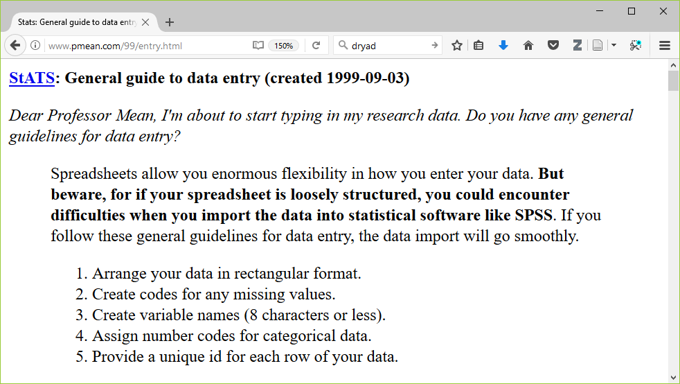

[[Speaker notes]]

Here is a web page with some general advice that I wrote way back in 1999. Some of the advice still holds but some of it is obsolete today.

## Much newer (and better) recommendations

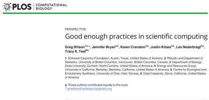

http://journals.plos.org/ploscompbiol/article?id=10.1371/journal.pcbi.1005510

A much better and more recent set of recommendations appeared in PLOS Computational Biology in 2017.

Have you ever experienced befuddlement when you dust off a data analysis that you ran six months ago? Ever gritted your teeth when your collaborator invalidates all your hard work by telling you that the data set you were working on had "a few minor changes"? Or panicked when someone running a big meta-analysis asks you to share your data? If any of these experiences rings true to you, then you need to adopt the philosophy of reproducible research. 

## Methods and Tools for Reproducible Research 

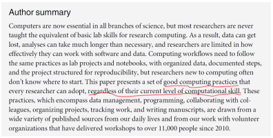

Reproducible research refers to methods and tools developed by large software development teams but which can help you keep a sense of order in your data, analysis programs, and results.

The recommendations are based on decades of experience from software development teams. The lessons that they learned can also help with data analysis. They are great when you are part of a team doing data analysis, but they can also help with a solo analyst.

Most importantly, you don't have to be a programmer to understand how to use these tools.

http://journals.plos.org/ploscompbiol/article?id=10.1371/journal.pcbi.1005510

## Change is never easy
+ Good practices require time and energy.
+ You have to break old habits.
+ You cannot retrofit these recommendations.

All of the recommendations that I will make today require an investment of time and energy. This investment will pay off, especially in the long run, but don't let me fool you into thinking that this is easy. It requires you to break old habits, and for someone as old as I am, that means a whole bunch of old habits.

Another thing that you need to realize is that you have to build these changes in to the data analysis itself. It is not something that you can tack on at the end once you're done with your work.

## Why should you adopt good programming practices?
+ These recommendations will
  + make your job easier today.
    + Only partially true!
  + make your job easier six months down the road.
  + help everyone who is currently working with you.
  + encourage future collaborators to work with you.
  + enhance the quality of your work.
    + make your work more reproducible.

You will see some immediate benefits to adopting these practices, but that's only partially true because you will be investing time. The real payoff comes six months down the road.

You'll also see benefits if you are working in a group. Even if you are going solo, the recommendations will help if you want to attract future collaborators.

The other direct benefit is quality. You will have a better product when you are done because everything that you do will be easy to reproduce.

## Recommendations in six areas
+ Data management.
+ Software.
+ Collaboration.
+ Project organization.
+ Keeping track of changes.
+ Manuscripts.

Wilson et al have made recommendations in six broad areas: data management, software, collaboration, project organizations, tracking changes, and preparing manuscripts or reports.

## Data management recommendations
+ Save the raw data.
+ Ensure that raw data are backed up in more than one location.
+ Create the data you wish to see in the world.
+ Create analysis-friendly data.
+ Record all the steps used to process data.
+ Use a unique identifier for every record.
+ Submit data to a reputable DOI-issuing repository.

The first set of recommendations relate to data management. You need to save the raw data, make sure it is backed up, create a version of the data that you would have liekd to see, make it analysis-friendly, document all the data processing steps, provide a unique identifier for every records, and submit your data to a repository.

## Save the raw data.
+ Never make changes directly on top of the data you receive.
+ Note the version number and date of any data you receive remotely.
  + Wilson et al (2017) page 2, recommendation 1a.

When you get your data, store it someplace safe and do not make any changes to this data. Always make changes to a copy of the original data. This allows you to more easily undo any bad choices that you might make during the data clean-up.

If you receive data from the web, see if there is a date and/or version number. Data on the web will sometimes change, and you want to make sure that your analysis is not affected adversely by these changes. This is also part of the process of documenting what you do.

## Ensure that raw data are backed up in more than one location.
+ Your company/university network may include remote back up, but check first.
+ You can also use cloud services or your own USB stick/drive, but be sure to encrypt anything confidential.
  + Wilson et al (2017) page 4, recommendation 1b.

An off-site backup is very important. You don't want a local disaster to set you back. Two copies of a file on two different locations on your hard drive will not help you if your hard drive fails or if your machine gets stolen.

Generally, most companies will provide off-site backup of any files stored on the local network, but as the saying goes "Trust but verify." Make a local backup, then "accidentally" delete your network file. Then see if the computer experts at your company can get your file back from the daily backup.

If you use your own USB stick and store it at home, that works well. But please make sure that any sensitive information is encrypted. That also is true for any backups you do on the cloud.

Many things that you do, such as your programs and documentation, are not confidential, and it might be overkill to encrypt these. As the saying goes "he who steals my purse steals trash." (Iago, in the Shakespeare play, Othello)

Sensitive financial or health data, on the other hand, can get you in a lot of trouble if it falls into the wrong hands.

## Create the data you wish to see in the world
+ Use open formats like csv, json , yaml , or xml.
+ Replace cryptic names with self-explaining alternatives.
  + Wilson et al (2017) page 4, recommendation 1c.

The data that you get may come in a proprietary format, but please spend the time to convert it to an open format. There are a variety of open formats, but they almost all share a nice feature. Open formats are easily opened in notepad or any other text editing program. You may not want to manipulate your data in a text editor, but there is great value in being able to peek at any time at your data.

## What is json?

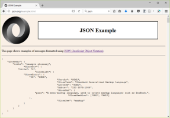

For simple files that can fit into a single table, the comma separated value (csv) files are quite common.

The json format is quite popular because it is fairly easy to review, but the multiple levels of nesting allow you to store very complex data sets.

## Create analysis-friendly data.
+ Each column is a variable. (No double dipping).
  + Avoid age/gender combinations (44M, 52F)
  + Avoid bivariate measures separated by a delimiter
    + Ex. blood pressure (120/80).
+ Make each row an observation (use a tall/thin format).
  + Wilson et al (2017) page 5, recommendation 1d.

Your next step is to manipulate your data into a form that is easily amenable to analysis. There's a term for this: "tidy data."

For tidy data, each column is a variable. That means no double dipping. You want to avoid squeezing two independent pieces of information into the same column of data. This could occur if you have codes like 44M for a 44 year old male and 52F for a 52 year old female. Also watch out for bivariate measures that are commonly paired. Blood pressure, for example, is often listed as two numbers, the systolic and diastolic measure, separated by a slash.

When you double dip, you limit the statistics that you can compute. A column of data filled with 44M, 52F, and so forth, will not be easily summarized into an average age and a proportion of females. The 120/80 will not allow you to compute either an average systolic blood pressure or an average diastolic blood pressure.

The other key feature of tidy data is that each row represents a single observation, not multiple observations. In a longitudinal study, subjects are measured at different time points. Each time point represents a separate row. Do not try to string out multiple time points across a very long row. Five time points means five rows per patient.

There are two reasons for this. First, the long rows require a lot of left/right scrolling, which is difficult on the eyes. You can easily lose track of which row corresponds to which patient. Second, the long row is inefficient for many settings, especially when subjects may not have data at one or more of the time points.

## What is tidy data?

+ https://cran.r-project.org/web/packages/tidyr/vignettes/tidy-data.html
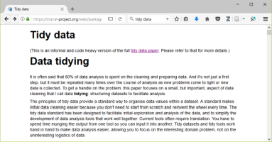

Th website listed here provides a nice overview of the principle of tidy data.

## Record all the steps used to process data.
+ Write scripts/use syntax instead of a graphical user interface.
+ If you can't use scripts/syntax, hand document all your steps.
  + Wilson et al (2017) page 5, recommendation 1e.

Document all the steps that you used to process your data. This is fairly easy to do with a program that uses scripts or syntax. If your program has a graphical user interface instead, take the time to write down all the steps that you used during data wrangling.

##  Anticipate the need to use multiple tables and use a unique identifier for every record.
+ Prevents loss of information from simple sorts.
+ Allows you to split your data into pieces
  + Time-constant and time-varying data in a longitudinal study.
+ Wilson et al (2017) page 5, recommendation 1f.

Make sure that the very first column or the first few columns of data represent a unique identifier. This allows you to track things after a simple operation like sorting your data.

It also helps if you see some weird values and want to track back to the original source.

For large and complex data sets, you may wish to split your data into several pieces. This might involve separating longitudinal data into time constant and time varying data. In a longitudinal study, certain variables like gender and race, do not change over time. These are time constant data. Other variables, like a person's weight, do fluctuate from one time point to another. These are time varying data.

## Submit data to a reputable DOI-issuing repository
+ Only for non-proprietary data
  + No personal identifiers
+ This will allow others to access and cite your data.
+ Include a README file.
  + Wilson et al (2017) page 6, recommendation 1g.

If your data is proprietary, skip this step. But if your data is not proprietary, think about how it might benefit others. This includes teaching. Your data set might be the perfect example that can help with those of us who are trying to develop the next generation of data scientists.

Strip out any personal identifiers. Keep in mind that a single variable may not allow someone to de-identify your data, but a combination might. You might share your birthday with lots of other people and you might share your zip code with a lot of other people. But the combination of a particular birthday with a particular zip code might lead to someone being able to easily identify who you are.

When you share your data, provide a data dictionary and other important information in a README file.

DOI is Digital Object Identifier, which assigns a permanent, unchanging URL. This avoids the problem of "link rot." 

## Dryad, an examploe of a DOI-issuing repository 

+ http://datadryad.org
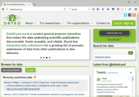

if you publish research papers, there are repositories like Dryad that allow you to easily share your information.

## Review of data management recommendations
+ Save the raw data.
+ Ensure that raw data are backed up in more than one location.
+ Create the data you wish to see in the world.
+ Create analysis-friendly data.
+ Record all the steps used to process data.
+ Use a unique identifier for every record.
+ Submit data to a reputable DOI-issuing repository.

Here are the seven data management recommendations again.

## Software recommendations
+ Place a brief explanatory comment at the start of every program.
+ Decompose programs into functions.
+ Be ruthless about eliminating duplication.
+ Always search for well-maintained libraries that do what you need.
+ Test libraries before relying on them.

There are ten software recommendations. Let's take them in two pieces, The first five recommendations are listed here.

## Place a brief explanatory comment at the start of every program.
+ Give an example of how it is used, and explain what parameters are needed.
+ Write the explanatory comment BEFORE you write your program
+ Revise comment as needed as you revise your program.
  + Wilson et al (2017) page 6, recommendation 2a.

## Decompose programs into functions.
+ This really means using macros for programs like SPSS and SAS.
+ Keep it short: one page and no more than 6 input parameters.
+ Do not reference information outside the function.
  + Wilson et al (2017) page 7, recommendation 2b.

## Be ruthless about eliminating duplication.
+ DRY code (don't repeat yourself).
+ Cut, paste, and slightly modify is your enemy.
  + Wilson et al (2017) page 7, recommendation 2c.

## Always search for well-maintained libraries that do what you need.
+ The "buy" versus "build" trade-off.
+ Don't be a Frank Sinatra programmer ("I did it my way.")
  + Wilson et al (2017) page 7, recommendation 2d.

## Example of well-maintained libraries

+ https://cran.r-project.org/web/packages/index.html
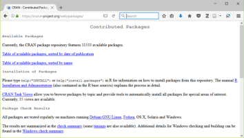

## Test libraries before relying on them.
+ Run textbook examples.
+ Evaluate instead of test?
  + Wilson et al (2017) page 7, recommendation 2e.

## Suggestions for evaluation

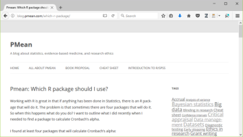

## Review of software recommendations 
+ Place a brief explanatory comment at the start of every program.
+ Decompose programs into functions.
+ Be ruthless about eliminating duplication.
+ Always search for well-maintained libraries that do what you need.
+ Test libraries before relying on them.

## Additional software recommendations
+ Give functions and variables meaningful names.
+ Make dependencies explicit.
+ Do not comment and uncomment sections of code to control a program's behavior.
+ Provide a simple example or test data set.
+ Submit your code to a reputable DOI-issuing repository.

## Give functions and variables meaningful names.
+ Functions are verbs and variables are nouns.
+ With the exception of loop counters, avoid one character variable names.
+ Be consistent with your delimiters
  + CamelCase, dot.delimiters , or underscore_delimiters
+ Be consistent with case
  + lower_case , Title_Case , or UPPER_CASE.
+ Wilson et al (2017) page 7, recommendation 2f.

## Make dependencies explicit.
+ Dependencies include what version of the software you need (e.g., 3.1.0 or later) and what additional software or libraries you need.
+ Document this as part of README, or in REQUIREMENTS.TXT.
  + Wilson et al (2017) page 7, recommendation 2g.

##  Do not comment and uncomment sections of code to control a program's behavior.
+ Use if/else statements and verbose/debug flags instead.
+ Don't keep old code around for historical reference, use version control instead.
  + Wilson et al (2017) page 8, recommendation 2h.

## Provide a simple example or test data set.
+ Run these tests when you 
  + switch computers, 
  + upgrade to a new software version, or 
  + add new pieces to your program.
+ Simplify the work of others who follow in your footsteps.
  + Wilson et al (2017) page 8, recommendation 2i.

##  Submit your code to a reputable DOI-issuing repository.
+ Share BOTH your data and your code
  + Helps insure reproducibility
  + Encourages new collaborations
+ Is your program code really so important that you must keep it secret?
  + Wilson et al (2017) page 8, recommendation 2j.

## Review software recommendations
+ Give functions and variables meaningful names.
+ Make dependencies explicit.
+ Do not comment and uncomment sections of code to control a program?s behavior.
+ Provide a simple example or test data set.
+ Submit your code to a reputable DOI-issuing repository.

## Collaboration recommendations
+ Create an overview of your project.
+ Create a shared to-do list.
+ Decide on communication strategies.
+ Make the license explicit.
+ Make the project citable.

## Create an overview of your project.
+ This is useful even if you work alone, because it gives a focus to your work.
+ Store the overview in a README file.
+ Include information about opportunities for collaboration in a CONTRIBUTING file.
  + Wilson et al (2017) page 8, recommendation 3a.

## Create a shared to-do list.
+ Document this well enough for an outsider to understand.
  + Wilson et al (2017) page 8, recommendation 3b.

## Decide on communication strategies.
+ Where and how will your team meet to resolve issues.
+ Explain how new collaborators can get involved.
+ Specify where key documents are stored and who can modify them.
  + Wilson et al (2017) page 8, recommendation 3c.

## Make the license explicit.
+ Use a liberal license to makes it easy for future collaborators to join in the fun.
+ Remember that you are far better off being the pioneer in a new research area that everyone is working in than a new research area that no one is working in.
+ "A candle loses nothing by lighting another candle." James Keller
  + Wilson et al (2017) page 9, recommendation 3d.

## Make the project citable.
+ Include a suggested citation for your work in a CITATION file.
+ Here's what I put in my CITATION file: "You are free to use any of the material in this repository without restriction. If you do wish to give credit, however, when you use this work, it would be appreciated. An example of appropriate credit would be "thanks to Steve Simon (list the url of this repository) for sharing this material."
  + Wilson et al (2017) page 9, recommendation 3e.

## Methods and Tools for Reproducible Research 

+ Create an overview of your project.
+ Create a shared to-do list.
+ Decide on communication strategies.
+ Make the license explicit.
+ Make the project citable.

## Project organization recommendations
+ Put each project in its own directory, which is named for the project.
+ Use standard names for subdirectories.
+ Name all files to reflect their content or function.

## Put each project in its own directory, which is named for the project.
+ If two projects share more than 50% of the code or data, then they can be safely combined into one project.
+ Two projects that share no code or data belong in separate directories.
  + Wilson et al (2017) page 9, recommendation 4a.

## Use standard names for subdirectories.
+ DOC for most other documentation.
+ DATA for raw data, 
+ RESULTS for intermediate data sets and program output.
+ SRC for source code.
+ BIN for compiled programs.
+ README, LICENSE, CITATION, REQUIREMENTS go in root directory.
  + Wilson et al (2017) page 10, recommendation 4b-e.

## Methods and Tools for Reproducible Research 

## Name all files to reflect their content or function.
+ Avoid sequence names like logistic_model1, logistic_model2, ...
  + Not descriptive
  + Subject to frequent renumbering.
+ Better choice would be simple_logistic_model, cubic_spline_logistic_model, ...
  + Wilson et al (2017) page 11, recommendation 4f.

## Review project organization recommendations

+ Put each project in its own directory, which is named for the project.
+ Use standard names for subdirectories.
+ Name all files to reflect their content or function.

## Review tracking changes (manual) recommendations
+ Back up (almost) everything created by a human being as soon as it is created.
+ Keep changes small.
+ Share changes frequently.
+ Create, maintain, and use a checklist for saving and sharing changes to the project.
+ Store each project in a folder that is mirrored off the researcher?s working machine.
+ Add a file called CHANGELOG.txt to the project?s DOC subfolder.
+ Copy the entire project whenever a significant change has been made.

## Back up (almost) everything created by a human being as soon as it is created.
+ This is easily automated.
+ If your team is all within the same organization, a shared network folder works well.
  + Wilson et al (2017) page 12, recommendation 5a.

## Keep changes small.
+ Any group of edits that you might think about undoing as a batch should be considered a single change.
  + Wilson et al (2017) page 12, recommendation 5b.

## Share changes frequently.
+ Do not allow different investigator versions to drift apart.
+ This is even a problem if you run analyses on both a work and home computer.
  + Wilson et al (2017) page 12, recommendation 5c.

## Create, maintain, and use a checklist for saving and sharing changes to the project.
+ This is stored as TODO.txt.
  + Wilson et al (2017) page 12, recommendation 5d.

## Store each project in a folder that is mirrored off the researcher's working machine.
+ Several products can automate this process. I use Dropbox, but there are a lot of excellent alternatives out there.
  + Wilson et al (2017) page 12, recommendation 5e.

## Add a file called CHANGELOG.txt to the project's DOC subfolder
+ Date entries and put most recent changes as the top.
  + Wilson et al (2017) page 13., recommendation 5f.

## Sample changelog file

## Copy the entire project whenever a significant change has been made.
+ It is better to waste hardware resources than to waste your time.
  + Wilson et al (2017) page 13, recommendation 5g.

## Storage is cheap, thanks to Moore's Law

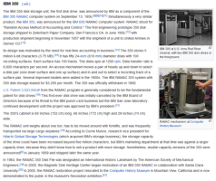

https://en.wikipedia.org/wiki/History_of_IBM_magnetic_disk_drives#IBM_350

## Example of sequential project copies

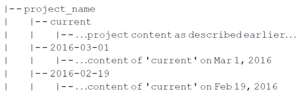

## Review tracking changes (manual) recommendations
+ Back up (almost) everything created by a human being as soon as it is created.
+ Keep changes small.
+ Share changes frequently.
+ Create, maintain, and use a checklist for saving and sharing changes to the project.
+ Store each project in a folder that is mirrored off the researcher?s working machine.
+ Add a file called CHANGELOG.txt to the project?s DOC subfolder.
+ Copy the entire project whenever a significant change has been made.

## OR automate the process
+ Use a version control system to manage changes to a project.
	+ Version control tracks the actual changes rather than what you think the changes were.
	+ Version control handles dating automatically.
	+ Version control can rollback changes that you end up regretting.
+ But:
	+ Do not put large binary files in your version control system.
	+ Avoid putting confidential or proprietary information on a public version control system.
	+ Don?t store passwords for database access on a public version control system.
+ Most version control software is open source
  + Wilson et al (2017) page 13, recommendation 5h.

## Example of version control using git

https://github.com/pmean

## Methods and Tools for Reproducible Research 

Private coorespondance

## Methods and Tools for Reproducible Research 

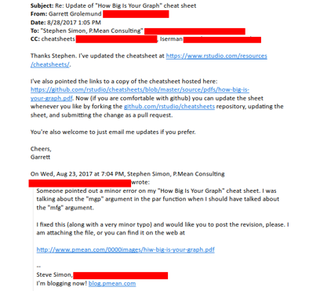

Private correspondance

## Manuscripts/reports recommendations

+ Two choices
+ Write manuscripts using online tools
	+ Rich text formatting, 
	+ Change tracking, and 
	+ Reference management.
		+ Google Doc, but not Microsoft Word
+ Write the manuscript in a plain text format that allows version control.
	+ LaTeX .
	+ Markdown.

## Google docs

## Markdown

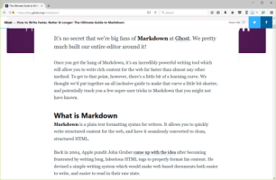

## Bookdown

## LaTex

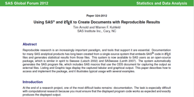

## Advanced tools (1/2)

+ Branches: allows better control over changes in version control.
+ Build tools: ?re-compile? everything down to the final paper if your data changes.
+ Unit tests: rigorous approach to insure quality of your functions.
+ Coverage: measures what lines are used/ignored to winnow out unused code.
+ Continuous integration: automate your testing process whenever you make changes.
  + But wait, there's more!

## Advanced tools (2/2)

+ Profiling: identify parts of your code that are bottlenecks.
+ The semantic web: using consensus standards for naming things.
+ Documentation: meaning more than just a few comments here and there.
+ Bibliography manager: EndNotes / Zotero / Mendeley and get an ORCID number.
+ Code reviews and pair programming: have a partner to check your work.
  + But wait, there's more!

