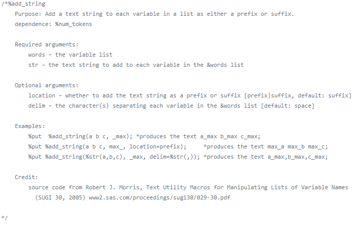

```{r setup, echo=FALSE}
# The documentation for this program can be found on the section titled "Documentation for THIS progam."
```

## Good Documentation

Abstract: Every program that you write should have a brief documentation header at the very top of the program. The only exception is short throw-away programs that you run once and then delete. This presentation will review some of the elements that you might want to include in your documentation header.

+ This presentation was written on 2019-06-05 and was last modified on `r Sys.Date()`.

<div class="notes">

I want to talk briefly about good documentation practices. In particular, I want to talk about the documentation header, the documentation that you would place at the very top of any program you write. You should always include a documention header for any program you write. It doesn't matter if you are the only one who will ever see your code, because you yourself may end up reviewing your programs months or years after you originally wrote it. The documentation header will help you remember why you wrote the program and how to get it running again.

</div>

## Documentation for THIS program

The program was written by Steve Simon. The creation and last modification dates appear on the previous slide. The program and any output produced by this program are placed in the public domain (no copyright). If you use this program, a brief acknowledgement of the author is appreciated, but not required.

<div class="notes">

This PowerPoint presentation was itself produced by a program, so it is only fair that I include some documentation. I cheated a bit because this documentation was not placed at the very top of the program. It is not intended to be a model for your program, but more as an effort to keep me from feeling too guilty about failing to practice what I preach.

</div>

## Documentation for THIS program

+ This program is written in R Markdown. It was run using `r R.version.string`. It requires the use of the knitr package. It produces a PowerPoint file, including speaker notes that you can use to talk about good documentation practices.
  + Why R Markdown? See http://blog.pmean.com/powerpoint-with-r-markdown/


<div class="notes">

Here is some additional information in my documentation header. It is a bit unusual to use R Markdown to produce a PowerPoint presentation. If you are curious about this, please refer to the entry on my blog listed at the bottom of this slide.

</div>

## Documentation



## http://github.com/Jiangtang/SAS_ListProcessing

```{}
/*%add_string 
    Purpose: Add a text string to each variable in a list as either a prefix or suffix.
    dependence: %num_tokens
    Required arguments: 
        words – the variable list 
        str – the text string to add to each variable in the &words list 
    Optional arguments: 
        location – whether to add the text string as a prefix or suffix [prefix|suffix, default: suffix] 
        delim – the character(s) separating each variable in the &words list [default: space] 
    Examples: 
        %put  %add_string(a b c, _max); *produces the text a_max b_max c_max;            
        %put %add_string(a b c, max_, location=prefix);     *produces the text max_a max_b max_c;            
        %put %add_string(%str(a,b,c), _max, delim=%str(,)); *produces the text a_max,b_max,c_max;
    Credit:
        source code from Robert J. Morris, Text Utility Macros for Manipulating Lists of Variable Names
          (SUGI 30, 2005) www2.sas.com/proceedings/sugi30/029-30.pdf           
*/
```

## Documentation


## https://github.com/FinancialRiskGroup/SASPerformanceAnalytics

```{}
/*---------------------------------------------------------------
* NAME: ActivePremium.sas
*
* PURPOSE: Cacluate the return on an investment's annualized return minus the benchmark's annualized return.
*
* NOTES: Also known as active return.
*		 Active premium= Investment's annualized return- Benchmark's annualized return. 
*
* MACRO OPTIONS:
* returns - Required.  Data Set containing returns.
* BM - Required.  Specifies the variable name of benchmark asset or index in the returns data set.
* scale - Optional. Number of periods in a year {any positive integer, ie daily scale= 252, monthly scale= 12, quarterly scale= 4}.
          Default=1
* method - Optional. Specifies either DISCRETE or LOG chaining method {DISCRETE, LOG}.  
           Default=DISCRETE
* dateColumn - Optional. Date column in Data Set. Default=DATE
* outData - Optional. Output Data Set with active premium.  Default="active_premium"
*
* MODIFIED:
* 7/22/2015 – CJ - Initial Creation
* 3/05/2016 – RM - Comments modification  
* 3/09/2016 - QY - Parameter consistency 
*
* Copyright (c) 2015 by The Financial Risk Group, Cary, NC, USA.
*-------------------------------------------------------------*/
```

## Documentation


## https://www.hhs.gov/opa/performance-measures/claims-data-sas-program-instructions/index.html

```{}
/*
________________________________________________________________________________

   00.setup.sas 
   OPA Measure Calculations
   Step 0: Define macro variables

   Summary  : Define macro variables used in subsequent programs.
              User enters environment- and data-specific info (directories,
              variable names). User specifies whether to perform measure 
              calculations on postpartum women (and number of days postpartum). 
              Measure calculations will be performed on all women population 
              by default. User can also specify demographic variables for 
              stratification of final measures.

   Data Reqs: 1) A sas data file containing women with one calendar year of claims
              2) Every record must contain at least: 
                  a) patient ID 
                  b) patient date of birth (or age at service date)
                  c) date of service

   Authors  : P. Hastings / phil -at- farharbor -dot- com
            : H. Monti / holly -at- farharbor -dot- com  
            : Based on original code by B. Frederiksen -at- DHHS/OPA
   Version  : 2.01
   Date     : 2019-02-26
   Revisions: Now using contraceptive provision to describe measures.  
			  Updated OPA contact in setup helper. Updated names of revised claims code 
		   	  lookup tables. Updated LARC flag to exclude surveillance codes. 
		  	  Separated IUD and implant methods from LARC for MostMod report only. 
		   	  Updated the live birth date of service as the first date rather than 
              the last date of live birth claim in the postpartum period. 
		   	  Added a flag for each contraceptive method used during the time period,
              and added these variables to final dataset. Calculating measures based on
	   		  2018 specifications. 
   History  : 2016-12-19(1.00), 2017-02-22(1.01), 2017-05-17(1.02), 
              2018-04-20(1.03), 2018-08-20(1.03a)

________________________________________________________________________________

*/
```

### Further resources

The Pennsylvania State University. 1.6 - Guidelines for Formatting and Commenting SAS Programs. Available in [html format](https://newonlinecourses.science.psu.edu/stat480/node/13/).