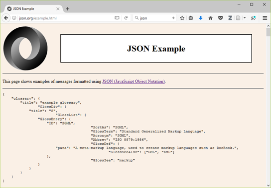
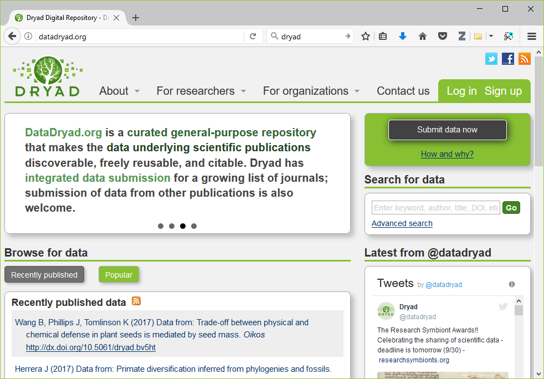
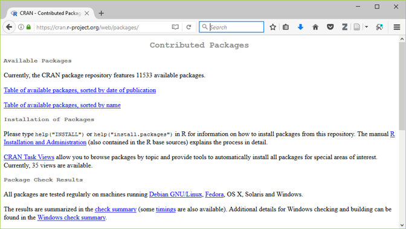
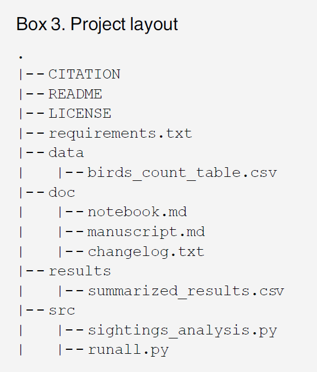
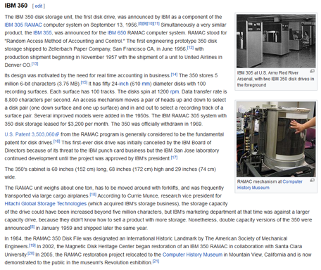
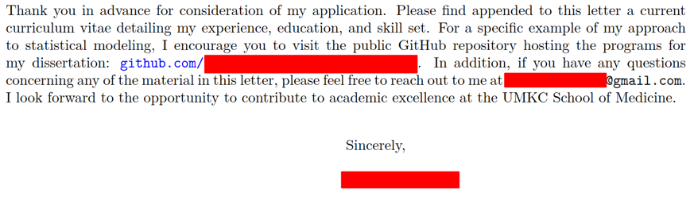
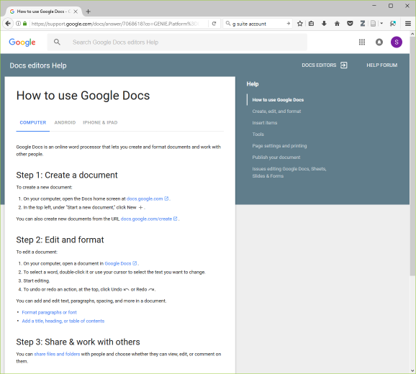
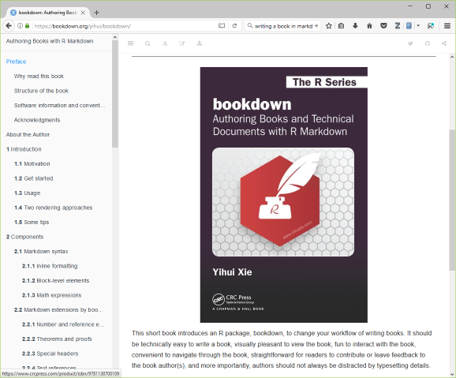
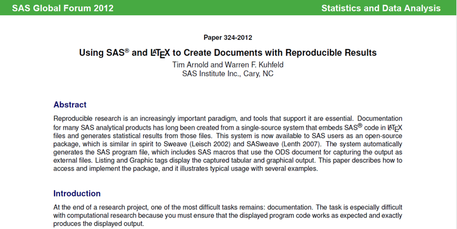

## Abstract (1 of 2)

+ Have you ever experienced befuddlement when you dust off a data analysis that you ran six months ago? Ever gritted your teeth when your collaborator invalidates all your hard work by telling you that the data set you were working on had "a few minor changes"? Or panicked when someone running a big meta-analysis asks you to share your data? If any of these experiences rings true to you, then you need to adopt the philosophy of reproducible research. Reproducible research refers to methods and tools developed by large software development teams but which can help you keep a sense of order in your data, analysis programs, and results.

I want to talk about reproducible research. This is research that will help you if you are reviewinng your code from a data analysis you ran six months ago. It will help when your collaborators give you a few minor changes

## Abstract (2 of 2)

+ In this webinar, we'll review reproducible research methodology, using recent recommendations in the literature. Although these recommendations may ask you to break long entrenched habits, the approach is easy to implement, even for data analysts who are new to computation.

I want to talk about software tools, but you don't have to be a programmer to understand how to use these tools.

## My recommendations in 1999

I wrote about this issue in 1999, but much of the advice I offered back then is obsolete today.

## Much newer (and better) recommendations

http://journals.plos.org/ploscompbiol/article?id=10.1371/journal.pcbi.1005510

## Methods and Tools for Reproducible Research 

http://journals.plos.org/ploscompbiol/article?id=10.1371/journal.pcbi.1005510

## Methods and Tools for Reproducible Research 

+ If you adopt good programming practices, you will?
	+ make your job easier today. **(only partially true!)**
	+ make your job easier six months down the road when you have to dust off your work and dig in again.
	+ help everyone who is currently working with you.
	+ encourage future collaborators to work with you.
	+ make your research more reproducible.
	+ enhance the quality of your publications.
+ But, it requires time and energy and the breaking of many old habits.
+ Why should you adopt these recommendations?

## Methods and Tools for Reproducible Research 

+ Data management.
+ Software.
+ Collaboration.
+ Project organization.
+ Keeping track of changes.
+ Manuscripts.
+ Recommendations in six areas

## Methods and Tools for Reproducible Research 

+ Data management.
+ Software.
+ Collaboration.
+ Project organization.
+ Keeping track of changes.
+ Manuscripts.
+ Recommendations in six areas

## Methods and Tools for Reproducible Research 

+ a. Save the raw data.
	+ Never make changes directly on top of the data you receive.
	+ Note the version number and date of any data you receive remotely.
+ 1. Data management
+ Wilson et al (2017) page 2.

## Methods and Tools for Reproducible Research 

+ b. Ensure that raw data are backed up in more than one location.
	+ Your company/university network may include remote back up, but check first.
	+ You can also use cloud services or your own USB stick/drive, but be sure to encrypt anything confidential.
+ 1. Data management
+ Wilson et al (2017) page 4.

## Methods and Tools for Reproducible Research 

+ c. Create the data you wish to see in the world
	+ Use open formats like csv, json , yaml , or xml.
	+ Replace cryptic names with self-explaining alternatives.
+ 1. Data management
+ Wilson et al (2017) page 4.

## Methods and Tools for Reproducible Research 

+ http://json.org/example.html

## Methods and Tools for Reproducible Research 

+ d. Create analysis-friendly data.
	+ Each column is a variable. (No double dipping).
	+ Make each row an observation (use a tall/thin format).
+ 1. Data management
+ Wilson et al (2017) page 5.

## Methods and Tools for Reproducible Research 

+ https://cran.r-project.org/web/packages/tidyr/vignettes/tidy-data.html

## Methods and Tools for Reproducible Research 

+ e. Record all the steps used to process data.
	+ Write scripts/use syntax instead of a graphical user interface.
	+ If you can?t use scripts/syntax, hand document all your steps.
+ 1. Data management
+ Wilson et al (2017) page 5.

## Methods and Tools for Reproducible Research 

+ f. Anticipate the need to use multiple tables and use a unique identifier for every record.
	+ This allows you to split your data into pieces (e.g., time-constant and time-varying data in a longitudinal study).
+ 1. Data management
+ Wilson et al (2017) page 5.

## Methods and Tools for Reproducible Research 

+ g. Submit data to a reputable DOI-issuing repository so that others can access and cite it.
	+ DOI is Digital Object Identifier, which assigns a permanent, unchanging URL.
	+ This avoids the problem of ?link rot?.
	+ Include a README file with information that will simplify the task of others using your data.
+ 1. Data management
+ Wilson et al (2017) page 6.

## Methods and Tools for Reproducible Research 

+ http://datadryad.org

## Methods and Tools for Reproducible Research 

+ a. Save the raw data.
+ b. Ensure that raw data are backed up in more than one location.
+ c. Create the data you wish to see in the world.
+ d. Create analysis-friendly data.
+ e. Record all the steps used to process data.
+ f. Anticipate the need to use multiple tables and use a unique identifier for every record.
+ g. Submit data to a reputable DOI-issuing repository so that others can access and cite it.
+ 1. Data management (What do you think?)

## Methods and Tools for Reproducible Research 

+ Data management.
+ Software.
+ Collaboration.
+ Project organization.
+ Keeping track of changes.
+ Manuscripts.
+ Recommendations in six areas

## Methods and Tools for Reproducible Research 

+ a. Place a brief explanatory comment at the start of every program.
	+ Give an example of how it is used, and explain what parameters are needed.
	+ Write the explanatory comment BEFORE you write your program, and revise it as needed as you revise your program.
+ 2. Software
+ Wilson et al (2017) page 6.

## Methods and Tools for Reproducible Research 

+ b. Decompose programs into functions.
	+ This really means using macros for programs like SPSS and SAS.
	+ Keep it short: one page and no more than 6 input parameters.
	+ Do not reference information outside the function.
+ 2. Software
+ Wilson et al (2017) page 7.

## Methods and Tools for Reproducible Research 

+ c. Be ruthless about eliminating duplication.
	+ DRY code (don?t repeat yourself).
	+ Cut, paste, and slightly modify is your enemy.
+ 2. Software
+ Wilson et al (2017) page 7.

## Methods and Tools for Reproducible Research 

+ d. Always search for well-maintained libraries that do what you need.
	+ Don?t be a Frank Sinatra programmer (?I did it my way.?)
+ 2. Software
+ Wilson et al (2017) page 7.

## Methods and Tools for Reproducible Research 

+ https://cran.r-project.org/web/packages/index.html

## Methods and Tools for Reproducible Research 

+ e. Test libraries before relying on them.
	+ It might be more practical to say ?evaluate libraries? rather than ?test libraries.?
+ 2. Software
+ Wilson et al (2017) page 7.

## Methods and Tools for Reproducible Research 

+ Wilson et al (2017) page 7.

## Methods and Tools for Reproducible Research 

+ a. Place a brief explanatory comment at the start of every program.
+ b. Decompose programs into functions.
+ c. Be ruthless about eliminating duplication.
+ d. Always search for well-maintained libraries that do what you need.
+ e. Test libraries before relying on them.
+ 2. Software (What do you think?)
+ Wilson et al (2017) page 7.

## Methods and Tools for Reproducible Research 

+ f. Give functions and variables meaningful names.
	+ Functions are verbs and variables are nouns.
	+ With the exception of loop counters, avoid one character variable names.
	+ Be consistent with your delimiters (CamelCase, dot.delimiters , or underscore_delimiters ) and with case ( lower_case , Title_Case , or UPPER_CASE).
+ 2. Software
+ Wilson et al (2017) page 7.

## Methods and Tools for Reproducible Research 

+ g. Make dependencies explicit.
	+ Dependencies include what version of the software you need (e.g., 3.1.0 or later) and what additional software or libraries you need.
	+ Document this as part of README, or in REQUIREMENTS.TXT.
+ 2. Software
+ Wilson et al (2017) page 7.

## Methods and Tools for Reproducible Research 

+ h. Do not comment and uncomment sections of code to control a program?s behavior.
	+ Use if/else statements and verbose/debug flags instead.
	+ Don?t keep old code around for historical reference, use version control instead.
+ 2. Software
+ Wilson et al (2017) page 8.

## Methods and Tools for Reproducible Research 

+ i . Provide a simple example or test data set.
	+ Run these tests when you switch computers, upgrade to a new software version, or add new pieces to your program.
+ 2. Software
+ Wilson et al (2017) page 8.

## Methods and Tools for Reproducible Research 

+ j. Submit your code to a reputable DOI-issuing repository.
	+ When you share both your data and your code, you help insure reproducibility and you encourage new collaborations.
+ 2. Software
+ Wilson et al (2017) page 8.

## Methods and Tools for Reproducible Research 

+ f. Give functions and variables meaningful names.
+ g. Make dependencies explicit.
+ h. Do not comment and uncomment sections of code to control a program?s behavior.
+ i . Provide a simple example or test data set.
+ j. Submit your code to a reputable DOI-issuing repository.
+ 2. Software (What do you think?)
+ Wilson et al (2017) page 8.

## Methods and Tools for Reproducible Research 

+ Data management.
+ Software.
+ Collaboration.
+ Project organization.
+ Keeping track of changes.
+ Manuscripts.
+ Recommendations in six areas

## Methods and Tools for Reproducible Research 

+ a. Create an overview of your project.
	+ This is useful even if you work alone, because it gives a focus to your work.
	+ Store the overview in a README file.
	+ Include information about opportunities for collaboration in a CONTRIBUTING file.
+ 3. Collaboration
+ Wilson et al (2017) page 8.

## Methods and Tools for Reproducible Research 

+ b. Create a shared to-do list.
	+ Document this well enough for an outsider to understand.
+ 3. Collaboration
+ Wilson et al (2017) page 8.

## Methods and Tools for Reproducible Research 

+ c. Decide on communication strategies.
	+ Where and how will your team meet to resolve issues.
	+ Explain how new collaborators can get involved.
	+ Specify where key documents are stored and who can modify them.
+ 3. Collaboration
+ Wilson et al (2017) page 8.

## Methods and Tools for Reproducible Research 

+ d. Make the license explicit.
	+ Use a liberal license to makes it easy for future collaborators to join in the fun.
	+ Remember that you are far better off being the pioneer in a new research area that everyone is working in than a new research area that no one is working in.
	+ ?A candle loses nothing by lighting another candle.? James Keller
+ 3. Collaboration
+ Wilson et al (2017) page 9.

## Methods and Tools for Reproducible Research 

+ e. Make the project citable.
	+ Include a suggested citation for your work in a CITATION file.
	+ Here?s what I put in my CITATION file
		+ You are free to use any of the material in this repository without
		+ restriction. If you do wish to give credit, however, when you use
		+ this work, it would be appreciated. An example of appropriate credit
		+ would be "thanks to Steve Simon (list the url of this repository)
		+ for sharing this material."
+ 3. Collaboration
+ Wilson et al (2017) page 9.

## Methods and Tools for Reproducible Research 

+ a. Create an overview of your project.
+ b. Create a shared to-do list.
+ c. Decide on communication strategies.
+ d. Make the license explicit.
+ e. Make the project citable.
+ 3. Collaboration (What do you think?)

## Methods and Tools for Reproducible Research 

+ Data management.
+ Software.
+ Collaboration.
+ Project organization.
+ Keeping track of changes.
+ Manuscripts.
+ Recommendations in six areas

## Methods and Tools for Reproducible Research 

+ a. Put each project in its own directory, which is named for the project.
	+ If two projects share more than 50% of the code or data, then they can be safely combined into one project.
	+ Two projects that share no code or data belong in separate directories.
+ 4. Project organization
+ Wilson et al (2017) page 9.

## Methods and Tools for Reproducible Research 

+ Use standard names for subdirectories.
	+ b. DOC for most other documentation.
	+ c. DATA for raw data, RESULTS for intermediate data sets and program output.
	+ d. SRC for source code.
	+ e. BIN for compiled programs.
+ README, LICENSE, CITATION, REQUIREMENTS go in root directory.
+ 4. Project organization
+ Wilson et al (2017) page 10.

## Methods and Tools for Reproducible Research 

+ Wilson et al (2017) page 11.

## Methods and Tools for Reproducible Research 

+ f. Name all files to reflect their content or function.
	+ Avoid sequence names like logistic_model1, logistic_model2, ? as these are not descriptive and subject to frequent renumbering. Better would be simple_logistic_model , cubic_spline_logistic_model , ?
+ 4. Project organization
+ Wilson et al (2017) page 11.

## Methods and Tools for Reproducible Research 

+ a. Put each project in its own directory, which is named for the project (4a, page 9).
+ b-e. Use standard names for subdirectories.
+ f. Name all files to reflect their content or function.
+ 4. Project organization (What do you think?)

## Methods and Tools for Reproducible Research 

+ Data management.
+ Software.
+ Collaboration.
+ Project organization.
+ Keeping track of changes.
+ Manuscripts.
+ Recommendations in six areas

## Methods and Tools for Reproducible Research 

+ a. Back up (almost) everything created by a human being as soon as it is created.
	+ This is easily automated.
	+ If your team is all within the same organization, a shared network folder works well.
+ 5. Keeping track of changes.
+ Wilson et al (2017) page 12.

## Methods and Tools for Reproducible Research 

+ b. Keep changes small.
	+ Any group of edits that you might think about undoing as a batch should be considered a single change.
+ 5. Keeping track of changes.
+ Wilson et al (2017) page 12.

## Methods and Tools for Reproducible Research 

+ c. Share changes frequently.
	+ Do not allow different investigator versions to drift apart.
	+ This is even a problem if you run analyses on both a work and home computer.
+ 5. Keeping track of changes.
+ Wilson et al (2017) page 12.

## Methods and Tools for Reproducible Research 

+ a. Back up (almost) everything created by a human being as soon as it is created.
+ b. Keep changes small.
+ c. Share changes frequently.
+ 5. Keeping track of changes (What do you think?)

## Methods and Tools for Reproducible Research 

+ d. Create, maintain, and use a checklist for saving and sharing changes to the project.
	+ This is stored as TODO.txt.
+ 5. Keeping track of changes.
+ Wilson et al (2017) page 12.

## Methods and Tools for Reproducible Research 

+ e. Store each project in a folder that is mirrored off the researcher?s working machine.
	+ Several products can automate this process. I use Dropbox, but there are a lot of excellent alternatives out there.
+ 5. Keeping track of changes.
+ Wilson et al (2017) page 12.

## Methods and Tools for Reproducible Research 

+ f. Add a file called CHANGELOG.txt to the project?s DOC subfolder (5f, page 13).
	+ Date entries and put most recent changes as the top.
+ 5. Keeping track of changes.
+ Wilson et al (2017) page 13.

## Methods and Tools for Reproducible Research 

+ Wilson et al (2017) page 13.

## Methods and Tools for Reproducible Research 

+ g. Copy the entire project whenever a significant change has been made.
	+ It is better to waste hardware resources than to waste your time.
+ 5. Keeping track of changes.
+ Wilson et al (2017) page 13.

## Methods and Tools for Reproducible Research 

+ https://en.wikipedia.org/wiki/History_of_IBM_magnetic_disk_drives#IBM_350

## Methods and Tools for Reproducible Research 

+ Wilson et al (2017) page 13.

## Methods and Tools for Reproducible Research 

+ d. Create, maintain, and use a checklist for saving and sharing changes to the project.
+ e. Store each project in a folder that is mirrored off the researcher?s working machine.
+ f. Add a file called CHANGELOG.txt to the project?s DOC subfolder.
+ g. Copy the entire project whenever a significant change has been made.
+ 5. Keeping track of changes (What do you think?)

## Methods and Tools for Reproducible Research 

+ h. Use a version control system to manage changes to a project.
	+ Version control tracks the actual changes rather than what you think the changes were.
	+ Version control handles dating automatically.
	+ Version control can rollback changes that you end up regretting.
+ But?
	+ Do not put large binary files in your version control system.
	+ Avoid putting confidential or proprietary information on a public version control system.
	+ Don?t store passwords for database access on a public version control system.
+ 5. Keeping track of changes.
+ Wilson et al (2017) page 13.

## Methods and Tools for Reproducible Research 

+ https://github.com/pmean

## Methods and Tools for Reproducible Research 

+ Private coorespondance

## Methods and Tools for Reproducible Research 

+ Private correspondance

## Methods and Tools for Reproducible Research 

+ h. Use a version control system to manage changes to a project.
+ 5. Keeping track of changes (What do you think?)

## Methods and Tools for Reproducible Research 

+ Data management.
+ Software.
+ Collaboration.
+ Project organization.
+ Keeping track of changes.
+ Manuscripts.
+ Recommendations in six areas

## Methods and Tools for Reproducible Research 

+ Either
	+ Write manuscripts using online tools with rich text formatting, change tracking, and reference management.
		+ Google Docs
		+  Microsoft Word
+ Or
	+ Write the manuscript in a plain text format that allows version control.
		+ LaTeX .
		+ Markdown.
+ 6. Manuscripts
+ Wilson et al (2017) page 16.

## Methods and Tools for Reproducible Research 

+ Wilson et al (2017) page 16.

## Methods and Tools for Reproducible Research 

+ Wilson et al (2017) page 16.

## Methods and Tools for Reproducible Research 

+ Wilson et al (2017) page 16.

## Methods and Tools for Reproducible Research 

+ Wilson et al (2017) page 16.

## Methods and Tools for Reproducible Research 

+ Either
	+ Write manuscripts using online tools with rich text formatting, change tracking, and reference management.
		+ Google Docs
		+  Microsoft Word
+ Or
	+ Write the manuscript in a plain text format that allows version control.
		+ LaTeX .
		+ Markdown.
+ 6. Manuscripts (What do you think?)

## Methods and Tools for Reproducible Research 

+ Branches: allows better control over changes in version control.
+ Build tools: ?re-compile? everything down to the final paper if your data changes.
+ Unit tests: rigorous approach to insure quality of your functions.
+ Coverage: measures what lines are used/ignored to winnow out unused code.
+ Continuous integration: automate your testing process whenever you make changes.
+ But wait, there?s more!

## Methods and Tools for Reproducible Research 

+ Profiling: identify parts of your code that are bottlenecks.
+ The semantic web: using consensus standards for naming things.
+ Documentation: meaning more than just a few comments here and there.
+ Bibliography manager: EndNotes / Zotero / Mendeley and get an ORCID number.
+ Code reviews and pair programming: have a partner to check your work.
+ But wait, there?s more!

## Methods and Tools for Reproducible Research 

+ Here are the recommendations I see as most important:
+ Document and save all your data preparation work.
+ Take the time to write decent code.
+ Standardize how you archive information from your work.
+ Share liberally, if you can.
+ Conclusion

