```{r setup, include=FALSE}
# I will not use too much R in a class called "Introduction to SAS,"
# but am including this chunk just in case I need something from R.
knitr::opts_chunk$set(echo=FALSE, comment="")
suppressMessages(suppressWarnings(library(dplyr)))
suppressMessages(suppressWarnings(library(knitr)))
suppressMessages(suppressWarnings(library(magrittr)))
suppressMessages(suppressWarnings(library(stringr)))
```


### Overview

+ Introducing your instructor
+ Where you can get SAS
+ Your first SAS program
+ History of SAS
+ Directory structure and documentation header
+ Permanent storage
+ Saving your output
+ Getting data from a file

<div class="notes">[[Speaker notes]]

author: Steve Simon
date: created 2018-08-29
purpose: to produce slides for module01 videos
license: public domain

Here is an overview of what I want to cover in module02.

Okay. I want to get you started using SAS. It's either going to be really easy or it's going to be really really hard. I want to give you as much guidance as I can without staring over your shoulder. Just quickly, I wrote this PowerPoint presentation and all the PowerPoint presentations using R Markdown. If you are curious I have a repository. It has some beautiful output.

Greetings! My name is Steve Simon and I am the instructor for the class, MEDB 5507, Introduction to SAS.

</div>

### Course instructor, Steve Simon


<div class="notes">[[Speaker notes]]

Greetings! My name is Steve Simon and I am the instructor for the class, MEDB 5507, Introduction to SAS.

</div>

### Original developer, Mary Gerkovich


<div class="notes">[[Speaker notes]]

This course was originally developed by Dr. Mary Gerkovich. I've changed a few things, but I owe a big debt of gratitude to Mary for all of her hard work.

</div>

### A bit about myself


<div class="notes">[[Speaker notes]]

Let me share a bit about myself. 

</div>

### DBHI, http://med.umkc.edu/dbhi/

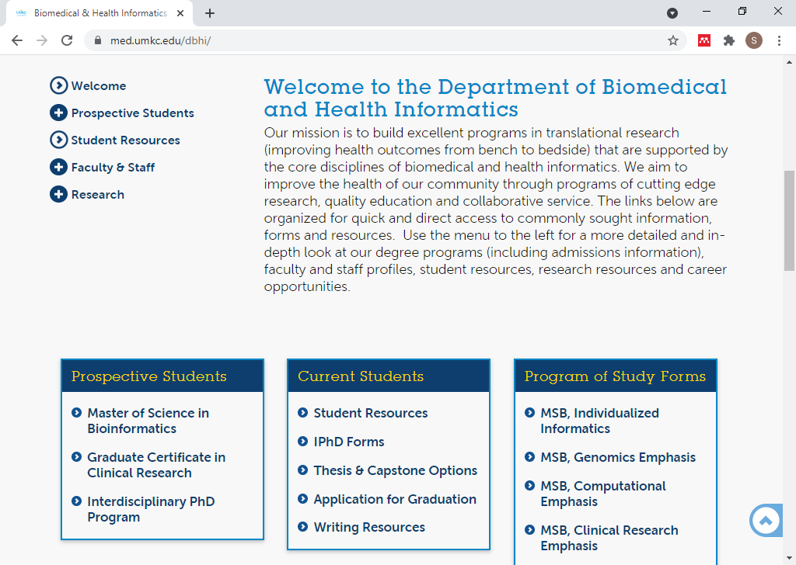


<div class="notes">[[Speaker notes]]

I am a part-time faculty member in the Department of Biomedical and Health Informatics. 

</div>

### Website, http://new.pmean.com

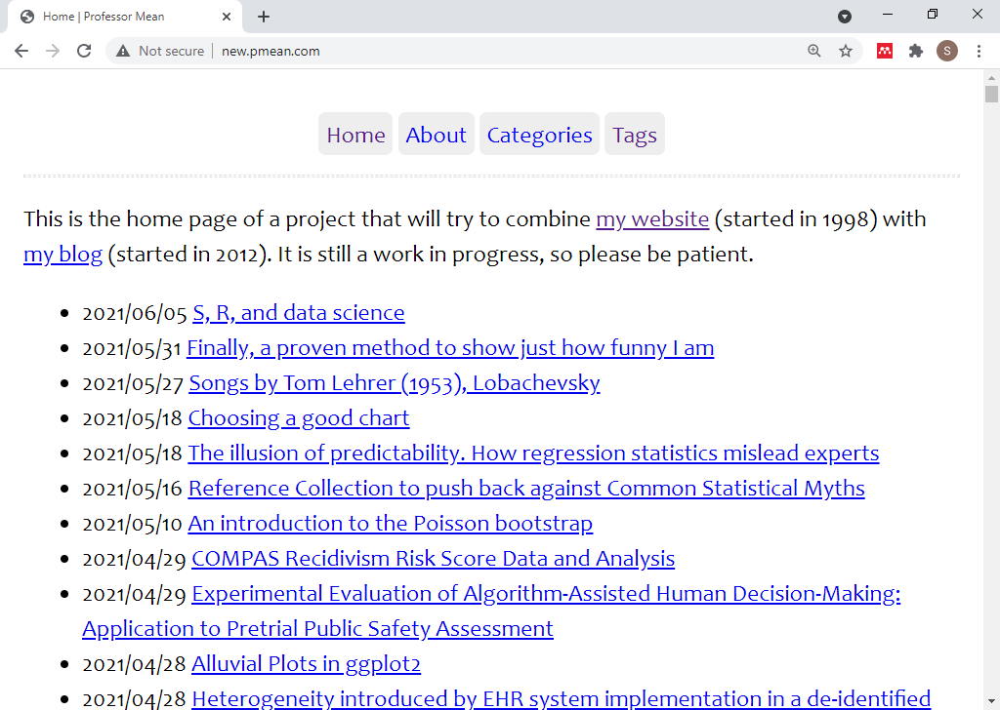


<div class="notes">[[Speaker notes]]

I have a blog and a website. I am trying to combine the two into a single site. It's a work in progress, but here is the url for my effort.

</div>

### Github, https://github.com/pmean

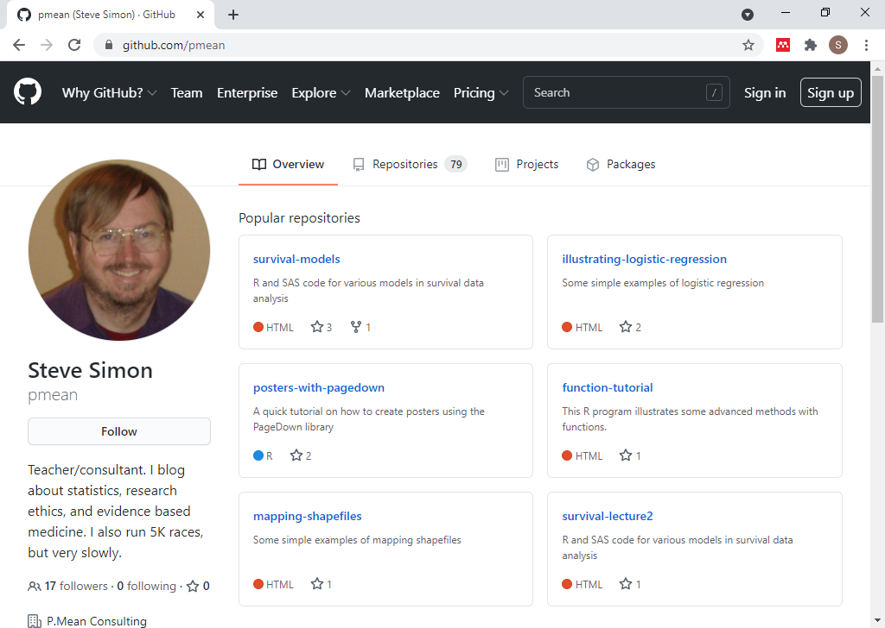


<div class="notes">[[Speaker notes]]

I have a github site. It includes some of the programs used in this class. All the material is public domain, but please do not plagiarize your homework from this github site.

</div>

### Canvas site

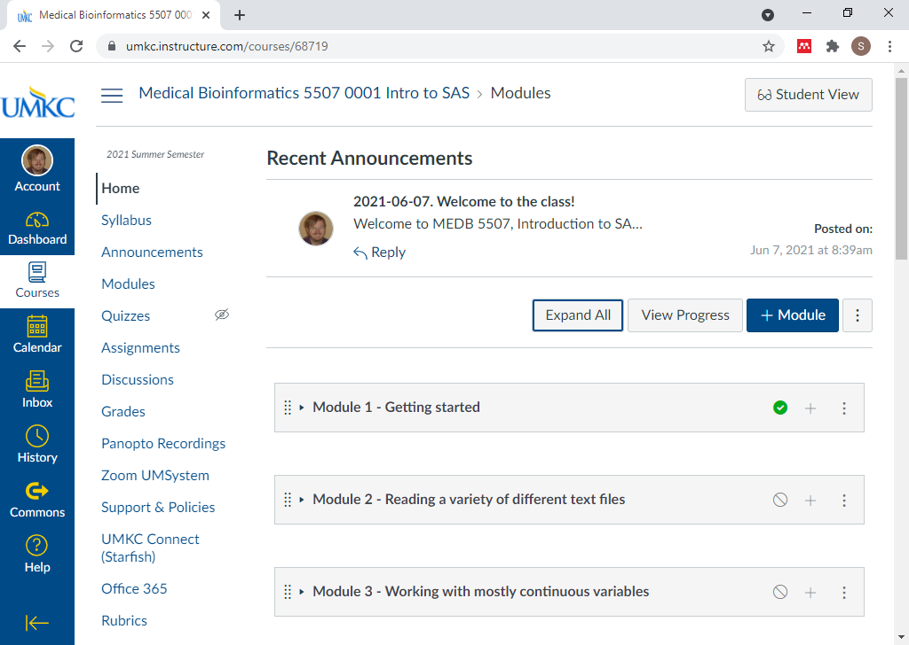


<div class="notes">[[Speaker notes]]

My course is currently under development in Canvas. This is the instructors view. You will see a slightly different interface.

</div>

### Break #1

+ What have you learned
  + Information about me (Steve Simon)
+ What's coming next
  + Where can you get SAS

### Where can you get SAS

+ SAS OnDemand for Academics (SODA)
+ On your UMKC computer
  + Desktop, hard-wired to UMKC network
  + No laptops, no home computers
+ UMKC Student labs
  + Royall Hall 303, Lab #17 and #38
+ UMKC Remote Labs
+ Alternatives not covered in this class
  + SAS University
  + Jupyter lab
  + SASMarkdown. StatWeave

<div class="notes">[[Speaker notes]]

There are several ways that you can get access to SAS software. One of these three options should work for you.

The recommended option is SAS OnDemand for Academics. This version of SAS runs in the cloud. It is restricted to educational uses only.

You can get it running on your UMKC computer, and I will show you how to do this.

You can also access SAS on the UMKC Remote Labs. I'll also show this.

There are some alternatives which I will not show, but if you are interested in investigating, let me know. I am glad to talk privately with anyone about this.

There is a very nice product that I have used in the past called SAS University. It is very difficult to install, but once you have it running, it is very easy to use.

If anyone is a fan of Jupyter, you should note that Jupyter lab can run SAS code. You probably need to have SAS already running on your computer, and I have not had time to experiment with this. 

If you are familiar with the R programming environment, there are a couple of packages, SASMarkdown and StatWeave, that allow you to integrate SAS code and output into your workflow. I have not had time to experiment with this either.

</div>

### SAS on your UMKC computer

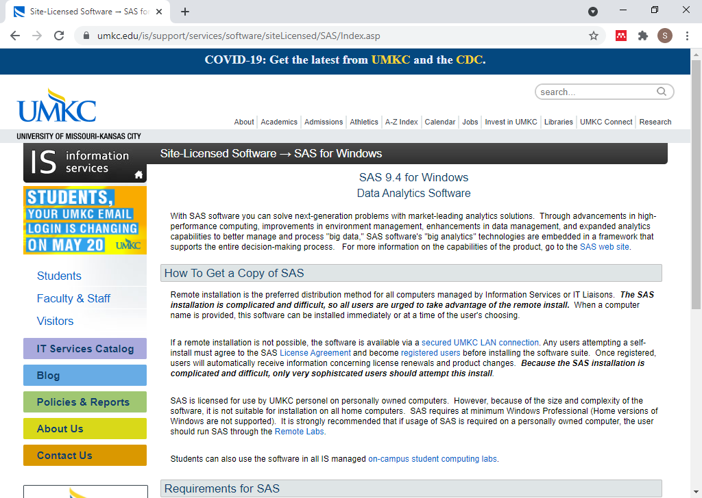

<div class="notes">[[Speaker notes]]

This screenshot may be too small for you to read, but you can find the proper link on the recommended readings list for this week on the Canvas website. SAS works for any desktop computer on the UMKC campus. But it has to be hard-wired to the UMKC network. By hard-wired, I mean that there is an ethernet cable connecting your computer to a socket on the wall.

If you are fortunate enough to have access to a hard-wired computer, you can get SAS installed easily. Someone else will do it for you. It may already be sitting on your computer.

With a very few rare exceptions, you cannot get UMKC to load SAS on a laptop computer or on a home computer. This because of the license agreement that UMKC signed with SAS Institute. It does not allow for home use of SAS.

</div>

### UMKC Remote Labs


<div class="notes">[[Speaker notes]]

You can also run SAS through the UMKC Remote Labs. It should run fine on most browsers, though it can be a bit fussy.

</div>

### SODA login page

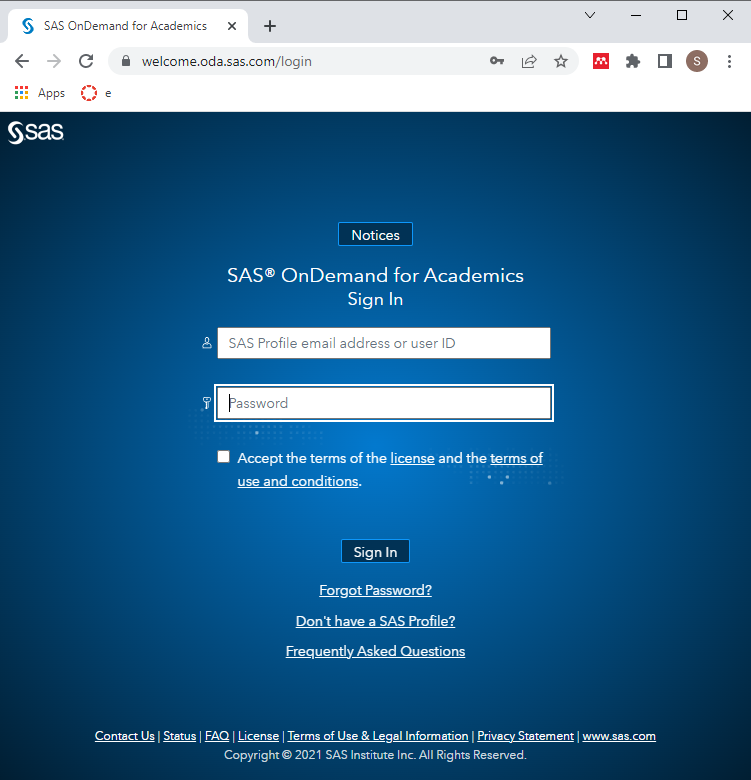

<div class="notes">[[Speaker notes]]

Here is the login page for SAS OnDemand for Academics. If you have used SAS a lot in the past, you may already have a SAS profile sign-in. More likely, you do not have such an account. You set it up by clicking on the "Don't have a SAS Profile?" link.

</div>

### SODA create profile (1 of 2)

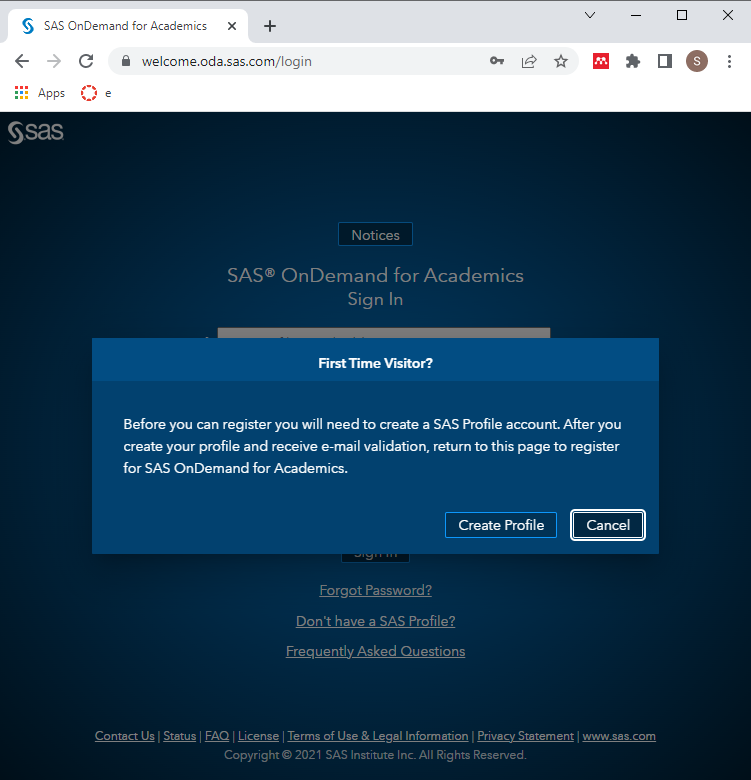

<div class="notes">[[Speaker notes]]

SAS guides you through the process fairly nicely. Read this dialog box. In particular, note that the profile by itself is not enough. You will still have to register for SAS OnDemand for Academics once the profile is created.

</div>

### SODA create profile (2 of 2)

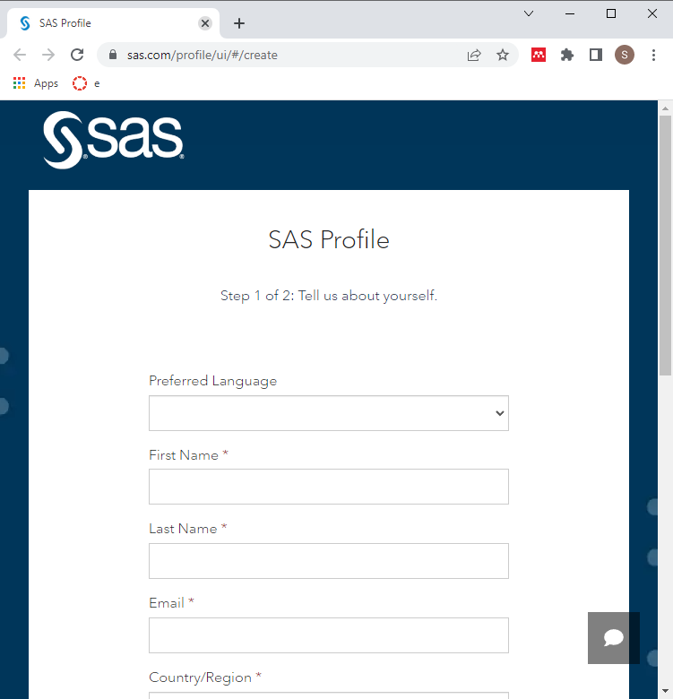

<div class="notes">[[Speaker notes]]

I won't take you through all of the steps, but SAS is not asking for a lot of information. Note the box at the bottom of the screen (not shown in this screenshot) that asks if you want to get promotional emails from SAS Institute. It's easy enough to say "Yes" here and then unsubscribe later if you find the emails are not worth the trouble. Or you can say "No" right away if you prefer.

</div>

### SODA dashboard (1 of 2)


<div class="notes">[[Speaker notes]]

This is the SAS OnDemand Dashboard. It offers two options, SAS Studio and a Python interface to SAS. I have not used the Python interface, but I'm sure it is pretty simple for someone already experienced with Python.

The top of the page has links to Planned Events and Notices. Beneath that are links to Applications, Enrollments, and Courses.

To load SAS Studio, click on the top link.

</div>


### SODA enrollments

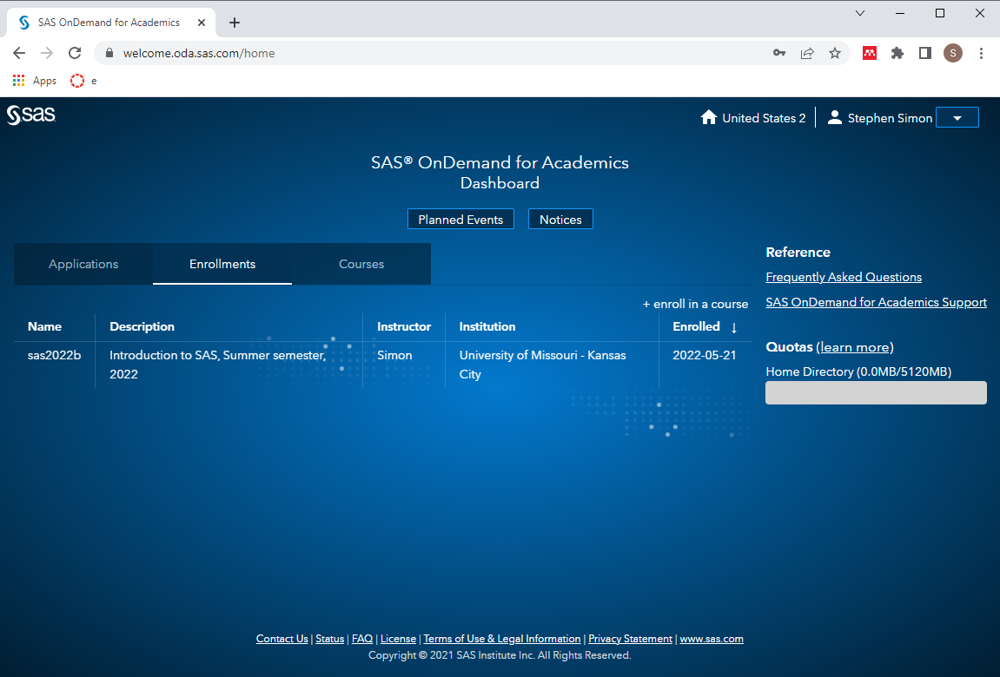

<div class="notes">[[Speaker notes]]

The enrollments page allows you to "enroll" in my class. This isn't really needed. It adds a folder with all the data files that I use in this class, but you could also get these from my github site.

</div>

### SODA dashboard (2 of 2)


<div class="notes">[[Speaker notes]]

Go back to the dashboard by clicking on the Applications link. To load SAS Studio, click on SAS Studio link.

</div>

### SODA studio (1 of 3)

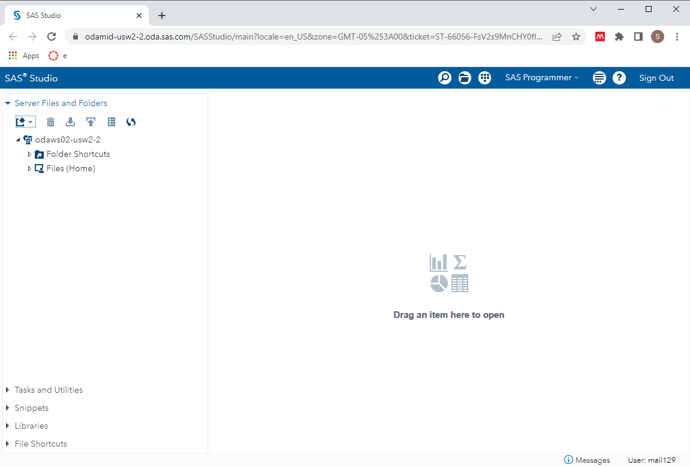

<div class="notes">[[Speaker notes]]

This is what SAS Studio looks like. The first thing you should do is to create a directory structure.

</div>

### SODA studio (2 of 3)

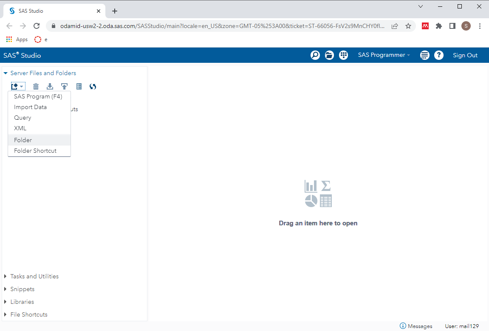

<div class="notes">[[Speaker notes]]

Click on the leftmost icon beneath "Server Files and Folders".

Create three directories: data, results, and src.

</div>

### SODA studio (3 of 3)

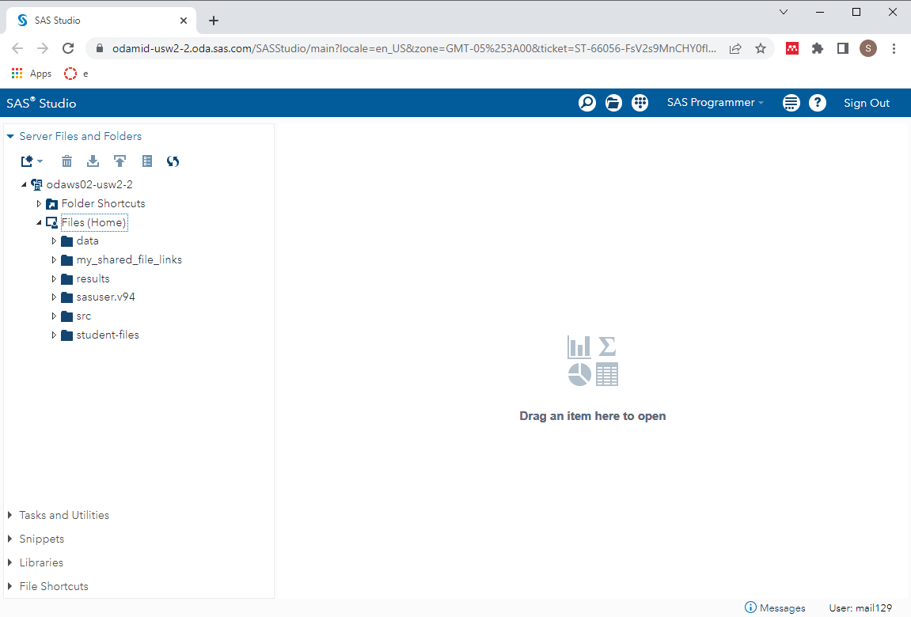

<div class="notes">[[Speaker notes]]

Create three directories: data, results, and src.

There are some folders already in there from SAS, my_shared_file_links, sasuser.v94, and student-files. Don't worry about these folders for now.

</div>

### Directory structure

+ One directory for the entire class
  + Possibly one directory for each module
+ Subdirectory structure
  + src
  + results
  + data
  + others?
    + images
    + doc
    
<div class="notes">

Make sure you store things consistently. This part of the requirements for this class.

Store all your programs for this class in a single directory. You can call it "sas" or "5507" or anything you like. Some people may prefer to create a separate directory for each module in this class. That's fine also.

Most importantly, create three subdirectories, src, results, and data. Store your programs in src, your output in results and your raw and intermediate datasets in data. You may wish to create other subdirectories, such an images folder for any graphs you produce, a doc folder for any documentation you collect, but the three important subdirectory folders are src, results, and data.

</div>


### Break #2

+ What have you learned
  + Where you can get SAS
+ What's coming next
  + Your first SAS program

### SAS program editor

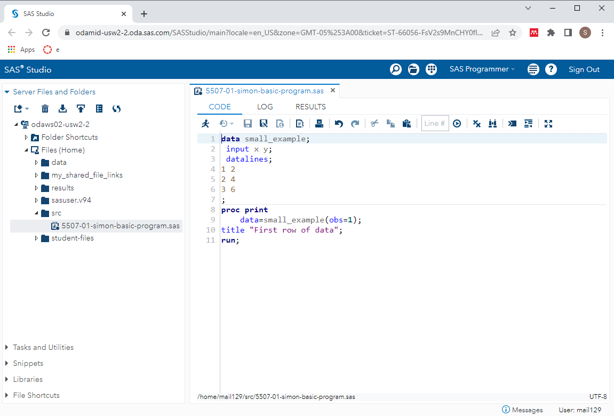


<div class="notes">[[Speaker notes]]

If you have SAS running, try running the following sample program. Here's a simple test program. After you type this program in, click on FILE | SAVE and store your program somewhere safe. Save it to a location where you can remember things.

If you are using the computer labs, you need to save things on a network folder. You can't use a USB stick.

</div>

### SAS Test program (1 of 2)

```
data small_example;
 input x y;
 datalines;
1 2
2 4
3 6
;
```

<div class="notes">[[Speaker notes]]

Here is the program I want you to type in.

I like to put lots of blank lines in.

The data statement creates a dataset with the name "small_example". Normally you would use a two part name. Not here. This is a simple throw-away example, so it can use a one part name. That means it disappears once the program is done. We'll explain this further in a later video.

The input statement tells SAS to expect two variables and assigns them the names x and y.

The datalines statement tells SAS to read the data directly below this line. This is NOT a recommended practice. You should normally keep your data separate from your code. I am doing this only for the sake of simplicity. You will see in just a minute how to handle data that comes in a separate file.

The three lines of data follow. A single semicolon tells SAS that this is the end of the data.

</div>

### SAS Test program (2 of 2)

```
proc print
    data=small_example;
  var x y;
  title1 "First row of data";
run;
```

<div class="notes">[[Speaker notes]]

The print procedure will print part or all of a dataset. 

You specify the name of the dataset with the data= option. The options obs=1 tells SAS to print only the first row. I like the obs option a lot.

The title1 statement prints a descriptive title on the first line of output.

The run statement tells SAS that there is no more information associated with this procedure.

The thing I always worry about is leaving out a semicolon. Please watch these closely.

Be careful and back up your programs regularly. There is no autosave feature in SAS. 

When you finish the program, save it in the src directory. Then click on the run button. The run button is a guy who looks like he is running.

Try this yourself. It's a baby step. If it works then you can take more baby steps.

</div>

### SAS results window (1 of 2)

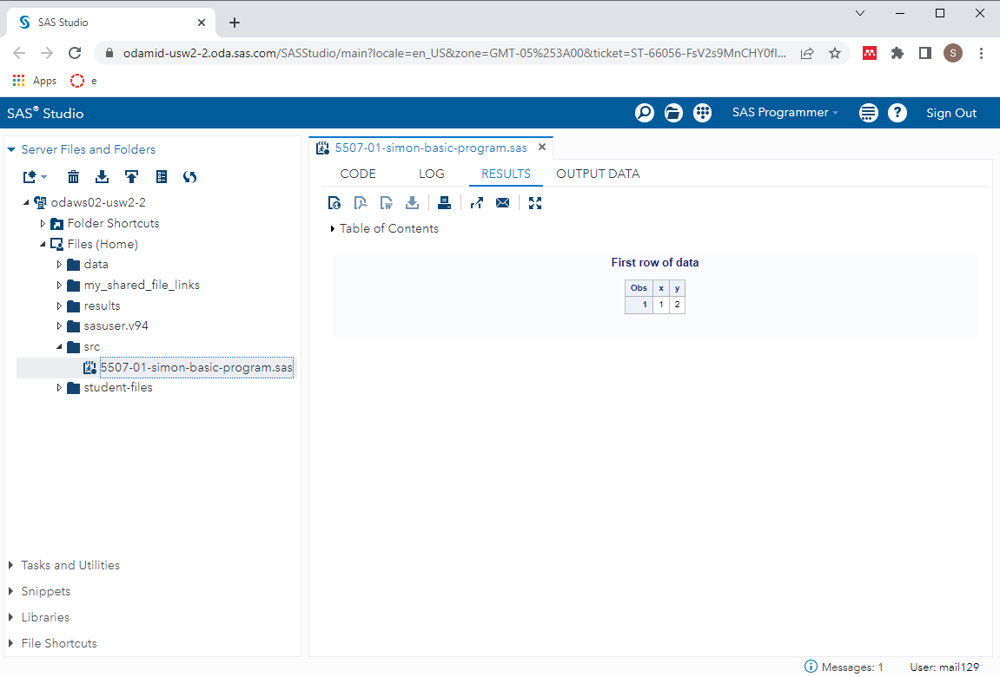


<div class="notes">[[Speaker notes]]

When the program runs, your output appears in the results window.

</div>

### SAS log window (1 of 4)

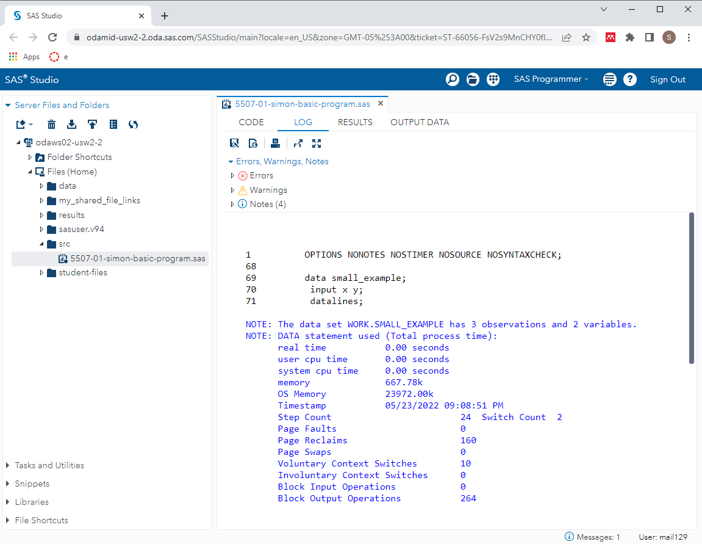


<div class="notes">[[Speaker notes]]

The font here is a bit small, but notice that there are no red messages indicating warnings or errors. We're thrilled when we see no warnings or error messages. We're always looking for warnings and errors. We also watch closely the number of observations.

</div>

### SAS log window (2 of 4)

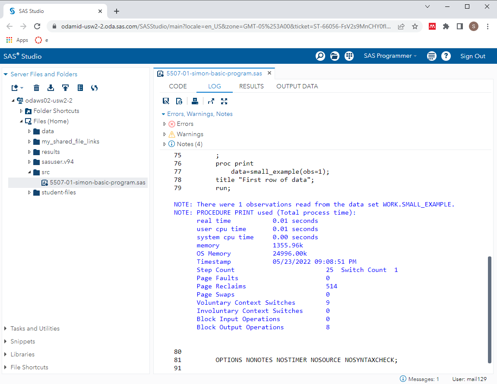


<div class="notes">[[Speaker notes]]

Always start looking from the top, and scroll slowly down to the bottom. No warnings or error messages here either.

</div>

### SAS log window (3 of 4)


```
1    data test_example;
2     input x y;
3     cards;

NOTE: The data set WORK.TEST_EXAMPLE has 3 observations and 2 variables.
```

<div class="notes">[[Speaker notes]]

Always watch the log to see that you have read in the proper number of observations.

</div>


### Log messages (4 of 4)

```
 75         ;
 76         proc print
 77             data=small_example(obs=1);
 78         title "First row of data";
 79         run;
 
NOTE: There were 1 observations read from the data set WORK.SMALL_EXAMPLE.
```

<div class="notes">[[Speaker notes]]

..and that you are analyzing the proper number of observations.

</div>

### Where is the output?

SAS has several options for storing output.

- In the output window
- As an html file
- As a pdf file

<div class="notes">[[Speaker notes]]

Output is tricky. I want to talk in more detail later about this, but you can take the output and save it several different ways.

</div>

### Break #3

+ What have you learned
  + Your first SAS program
+ What's coming next
  + Live demonstration (1 of 5)
  
### Live demonstration (1 of 5)

### Break #4

+ What have you learned
  + Live demonstration (1 of 5)
+ What's coming next
  + History of SAS

### History of SAS

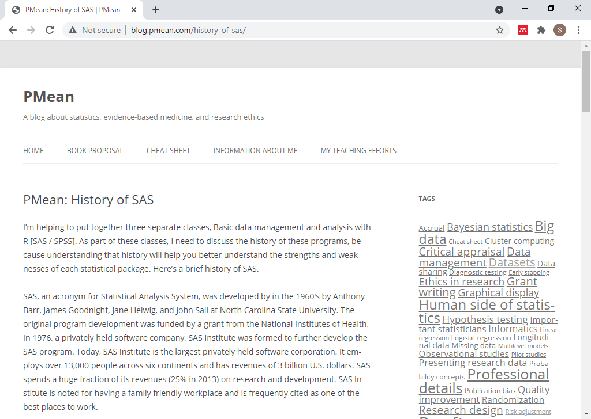

<div class="notes">[[Speaker notes]]

History of SAS. If you understand where SAS comes from, you understand some of the limitations.

This is on my blog.

</div>

### History of SAS

+ SAS=Statistical Analysis System
+ Founders come from NCSU
  + Anthony Barr
  + James Goodnight
  + Jane Helwig
  + John Sall
+ Originally for IBM mainframes
  + PL/1, FORTRAN, Assembler
  + Translated to C in 1985

<div class="notes">[[Speaker notes]]

SAS was developed at NC State. 

In the 1960's, IBM mainframes dominated. So SAS was originally written just for these systems. Originally, SAS was written in a mix of PL/1, Fortran, and Assembler. Millions of lines of code re-written in C in 1985 so that SAS could run on personal computers.

SAS was built in the 1960s. There is very little software written in the 1960s that is still in regular use. It shows the staying power of SAS, but it is "long in the tooth."

</div>

### History of SAS

+ SAS Institute
  + Founded 1976
  + Privately held
  + Huge spending on R&D
  + Great place to work

<div class="notes">[[Speaker notes]]

SAS Institute was formed in 1976. It is a privately held company.

SAS spends over a quarter of its budget, which is a huge fraction, on Research and Development.

The SAS Headquarters is in Cary, NC, and it is huge. It is a pretty nice place to work with many family friendly policies even from the 1980s. SAS Institute has been rated in many magazine reviews as one of the top places to work.

</div>

### History of SAS

+ SAS licensing model
  + Great for large organizations
  + Prohibitively expensive for individuals
+ Excellent training resources
  + SAS publications
  + Certification program
  + SAS user conferences
+ Other products
  + JMP, 1989
  + Viya, 2017

<div class="notes">[[Speaker notes]]

SAS has a licensing model that is aggressively priced for large corporations but prohibitively expensive for individual consultants.

SAS is oriented around various data sets and procedures. There is a menu driven version of SAS, but it is not very good. If you want a good package that is totally menu driven, use SPSS.

SAS has a licensing model that is prohibitive for individual consultants. They offer a free product, SAS University, that is intended for teaching.

SAS has literally hundreds of books published through an in-house publisher. It has a certification program that allows you to earn credentials that can help you in your job search. SAS also sponsors some very extravagant user conferences.

SAS Institute has many products beyond SAS. Most notable of these is JMP (pronounced "jump"). This is an acronym for John's Macintosh Product. it was released in 1989 when the Macintosh series of computers had many graphical user interface features that were not yet available for other personal computers. It pioneered (and continues to lead) in many interactive and dynamic graphic features.

SAS Viya is a cloud based platform with many advanced visualization and machine learning algorithms not found in SAS.

</div>

### Break #5

+ What have you learned
  + History of SAS
+ What's coming next
  +  Documentation header

  
### Documentation header

```{r}
tx <- readLines("5507-01-simon-documentation-header.sas")
tx[1:5] %>%
  paste0(collapse="\n") -> tx1  
```

```{}
`r tx1`
```

<div class="notes">

Here is a documentation header. It belongs on the top of every SAS program that you run.

</div>

### Break #6

+ What have you learned
  +  Documentation header
+ What's coming next
  + Live demonstration (2 of 5)


### Live demonstration (2 of 5)

### Break #7

+ What have you learned
  + Live demonstration (2 of 5)
+ What's coming next
  + Permanent storage

### Permanent storage (1 of 4)

```{r}
tx <- readLines("5507-01-simon-permanent-storage.sas")
tx %>% 
  str_subset(fixed("*")) %>%
  paste0(collapse="\n") -> tx1  
```

```{}
`r tx1`
```

<div class="notes">

Let's look at a modified program that stores the data in a permanent location.

Here is the documentation header. You should include a documentation header with any program you run for this class.

</div>

### Permanent storage (2 of 4)

```{r}
tx %>% str_which("^libname") -> i1
tx %>% str_which("^libname") -> i2
tx %>%
  extract(i1:i2) %>%
  paste0(collapse="\n") -> tx2  
```


```{}
`r tx2`
```

<div class="notes">

Notice the top line in this section. This is the libname statement. It tells SAS that you want to establish a permanent storage location at ../data. The ../data tells the computer system to go one level closer to the root directory, and then slide into the data subdirectory.

You assign a brief name (no more than eight characters!) to this location. In my program, I use the name "perm" but anything is fine here.

Then you prefix the dataset name simple_example with the libname location and a dot. This is called a two part name by SAS. The first part gives the permanent location folder and the second part gives the file name.

Once you establish a two-part name for a dataset, you assure that it is stored for later re-use.

</div>

### Permanent storage (3 of 4)

```{r}
tx %>% str_which("^data ") -> i1
tx %>% str_which("^;") -> i2
tx %>%
  extract(i1:i2) %>%
  paste0(collapse="\n") -> tx2  
```


```{}
`r tx2`
```

<div class="notes">

Notice the top line in this section. This is the libname statement. It tells SAS that you want to establish a permanent storage location at ../data. The ../data tells the computer system to go one level closer to the root directory, and then slide into the data subdirectory.

You assign a brief name (no more than eight characters!) to this location. In my program, I use the name "perm" but anything is fine here.

Then you prefix the dataset name simple_example with the libname location and a dot. This is called a two part name by SAS. The first part gives the permanent location folder and the second part gives the file name.

Once you establish a two-part name for a dataset, you assure that it is stored for later re-use.

</div>

### Permanent storage (4 of 4)

```{r}
tx %>% str_which("proc") -> i3
tx %>% str_which("run;") -> i4
tx %>%
  extract(i3:i4) %>%
  paste0(collapse="\n") -> tx3  
```


```{}
`r tx3`
```

<div class="notes">

Once you establish a two-part name, use it everywhere.

</div>
  
### Re-using data in permanent storage, part 1

```{r}
tx <- readLines("5507-01-simon-re-use.sas")
tx %>% 
  str_subset(fixed("*")) %>%
  paste0(collapse="\n") -> tx1  
```

```{}
`r tx1`
```

<div class="notes">

Here's a program that re-uses the dataset you just placed in permanent storage.

First, let's show the documentation header.

</div>

### Re-using data in permanent storage, part 2

```{r}
tx %>% str_which("^libname") -> i1
tx %>% str_which("run;") -> i2
tx %>%
  extract(i1:i2) %>%
  paste0(collapse="\n") -> tx2  
```


```{}
`r tx2`
```

<div class="notes">

Notice that there is no data step in this program, you start with a libname statement that reminds SAS where you stored the permanent dataset. Then you just refer to the two-part name in the data= option of any SAS procedure. Here we are computing some simple descriptive statistics using proc means.

</div>

### Break #8

+ What have you learned
  + Permanent storage
+ What's coming next
  + Live demonstration (3 of 5)

### Live demonstration (3 of 5)

### Break #9

+ What have you learned
  + Live demonstration (3 of 5)
+ What's coming next
  + Saving output as pdf

### Saving output as pdf (1 of 4)

```{r}
tx <- readLines("5507-01-simon-save-output.sas")
tx %>% 
  str_subset(fixed("*")) %>%
  paste0(collapse="\n") -> tx1  
```

```{}
`r tx1`
```

<div class="notes">

Let's look at a modified program that stores your output as a pdf file.

Here is the documentation header.

</div>

### Saving output as pdf (2 of 4)

```{r}
tx %>% str_which("^libname") -> i1
tx %>% str_which("output.pdf") -> i2
tx %>%
  extract(i1:i2) %>%
  paste0(collapse="\n") -> tx2  
```


```{}
`r tx2`
```

<div class="notes">

The ods statement should be placed near the top of the code, certainly before any SAS procedure that produces output.

</div>

### Saving output as pdf (3 of 4)

```{r}
tx %>% str_which("^data ") -> i1
tx %>% str_which("^;") -> i2
tx %>%
  extract(i1:i2) %>%
  paste0(collapse="\n") -> tx2  
```


```{}
`r tx2`
```

<div class="notes">

The ods statement should be placed near the top of the code, certainly before any SAS procedure that produces output.

</div>

### Saving output as pdf (4 of 4)

```{r}
tx %>% str_which("proc") -> i3
tx %>% str_which("close;") -> i4
tx %>%
  extract(i3:i4) %>%
  paste0(collapse="\n") -> tx3  
```


```{}
`r tx3`
```

<div class="notes">

Near the bottom, you turn off the output. Place this AFTER the last SAS procedure that produces output.

</div>

### Break #10

+ What have you learned
  + Saving output as pdf
+ What's coming next
  + Live demonstration (4 of 5)
  
### Live demonstration (4 of 5)

### Break #11

+ What have you learned
  + Live demonstration (4 of 5)
+ What's coming next
  + Getting data from a file
  
### Reading data from a file (1 of 4)

```{r}
tx <- readLines("5507-01-simon-read-data.sas")
tx %>% 
  str_subset(fixed("*")) %>%
  paste0(collapse="\n") -> tx1  
```

```{}
`r tx1`
```

<div class="notes">

It is a very basic principle of good computing practices that you keep your data and your program in separate files. This code shows you how to do this using the infile statement.

</div>

### Reading data from a file (2 of 4)

```{r}
tx %>% str_which("^libname") -> i1
tx %>% str_which("data.pdf") -> i2
tx %>%
  extract(i1:i2) %>%
  paste0(collapse="\n") -> tx2  
```


```{}
`r tx2`
```

<div class="notes">

The filename statement tells SAS where a particular dataset is stored: both the path and the name of the file. It associates that path and filename with a variable that you refer to using the infile statement.

</div>

### Reading data from a file (3 of 4)

```{r}
tx %>% str_which("^data ") -> i1
tx %>% str_which("input x y") -> i2
tx %>%
  extract(i1:(i2+1)) %>%
  paste0(collapse="\n") -> tx3  
```


```{}
`r tx3`
```

<div class="notes">

The filename statement tells SAS where a particular dataset is stored: both the path and the name of the file. It associates that path and filename with a variable that you refer to using the infile statement.

</div>

### Reading data from a file (4 of 4)

```{r}
tx %>% str_which("proc") -> i3
tx %>% str_which("close;") -> i4
tx %>%
  extract(i3:i4) %>%
  paste0(collapse="\n") -> tx4  
```


```{}
`r tx4`
```

<div class="notes">

The last part of the program remains unchanged.

</div>
  
### Reading data from a file, part 4

```{r}
tx <- readLines("../data/six-numbers.txt")
tx %>% 
  paste0(collapse="\n") -> tx1  
```

```{}
`r tx1`
```

<div class="notes">

This is what your data file looks like. It is just six numbers arranged in a grid.

You will see many variations on the layout of data, and SAS can handle just about any variation. You will see how to handle many of those variations in an upcoming module.

</div>

### Break #12

+ What have you learned
  + Getting data from a file
+ What's coming next
  + Live demonstration (5 of 5)
  
### Live demonstration (5 of 5)

### Summary
+ What have you learned?
  + Introducing your instructor
  + Where you can get SAS
  + Your first SAS program
  + History of SAS
  + Directory structure and documentation header
  + Permanent storage
  + Saving your output
  + Getting data from a file

