```{r setup, echo=FALSE}
knitr::opts_chunk$set(echo=FALSE, comment="")
suppressMessages(suppressWarnings(library(dplyr)))
suppressMessages(suppressWarnings(library(knitr)))
suppressMessages(suppressWarnings(library(magrittr)))
suppressMessages(suppressWarnings(library(stringr)))
```

### Overview

+ Using variable labels
+ Printing a small piece of data
+ Simple descriptive statistics
+ Printing row with smallest/largest value
+ Missing value logic
+ Simple transformations
+ Histograms
+ Correlations
+ Scatterplots

<div class="notes">

author: Steve Simon

date: created 2021-05-30

purpose: to produce slides for module01 videos

license: public domain

Here is an overview of the topics I want to cover in module02.

</div>

### Review definitions

+ Categorical
  + Small number of possible values
  + Each value associated with a category
+ Continuous
  + Large number of possible values
  + Potentially any value in an interval
  
<div class="notes">

Before we start, let's review a couple of definitions. 

A **categorical variable** is a variable that can only take on a small number of values. Each value is usually associated with a particular category.

Examples of categorical variables are

  * sex (Male or Female),
  * race (White, Black, Native American, etc.),
  * cancer stage (I, II, III, or IV),
  * birth delivery type (Vaginal, C-section). 

A **continuous variable** is a variable that can take on a large number of possible values, potentially any value in some interval.

Examples of continuous variables are

  * Birth weight in grams,
  * gestational age,
  * fasting LDL level.

There are some variables that are on the boundary between categorical and continuous, but it is not worth quibbling about here. 

The point to remember is that the types of graphs that you use and the types of statistics that you compute are dependent on many things, but first and foremost on whether the variables are categorical, continuous, or a mixture.

Today, you will see examples involving mostly continuous variables. 
  
</div>
  

### Semicolons are important

+ Ends every SAS statement
+ Easy to forget
+ Use this to your advantage
  + Several short lines
  + Indent continuations

<div class="notes">

Before I go too far, let me mention and important thing. Every SAS statement ends in a semicolon. This is important. You will forget a semicolon and it will lead to a cryptic error message. So here's a quick hint. If you get an error message on a certain line of code, look to see if you forgot a semicolon on the previous line. It happens to me all the time and I've been using SAS for decades.

</div>  

### Example of stretching statement across multiple lines.

One long line

```{}
statement option1 option2 option3 option4;
```

versus several short lines.

```{}
statement
  option1
  option2
  option3
  option4;
```

<div class="notes">

The use of semicolons is nice, in a way, because it allows you to stretch a complicated SAS statement across two or more rows of your program. This can often make your program more readable. It is hard to read a long line of code. Your eye has to scan left to right and you can sometimes lose track of which line you are on. Most newpapers place their articles in narrow columns because it makes them easier to read.

There is no official rule of thumb on this, but I do try to keep my lines below 50 characters. I also try to indent substatements with a data step or procedure. I use blank lines between data steps and procedures.


Don't obsess about this now, but you'll see a fairly consistent coding style that I use for my SAS code. You don't have to follow my format, of course, which might be a bit too extreme for your tastes. Just experiment with things a bit until you can settle on a layout that you are comfortable with.

</div>  

### SAS code, documentation header

```{r}
tx <- readLines("m02-5507-simon-continuous-variables.sas")
px <- function(tx, s1, s2, xtra_lines=-2) {
  tx %>% str_which(s1) -> i1
  tx %>% str_which(s2) -> j1
  if (length(i1)==0) return("No beginning found")
  if (length(j1)==0) return("No ending found")
  if (length(i1) > 1) return("Multiple beginnings found")
  if (length(j1) > 1) return("Multiple endings found")
  j1 <- j1 + xtra_lines
  tx %>%
    extract(i1:j1) %>%
    paste0(collapse="\n") %>%
    return
}
```

```{}
`r px(tx, "^\\* m02-", "^\\* license", xtra_lines=0)`
```

<div class="notes">

Here is the documentation header for a program that will show how to work with a dataset with mostly continuous variables.

</div>

### SAS code: filename, libname, ods statements

```{}
`r px(tx, "^%let", ("Part01"))`
```

<div class="notes">

The filename statement tells you where the raw data is stored.

The libname statement tells you where SAS will store any permanent datsets.

The ods statement tells you that SAS is going to store the results with a particular filename and in pdf format.

</div>

### SAS code, input statement (1/2)

```{}
`r px(tx, "Part01", "^    bmi$", xtra_lines=0)`
...
```

<div class="notes">

The input statement is very long.

</div>


### SAS code, input statement (2/2)

```{}
...
`r px(tx, "^    ffw$", "Part02")`

```

<div class="notes">

Here's the rest of it.

</div>

### Rules for variable names

+ Can use mix of
  + letters (A-Z, a-z),
  + numbers (0-9)
  + underscore (_)
  + no blanks
  + no symbols
+ Can't start with a number
  + "a1" but not "1a"
+ Capitalization not important
  + BMI, Bmi, bmi are same
+ Up to 32 characters in length

<div class="notes">

There are important rules for variable names in SAS. You can use a mix of letters, numbers, and the underscore. You can't use blanks or any special symbols like the dollar sign ($) or the dash/minus sign.

You can't start with a number. So "a1" is okay, but "1a" is not.

Capitalization is not important in SAS. So you can call your variable "BMI" with all caps, or "Bmi" with mixed capitals or "bmi" with all lower case. SAS treats all of these the same.

Your variable name has to be 32 characters or less in length.

I'm using the variable names provided but if you create your own names, use brief (but descriptive) name for EVERY variable in your data set. There's no precise rule, but names should be around 8 characters long. Longer variable names make your typing tedious and much shorter variable names makes your code terse and cryptic.

I'm a bit more terse with these variable names than I normally would be just to reduce the amount of typing you have to do.

You should avoid special symbols in your variable names especially symbols that are likely to cause confusion (the dash symbol, for example, which is also the symbol for subtraction). You should also avoid blanks. These rules are pretty much universal across most statistical software packages.

There are times when you'd like to have a blank in your variable name and you can use two special symbols in SAS (and most other statistical pacakges).
  
Here's how you can simulate blanks without actually using blanks.

  * the underscore symbol (above the minus key
  on most keyboards) and
    
  * the dot (period). (Note that SAS does not allow you to use the period this way.)

These symbols create some artificial spacing that mimics the blanks. Another approach is  "CamelCase" which is the mixture of upper and lower case within a variable name with each uppercase designating the beginning of a new "word".

</div>

### Recommendations for variable names

+ Avoid generic names (x1, var01, etc.)
+ Keep it short
  + Use commonly known abbreviations...
  + ...but nothing cryptic
+ Use all lower case (age, not AGE or Age)
+ Separate words with underscores
  + fat_brozek, not fatbrozek
+ Alternative: CamelCase
  + FatBrozek
+ Caution: Writer's Exchange website
  + www.writersexchange.com
  
<div class="notes">

Your variable names should by descriptive. Avoid generic names like x1, var01, and so forth.

Keep things short. You can use commonly known abbreviations, such as "wt" for "weight". But avoid any cryptic abbreviations.

I like to keep everything in lower case. It is more readable than all upper case, and easier to remember than a mixture of upper and lower case. Some people prefer an initiial upper case, and there's nothing wrong with that. It is important, however, to be consistent.

You can use two or three short words in a variable name, but be sure to separate them using underscores. So the variable for percentage body fat as measured by Brozek's equation is "fat" and "brozek" separated by an underscore. Some people prefer CamelCase, where each word starts with an initial capital letter: capital F fat, capital B brozek.

The one thing you do want to avoid is just running two or three words together and all lower case. There's a story about a group that started up in the era before the web called Writer's Exchange. As you can guess this was a resource for new authors. When the web came out, they decided to put their resources up on a website, www.writersexchange.com. That seemed logical enough, but then someone notices that you could read the website as "www dot writer sex change dot com". Not exactly the image they wanted.

</div>

### Break #1

+ What have you learned so far
  + Rules for variable names
  
+ What's next
  + Using variable labels
  + Printing a small piece of data

### SAS variable labels

+ Longer description of a variable
  + Can include blanks, special symbols
  + Internal documentation
  + Labels substituted on some (but not all) output
+ Required in this class (see grading rubric)
+ Recommendations for variable labels
  + Judicious use of upper and lower case
  + Spell out abbreviations
  + Specify units of measurement
  + Any other important details

<div class="notes">

SAS offers an opportunity for you to add documentation to your program about individual variables. These are called variable labels. They have almost no restrictions. You can use blanks, or special symbols like a dollar sign or a dash. The documentation that variable labels provide is mostly internal, but these labels are substituted in a few places like some graphs.

I strongly recommend use of variable labels and will require them for any homework you submit in this class. See the grading rubric for details.

What makes a good variable label? First take advantage of a mixture of upper and lower case to make your labels more readable. Spell out any abbreviations, even obvious abbreviations. If your variable has a measurement unit, specify that unit in your variable label. If there are other important details, put these in the variable label as well.

</div>

### SAS code, labels (1/2)

```{}
`r px(tx, "Part02", "^    ffw=")`
...
```

<div class="notes">

Every variable in a SAS program should have a label. This label will make some (but not all) of the SAS output more readable. it is also part of the internal documentation of your program. Note that some of these labels do not fit well in this Powerpoint slide, but that's okay.

</div>

### SAS code, labels (2/2)

```{}
...
`r px(tx, "^    neck=", "Part03")`

```

<div class="notes">


</div>

### SAS code, proc print

```{}
`r px(tx, "Print a small piece", "of the fat data set", 1)`
```

<div class="notes">

It's always a good idea to print out a small piece of your data to make sure everything is okay.
  
The data option tells SAS what data set you want to print. If you omit this, SAS will print the most recently created data set.
  
The obs=10 option limits the number of rows printed to the first 10. For large data sets, you should always take advantage of this option.
  
The var statement limits the variables that you print to those that you specify. Again, this is important for large data sets. 

Please do not ever print more than ten rows or more than five variables, if you can help it. Excessively lengthy outputs will lose you a few points (see the grading rubric).
  
The title statement tells SAS to provide a descriptive title at the top of the page of output.
  
The run statement says you're done with the procedure.

</div>

### SAS output, proc print

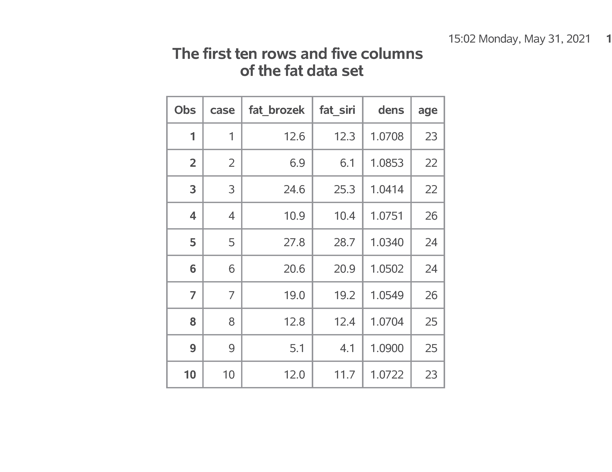

<div class="notes">

This is what your output looks like.

</div>

### Break #2

+ What have you learned so far
  + Using variable labels
  + Printing a small piece of data
  
+ What's next
  + Simple statistics
  + Printing row with smallest/largest value

### SAS code, proc means

```{}
`r px(tx, "Part04", "Part05")`
```

<div class="notes">

The means procedure will produce descriptive statistics for your data. By default, it will produce the count of non-missing values, the mean, the standard deviation, and the minimum and maximum values, but I am listing them explicitly here, just for show.

The data option tells SAS which data set you want descriptive statistics on, and the var statement tells SAS which variable(s) you want descriptive statistics on.

</div>

### SAS output, proc means

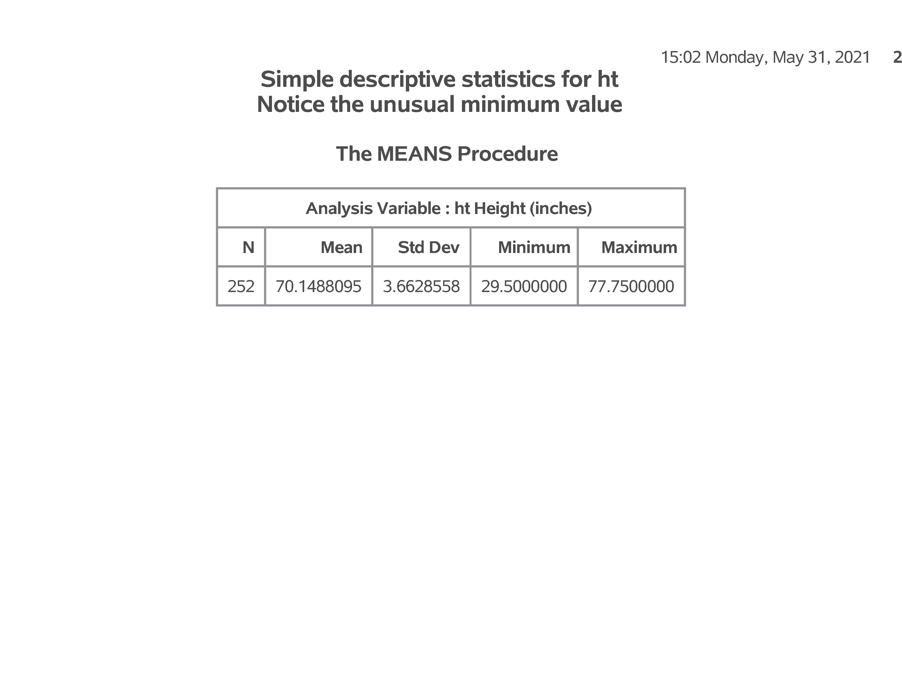

<div class="notes">

This is what your output looks like.

Notice the unusual minimum value. While this is not totally outside the realm of possibility, you should always ask when you see something unusual like this. 

First, let's look at this value in the context of the other values in this row of data.

</div>

### SAS code, print the smallest value

```{}
`r px(tx, "Part05", "Part06")`
```

<div class="notes">

First, let's look at this value in the context of the other values in this row of data.

You do this by sorting the data so that the shortest subject becomes the first row of the data and the tallest subject becomes the last. Then print just the very first row of your data.

Warning: be careful about sorting your data if you can't get the data easily back to the original order. It might be okay, but there are times when you'd like your data all the way back and that means data in the original order. This data set has a case variable that you can resort by in order to get back ot the original order.

If you don't have a case variable, store the sorted data in a separate location: something along the lines of proc sort data=x out=y.

</div>

### SAS output, print the smallest value

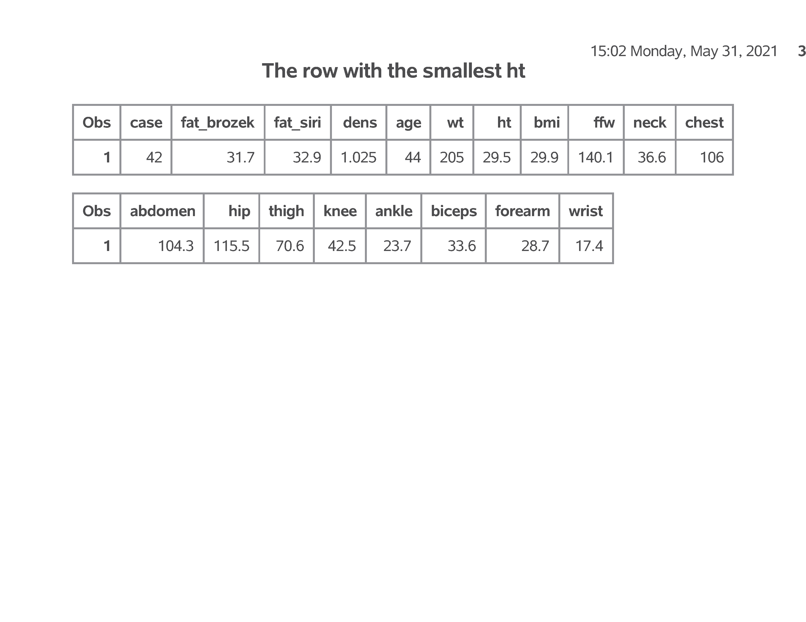

<div class="notes">

This is what your output looks like.

There is no possible way that a height of 29.5 inches could be paired with a weight of 205 pounds.

With this outlier on the low end, you might consider doing nothing other than noting the unusual value.

Alternately, you could delete the entire row associated with this value. Finally, you might consider converting the small ht value to a missing value code.

There is no one method that is preferred in this setting. If you encounter an unusual value, you should discuss it with your research team, investigate the original data sources, if possible, and review any procedures for handling unusual data values that might be specified in your research protocol.

Your data set may arrive with missing values in it already. Data might be designated as missing for a variety of reasons (lab result lost, value below the limit of detection, patient refused to answer this question) and how you handle missing values is way beyond the scope of this class. Just remember to tread cautiously around missing values as they are a minefield.

Notice that I store the revised data sets with the row removed and with the 29.5 replaced by a missing value in different data frames. This is good programming practice. If you ever have to make a destructive change to your data set (a change that wipes out one or more values or a change that is difficult to undo), it is good form to store the new results in a fresh spot. That way, if you get cold feet, you can easily backtrack.

We'll use the data set with the 29.5 changed to a missing value for all of the remaining analyses of this data set.

Logic statements involving missing value codes are tricky. SAS stores missing value codes as the most extreme legal negative number. So if you want, for example, to exclude negative values, make sure that you account for missing values as well.

   (ht < 0) & (ht ~= .) 

</div>

### SAS code, printing the largest value

```{}
`r px(tx, "Part06", "Part07")`
```

<div class="notes">

Just for the sake of completeness, let's look at the row of data with the largest height value. Add the keyword desc to sort the data in reverse order.

</div>

### SAS output, printing the largest value

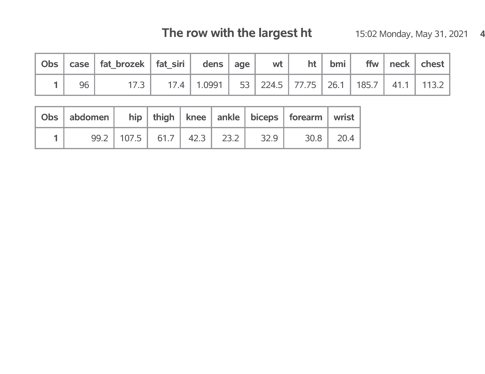

<div class="notes">

This is what your output looks like.

These values seem reasonable to me.

</div>

### Break #3

+ What have you learned so far
  + Simple statistics
  + Printing row with smallest/largest value
  
+ What's next
  + Handling outliers
  + Missing values


</div>

### Remove outlier

```{}
`r px(tx, "Part07", "Part08")`
```


<div class="notes">

This code removes the entire row of data. Notice that I store the modified data under a new name. That way, if I regret tossing the entire row out, I can easily revert to the original data.

</div>

### Change to missing value

```{}
`r px(tx, "Part08", "Part09")`
```

<div class="notes">

This code converts the height to a missing value, but keeps the original data.

There is no one method that is preferred in this setting. If you encounter an unusual value, you should discuss it with your research team, investigate the original data sources, if possible, and review any procedures for handling unusual data values that might be specified in your research protocol.

Your data set may arrive with missing values in it already. Data might be designated as missing for a variety of reasons (lab result lost, value below the limit of detection, patient refused to answer this question) and how you handle missing values is way beyond the scope of this class. Just remember to tread cautiously around missing values as they are a minefield.

Notice that I store the revised data sets with the row removed and with the 29.5 replaced by a missing value in different data frames. This is good programming practice. If you ever have to make a destructive change to your data set (a change that wipes out one or more values or a change that is difficult to undo), it is good form to store the new results in a fresh spot. That way, if you get cold feet, you can easily backtrack.

We'll use the data set with the 29.5 changed to a missing value for all of the remaining analyses of this data set.

</div>

### Logic statements and missing values

```{}
`r px(tx, "Part09", "Part10")`
```

<div class="notes">

Here's an important thing to remember about missing values. SAS stores missing value codes as the most extreme legal negative number. This can sometimes lead to surprising and misleading results.

Every procedure in SAS has its own default approach to missing values and often provides you with one or more alternatives. You have to review this carefully for each and every statistical procedure that you run. If you do data manipulations involving missing values, you have to make sure that the result correctly reflects what you want.

</div>

### SAS output, proc print with faulty logic

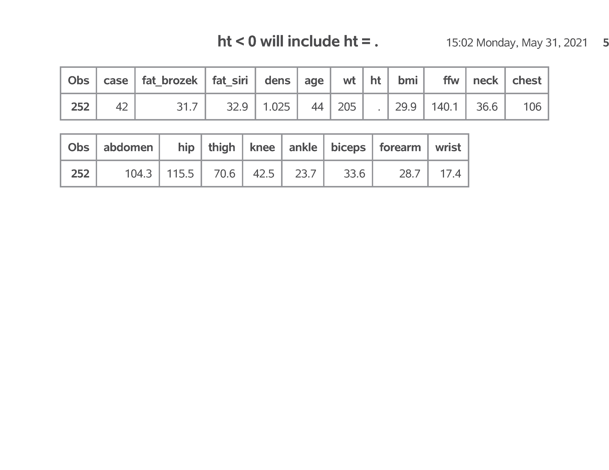

<div class="notes">

This is what your output looks like.

In order to prevent this from happening, you need to check for missingness before applying any other logic statement.

</div>


### The proper way to search for negative ht values

```{}
where (ht < 0) & (ht ~= .) 
```

<div class="notes">

You may hate having to do this and wish that SAS would have handled things differently. Different packages, like R, have a three valued logic system where every logic statement (well, almost every logic statement) involving missing values codes to MISSING rather than to TRUE or FALSE. This sometimes works better, but sometimes the SAS approach works better.

</div>

### SAS code, nmiss option

```{}
`r px(tx, "Part10", "Part11")`
```

<div class="notes">

If you are concerned at all about missing values (and you should be), ask for the number of missing values in proc means using nmiss.

</div>

### SAS output, proc means with nmiss option

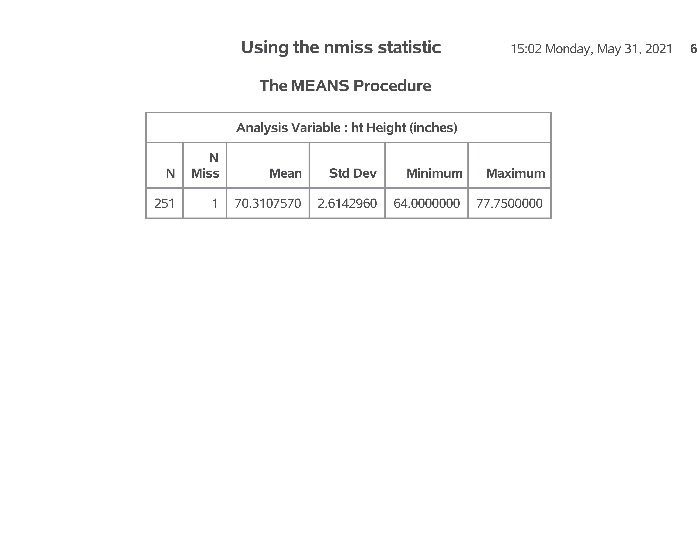

<div class="notes">

This is what your output looks like. Note that your data set has 251 observations and 1 missing value.

</div>

### Break #4
+ What have you learned
  + Missing values
+ What's next
  + Simple transformations
  + Histograms

### SAS code, simple transformations

```{}
`r px(tx, "Part11", "Part12")`
```

<div class="notes">

You can do simple transformations like unit conversions in SAS. Create a new dataset with the data statement. Use the set command to tell SAS that you plan to use and modify an existing dataset.

The conversions done here will turn height and weight into centimeters and kilograms, respectively.

</div>

### SAS output, simple transformations

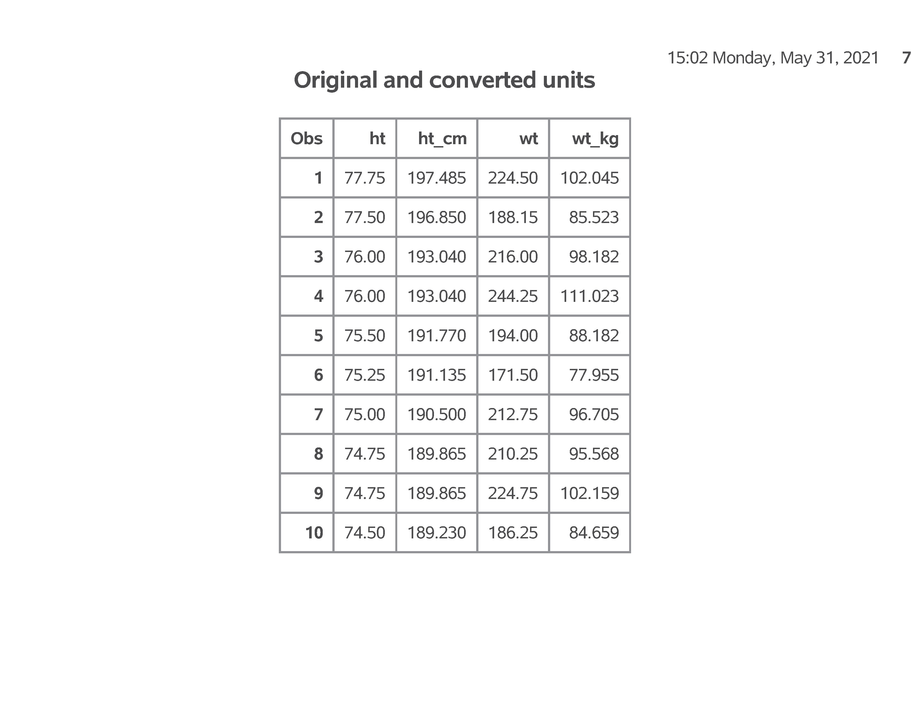

<div class="notes">

This is your output with measurements both in the original units and metric. Notice that I did not print any more than 10 rows of data.


</div>


### SAS code, Histogram

```{}
`r px(tx, "Part12", "Part13")`
```

<div class="notes">

Here's the code to create a histogram with the default option. Generally, it is wise to modify the defaults for any graphic image.

</div>

### SAS output, Histogram

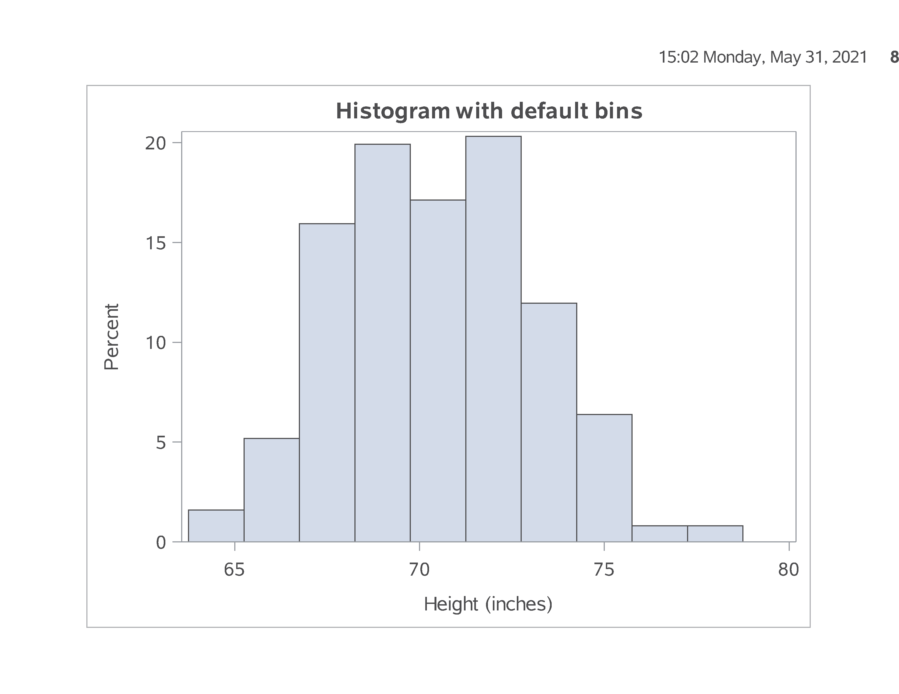

<div class="notes">

This is your output with measurements both in the original units and metric. Notice that I did not print any more than 10 rows of data.


</div>

### SAS code, Histogram with many bars

```{}
`r px(tx, "Part13", "Part14")`
```

<div class="notes">

Here's the code to create a histogram with many bars. The first bar is centered at 60, and each bin has a width of 1 inch (plus or minus 0.5 inches)

</div>

### SAS output, Histogram with many bars

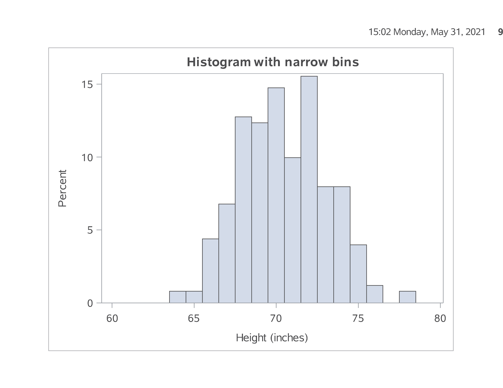

<div class="notes">

This is the revised histogram. You can also go in the opposite direction.

</div>


### SAS code, Histogram with fewer bars

```{}
`r px(tx, "Part14", "Part15")`
```

<div class="notes">

Here's the code to create a histogram with few bars. The first bar is again centered at 60, but now each bin has a width of 5 inches (plus or minus 2.5 inches). 

</div>

### SAS output, Histogram with many bars

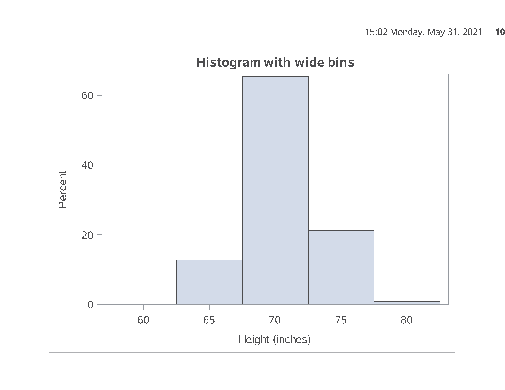

<div class="notes">

This is the revised histogram. There is no "correct" version of the histogram. Try several widths and see which one gives the clearest picture of your data.

</div>


### Break #5
+ What have you learned
  + Simple transformations
  + Histograms
+ What's next
  + Correlations
  + Scatterplots

### Correlations

+ Informal interpretation
  + between +0.7 and +1.0: strong positive association
  + between +0.3 and +0.7: weak positive association
  + between -0.3 and +0.3: little or no association
  + between -0.3 and -0.7: weak positive association
  + between -0.7 and -1.0: strong negative association

<div class="notes">

The correlation coefficient is a single number between -1 and +1 that quantifies the strength and direction of a relationship between two continuous variables. As a rough rule of thumb, a correlation larger than +0.7 indicates a strong positive association and a correlation smaller than -0.7 indicates a strong negative association. A correlation between +0.3 and +0.7 (-0.3 and -0.7) indicates a weak positive (negative) association. A correlation between -0.3 and +0.3 indicates little or no association.

Don't take these rules too literally. You're not trying to make definitive statements about your data set. You are just trying to get comfortable with some general patterns that occur in your data set. A complex and definitive statistical analysis will almost certainly not agree with at least some of the preliminary correlations noted here.

The corr procedure produces, by default, a square correlation matrix of all the numeric variables. The noprob and nosimple options cut down on the amount of information printed. The with statement produces a rectangular correlation matrix.
  
</div>

### SAS code, Simple correlations

```{}
`r px(tx, "Part15", "Part16")`
```

<div class="notes">

</div>

### SAS output, Correlations (1/2)

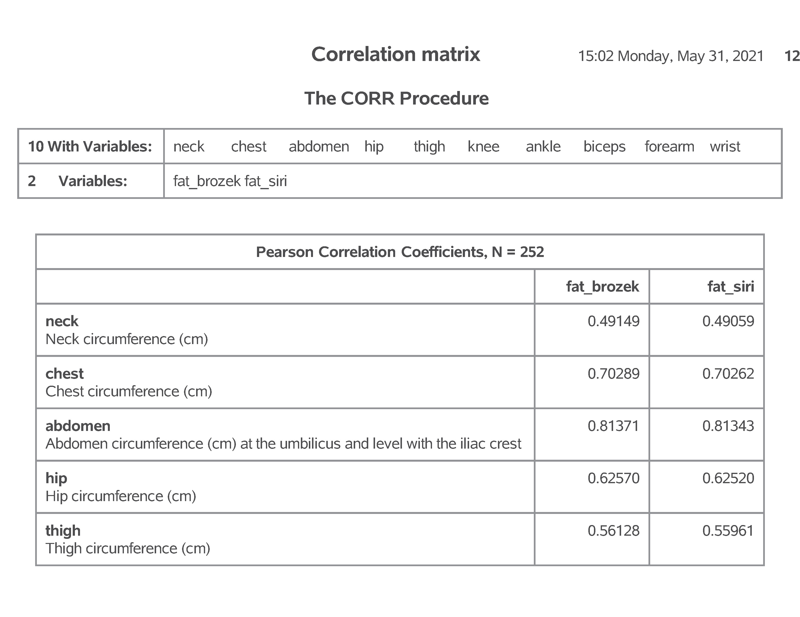

<div class="notes">

</div>

### SAS output, Correlations (2/2)

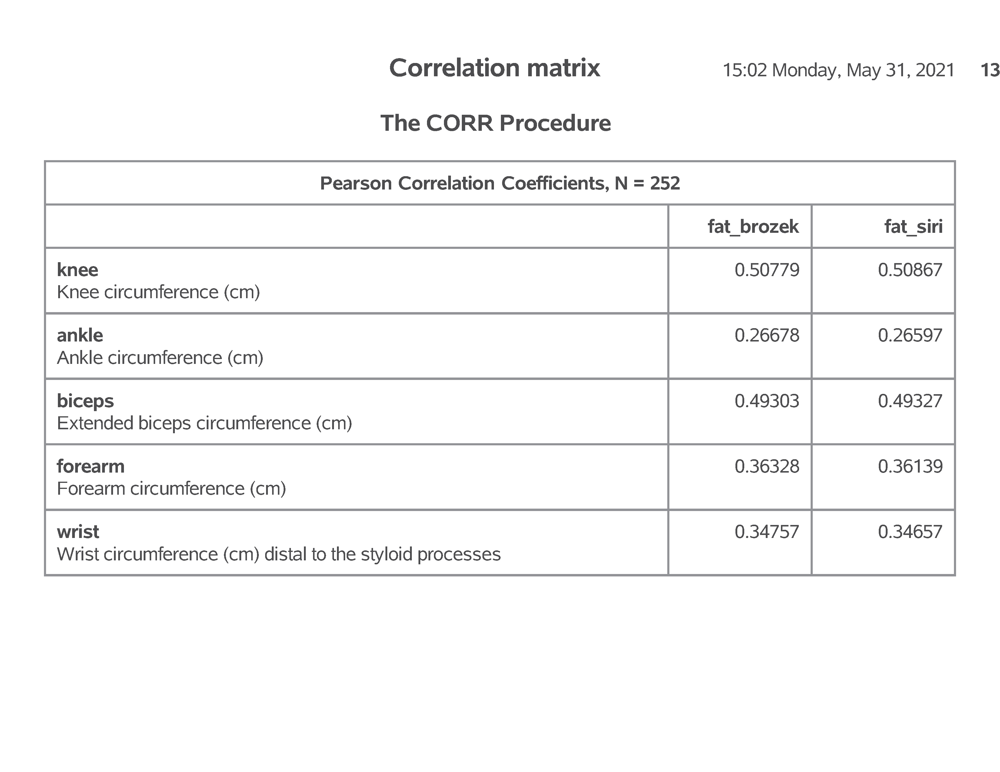

<div class="notes">

Notice that I deliberately avoided printing out the entire corelation matrix, which would span several pages of output. This is something you yourself should strive for, especially when you are running something that you want to share with others. Don't overwhelm your reader with things that they may not need. If your readers do want more information, it is better for them to tell you rather than you giving them more in the first meeting that they need.

</div>

### SAS code, New dataset with correlations

```{}
`r px(tx, "Part16", "Part17")`
```

<div class="notes">

You can save the correlations in a separate data file. 

</div>

### SAS output, New dataset with correlations (1/2)

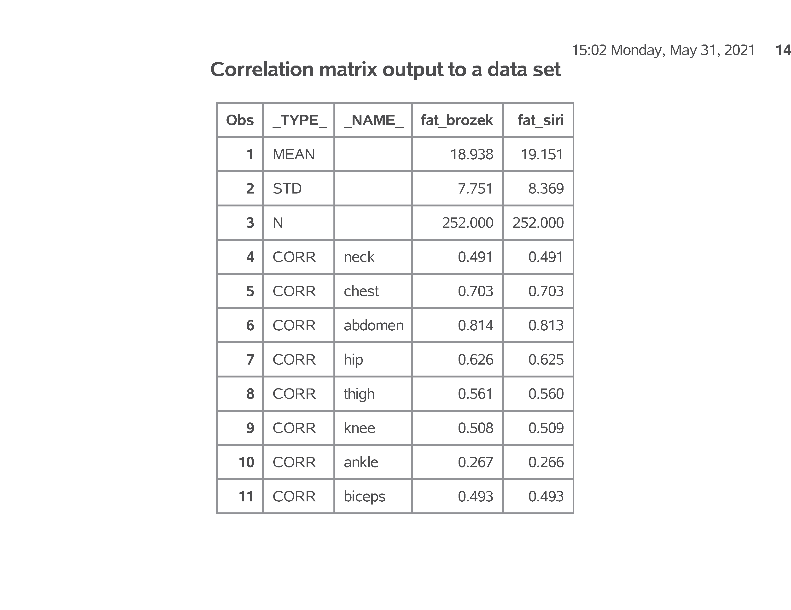

<div class="notes">

The output is a bit unusual because SAS wants to include means and standard deviations in your output. You can and should remove this. It would be easy enough to do (use the where statement), but I wanted to show you the full data set.

</div>

### SAS output, New dataset with correlations (2/2)

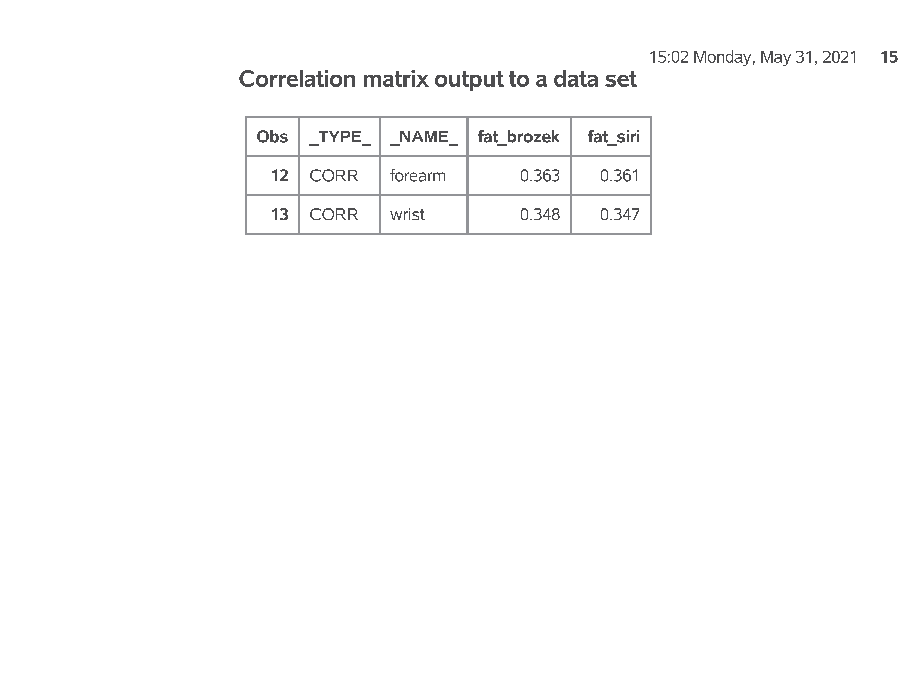

<div class="notes">

</div>

### SAS code, Modified correlations (1/2)

```{}
`r px(tx, "Part17", "Part18")`
```

<div class="notes">

Saving as a data file allows you to manipulate the individual correlations. Here we multiply the correlations by 100, round them, and sort them. This can often simplify the interpretation of large correlation matrices.

This code does the reordering and printing.

</div>

### SAS code, Modified correlations (2/2)

```{}
`r px(tx, "Part18", "Part19")`
```

<div class="notes">

</div>

### SAS output, Modified correlations

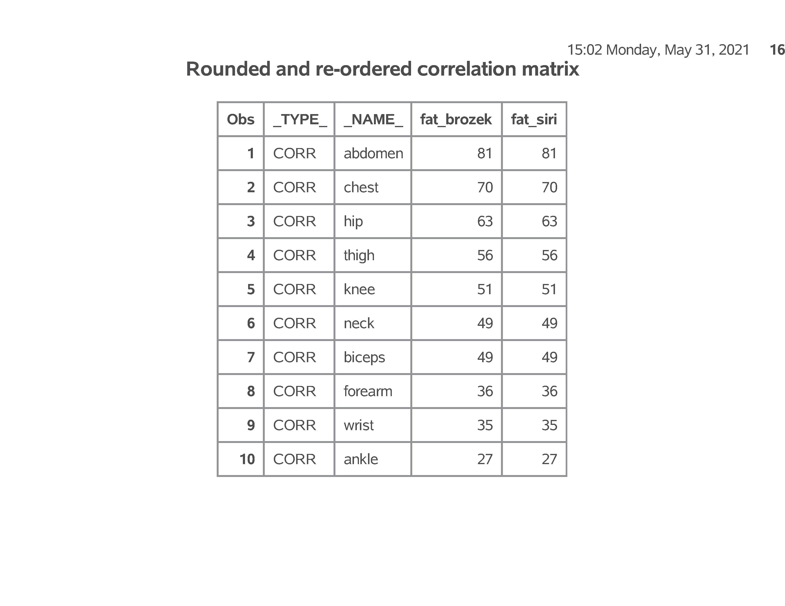

<div class="notes">

This is the output. You can see that measurements at the extremities are poor predictors of body fat. Apparently, we grow fat from the middle outward.

</div>

### SAS code, Simple scatterplot

```{}
`r px(tx, "Part19", "Part20")`
```

<div class="notes">

A scatterplot is also useful for examining the relationship among variables. You can produce scatterplots several different ways, but the scatterplots produced by the sgplot procedure have the most flexibility.

</div>

### SAS output, Simple scatterplot

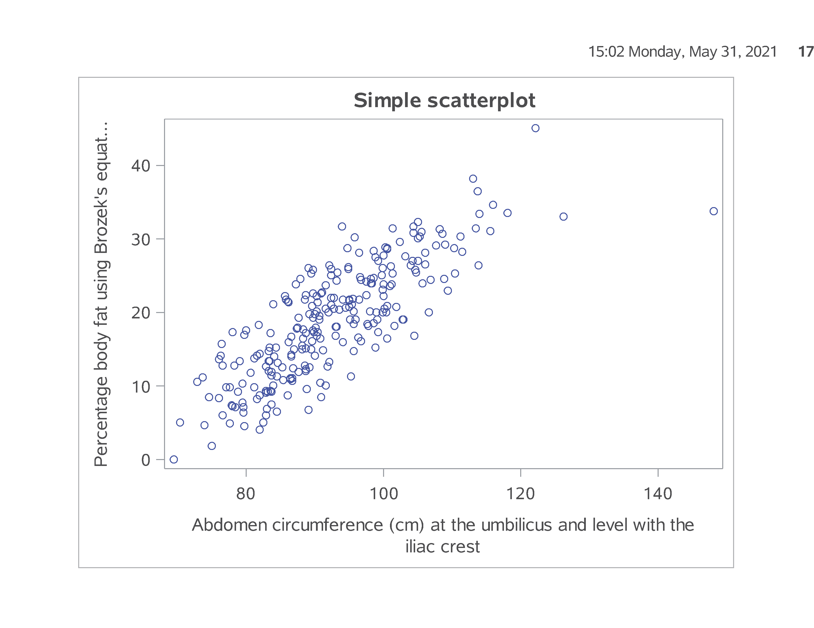

<div class="notes">

This plot shows a general upward trend.

</div>

### SAS code, Linear trend line

```{}
`r px(tx, "Part20", "Part21")`
```

<div class="notes">

The reg statement adds a least squares trend line to your graph.

</div>

### SAS output, Simple scatterplot with linear trend

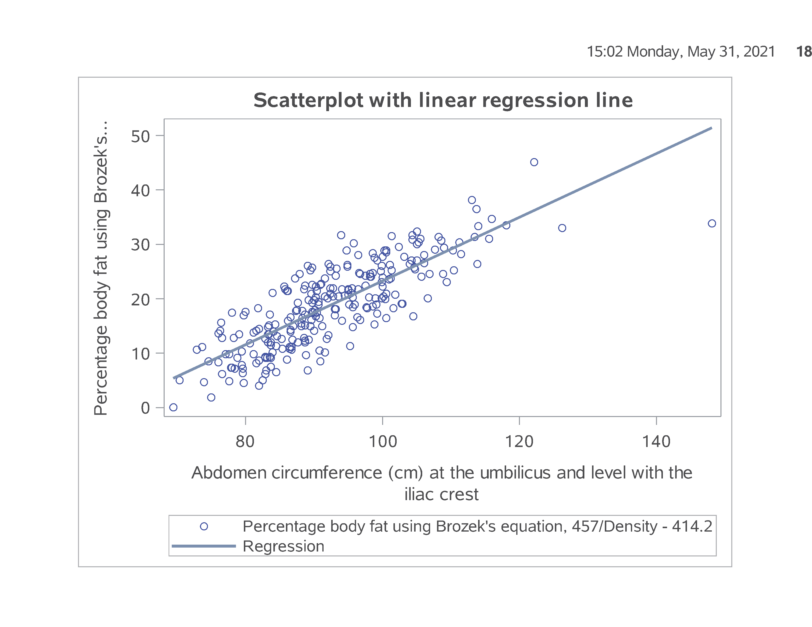

<div class="notes">

The trend line is very useful for large and noisy data sets. It also allows you to more quickly visualize extreme values. Notice, for example, that the person with the largest abdomen measure (the biggest gut, if I can be informal) is quite out of line with what you might expect the relationship to be.

</div>

### SAS code, Smooth curve

```{}
`r px(tx, "Part21", "End of program")`
```

<div class="notes">

The pbspline statement adds a smoothing spline to your graph. This allows you to informally investigate more complex relationships.

</div>


### SAS output, Simple scatterplot with smooth curve

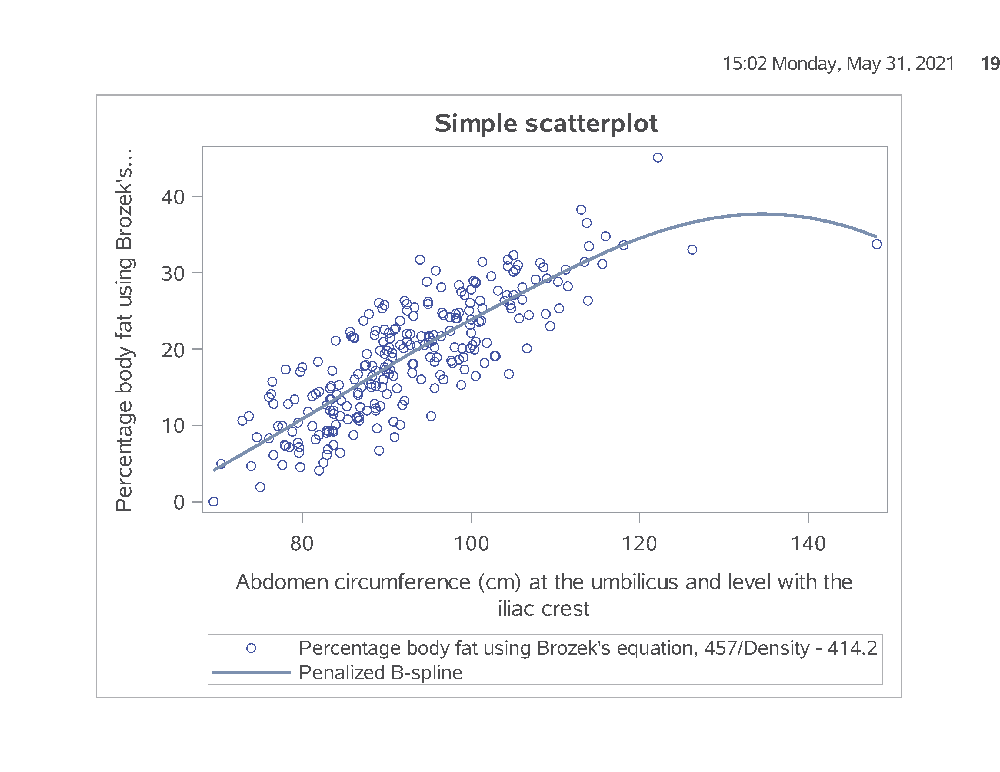

<div class="notes">

The smoothing spline provides some evidence that the relationship is roughly linear a low and medium abdomen measurements, but tends to level off a bit at higher levels. Interpret this with caution, of course, because you have very little data at extrmemy high adbomen measures.

</div>

### Don't forget!

```{}
ods pdf close;
```

<div class="notes">

I always seem to forget this last statement and then I get upset with SAS for not providing the PDF output. But SAS can't produce the PDF output until you tell it you are done. So don't yell at your computer when it's your own darn fault (just like Jimmy Buffet in the Margaritaville song).

</div>

### Summary
+ What have you learned
  + Using variable labels
  + Printing a small piece of data
  + Simple descriptive statistics
  + Printing row with smallest/largest value
  + Missing value logic
  + Simple transformations
  + Histograms
  + Correlations
  + Scatterplots
