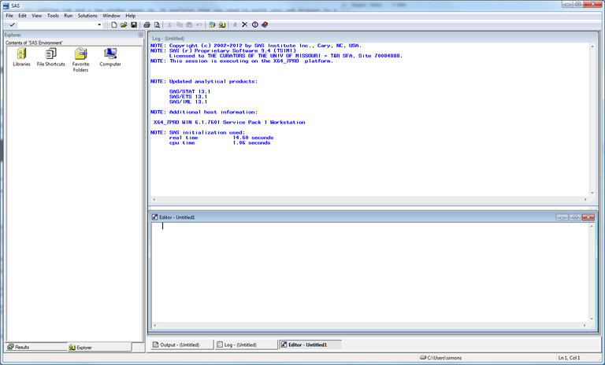
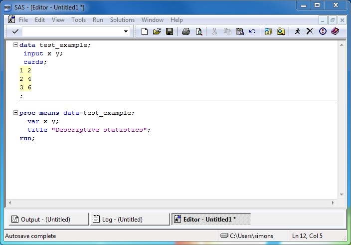
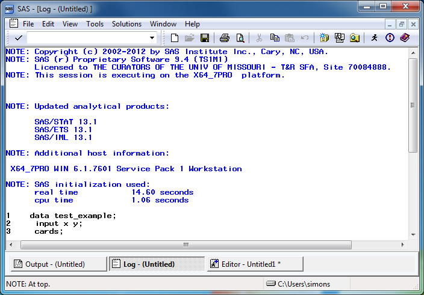
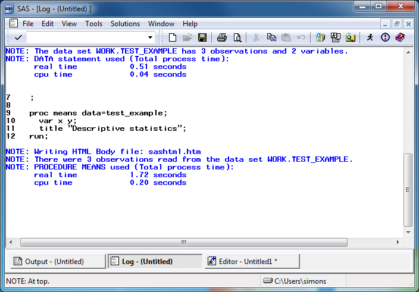
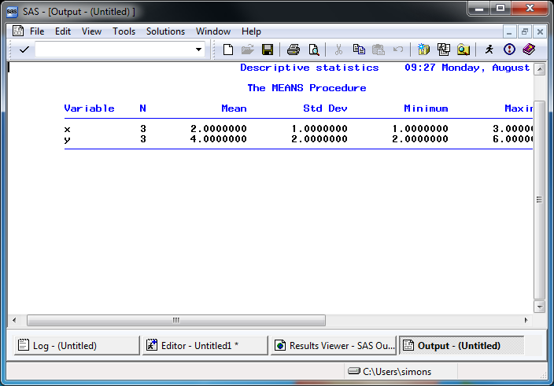
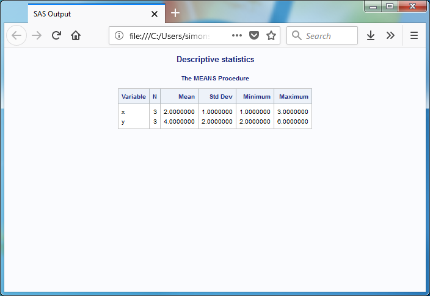

```{r setup, include=FALSE}
# I will not use too much R in a class called "Introduction to SAS,"
# but am including this chunk just in case I need something from R.
knitr::opts_chunk$set(echo = FALSE)
```

### Overview

+ Introducing your instructor

<div class="notes">

[[Speaker notes]]

author: Steve Simon
date: created 2018-08-29
purpose: to produce slides for module01 videos
license: public domain

Here is an overview of what I want to cover in module02.

Okay. I want to get you started using SAS. It's either going to be really easy or it's going to be really really hard. I want to give you as much guidance as I can without staring over your shoulder. Just quickly, I wrote this Powerpoint presentation and all the Powerpoint presentations using R Markdown. If you are curious I have a repository. It has some beautiful output.

Greetings! My name is Steve Simon and I am the instructor for the class, MEDB 5507, Introduction to SAS.

</div>

### Course instructor, Steve Simon


<div class="notes">

Greetings! My name is Steve Simon and I am the instructor for the class, MEDB 5507, Introduction to SAS.

</div>

### Original developer, Mary Gerkovich


<div class="notes">

This course was originally developed by Dr. Mary Gerkovich. I've changed a few things, but I owe a big debt of gratitude to Mary for all of her hard work.

</div>

### A bit about myself


<div class="notes">

Let me share a bit about myself. 

</div>

### DBHI, http://med.umkc.edu/dbhi/


<div class="notes">

I am a part-time faculty member in the Department of Biomedical and Health Informatics. 

</div>

### Website, http://new.pmean.com


<div class="notes">

I have a blog and a website. I am trying to combine the two into a single site. It's a work in progress, but here is the url for my effort.

</div>

### Github, https://github.com/pmean


<div class="notes">

I have a github site. It includes some of the programs used in this class. All the material is public donain, but please do not plagiarize your homework from this github site.

</div>

### Canvas site


<div class="notes">

My course is currently under development in Canvas. This is the instructors view. You will see a slightly different interface.

</div>

### Break #1

+ What have you learned
  + Information about me (Steve Simon)
+ What's coming next
  + Where can you get SAS

### Where can you get SAS

+ On your UMKC computer
  + Desktop, hard-wired to UMKC network
  + No laptops, no home computers
+ UMKC Remote Labs
  + Several locations on campus
  + Remote access
+ Alternatives not covered in this class
  + SAS University
  + SAS OnDemand for Academics
  + Jupyter lab
  + SASMarkdown, StatWeave

<div class="notes">[[Speaker notes]]

There are several ways that you can get access to SAS software. One of these three options should work for you.

You can get it running on your UMKC computer, and I will show you how to do this. You can also access SAS on the UMKC Remote Labs. I'll also show this.

There are some alternatives which I will not show, but if you are interested in investigating, let me know. I am glad to talk privately with anyone about this.

There is a very nice product that I have used in the past called SAS University. It is very difficult to install, but once you have it running, it is very easy to use.

SAS Institute is phasing out SAS University in favor of SAS OnDemand for Academics. This looks like it is much easier to install, though it does require the instructor (me) to set up a few things first. I started work on this, but do not have anything ready yet for this class. Sorry!

If anyone is a fan of Jupyter, you should note that Jupyter lab can run SAS code. You probably need to have SAS already running on your computer, and I have not had time to experiment with this. 

If you are familiar with the R programming environment, there are a couple of packages, SASMarkdown and StatWeave, that allow you to integrate SAS code and output into your workflow. I have not had time to experiment with this either.

</div>

### SAS on your UMKC computer


<div class="notes">[[Speaker notes]]

This screenshot may be too small for you to read, but you can find the proper link on the recommended readings list for this week on the Canvas website. SAS works for any desktop computer on the UMKC campus. But it has to be hard-wired to the UMKC netwok. By hard-wired, I mean that there is an ethernet cable connecting your computer to a socket on the wall.

If you are fortunate enough to have access to a hard-wired computer, you can get SAS installed easily. Someone else will do it for you. It may already be sitting on your computer.

With a very few rare exceptions, you cannot get UMKC to load SAS on a laptop computer or on a home computer. This because of the license agreement that UMKC signed wih SAS Institute. It does not allow for home use of SAS.

</div>

### UMKC Remote Labs


<div class="notes">[[Speaker notes]]

You can also run SAS through the UMKC Remote Labs. It should run fine on most browsers, though it can be a bit fussy. 

</div>

### Break #2

+ What have you learned
  + Where you can get SAS
+ What's coming next
  + Your first SAS program

### Your first SAS program

<div class="notes">

I want to show how to use SAS. I had the screen resolution too high. It is now 800 by 600 and I think it is like going back.

I like to get rid of a couple of windows and use tile vertical for the rest.

Take baby steps. If you can't run this program, talk to me face-to-face.

You should try typing in the program like I am doing. It helps.

I like to put lots of blank lines in.

Normally you would use a two part name. Not here. This is a simple throw-away example, so it can use a one part name. That means it disappears.

Here is where we type the data. At the end you put in another run statement.

This is bad form. Normally you put the data in a separate file.

I like the obs option a lot.

I'll put in a title as well.

I'm going to indent a bit less.

The thing I always worry about is leaving out a semicolon.

There is no autosave feature.

SAS uses a stupid default 9.4. If you are using a network computer, you want to use a network folder, typically the Q drive.

I don't do this, but do what I preach, not what I do.

I'm going to create a new folder. I can't decide on a name. Am I indecisive? I want to set up a logical directory structure, but I also want it to be reasonably flat. I tend to save things in a folder called "source" (SRC).

The run guy is a guy who looks like he is running.

You see some diagnostic information. Work is a scratch. We are not using this again. Three observations, but then one because we said obs=1.

There is the output. SAS by default centers things, and it doesn't work well with 800 by 600.

Try this yourself. It's a baby step. If it works then you can take more baby steps.

</div>


### Opening screen - SAS commercial version





<div class="notes">[[Speaker notes]]

If you are running the "regular" version of SAS, click on the icon and here's an image of what the opening screen looks like. SAS uses a multi-window format. The layout is a bit chaotic. I usually close some windows and re-arrange others. For the benefit of this presentation, I am going to resize everything, close some of the windows, and maximize the one window of greatest importance, the program editor window.

</div>

### SAS program editor (1 of 2)


<div class="notes">[[Speaker notes]]

This is the program editor window. You type in your program in this window, or read an existing program from another window. The other two remaining tabs, the log window, and the output window, are also important.

</div>

### SAS program editor (2 of 2)




<div class="notes">[[Speaker notes]]

If you have SAS running, try running the following sample program. Here's a simple test program. After you type this program in, click on FILE | SAVE and store your program somewhere safe. Save it to a location where you can remember things.

If you are using the computer labs, you need to save things on a network folder. You can't use a USB stick.

</div>

### SAS Test program

```
data test_example;
 input x y;
 cards;
1 2
2 4
3 6
;

proc means data=test_example;
  var x y;
  title "Descriptive statistics";
run;
```

<div class="notes">[[Speaker notes]]

After you type this program in, click on FILE | SAVE and store your program somewhere safe.

</div>

### SAS log window (1 of 2)




<div class="notes">[[Speaker notes]]

The font here is a bit small, but notice that there are no red messages indicating warnings or errors. We're thrilled when we see no warnings or error messages. We're always looking for warnings and errors. We also watch closely the number of observations.

</div>

### SAS log window (2 of 2)




<div class="notes">[[Speaker notes]]

Always start looking for error messages at the top. The very first error or warning message is most likely to be helpful, and later errors/warnings are often of less value.

</div>

### Log messages (1 of 2)

```
1    data test_example;
2     input x y;
3     cards;

NOTE: The data set WORK.TEST_EXAMPLE has 3 observations and 2 variables.
NOTE: DATA statement used (Total process time):
      real time           0.51 seconds
      cpu time            0.04 seconds
```

<div class="notes">[[Speaker notes]]

Always watch the log to see that you have read in the proper number of observations.

</div>


### Log messages (2 of 2)

```
9    proc means data=test_example;
10     var x y;
11     title "Descriptive statistics";
12   run;

NOTE: Writing HTML Body file: sashtml.htm
NOTE: There were 3 observations read from the data set WORK.TEST_EXAMPLE.
NOTE: PROCEDURE MEANS used (Total process time):
      real time           1.72 seconds
      cpu time            0.20 seconds
```

<div class="notes">[[Speaker notes]]

..and that you are analyzing the proper number of observations.

</div>

### Where is the output?

SAS has several options for storing output.

- In the output window
- As an html file
- As a pdf file

<div class="notes">[[Speaker notes]]

Output is tricky. I want to talk in more detail later about this, but you can take the output and save it. There are several ways to do this. If you already have output, click on the CREATE LISTING option box to send the output to the output window. Click on the CREATE HTML option box to send the output to an html file. Click on the BROWSE button to select a default folder for your html file.

</div>

### Preferences window


<div class="notes">[[Speaker notes]]

There is a preference box. I don't want to talk about it today, but if you are adventurous, take a look at this. There are additional options for storing graphics, which I will talk about later. You control where SAS places its output in the results tab of the preferences dialog box. Select TOOLS | OPTIONS | PREFERENCES from the menu and click on the RESULTS tab.

</div>

### SAS output window



<div class="notes">[[Speaker notes]]

Here's what the output window looks like. Notice that SAS uses a monospaced font here.

</div>

### SAS html output



<div class="notes">[[Speaker notes]]

Here's what the html output looks like. Notice variety of font sizes and colors. It tries to fit things within the available space.

</div>

### Conclusion

You can run the commercial version of SAS using

+ Your UMKC computer
+ UMKC Student Computing Labs

You can run a free version of SAS using

+ SAS University

<div class="notes">[[Speaker notes]]

You can run the commercial version of SAS or SAS University and I've shown some screenshots of what this looks like. Try this on your own and let me know if you have been able to get SAS running successfully.

If you cannot get SAS running, drop me an email. It's tricky because it's the first time, but it's not that hard.

</div>

### Break #3

+ What have you learned
  + Your first SAS program
+ What's coming next
  + History of SAS

### History of SAS


<div class="notes">

History of SAS. If you understand where SAS comes from, you understand some of the limitations.

This is on my blog.

SAS was developed at NC State. SAS Institute was formed in 1976. It is a privately held company.

The SAS Headquarters is in Cary, NC, and it is huge. It is a pretty nice place to work.

In the 1960's, IBM mainframes dominated. So SAS was originally written just for these systems. Originally, SAS was written in a mix of PL/1, Fortran, and Assembler. Millions of lines of code re-written in C in 1985 so that SAS could run on personal computers.

Talk about JMP. Extensive use of dynamic graphics. If you can see a demo, it is pretty amazing.

SAS is oriented around various data sets and procedures. There is a menu driven version of SAS, but it is not very good. If you want a good package that is totally menu driven, use SPSS.

SAS has a licensing model that is prohibitive for individual consultants. They offer a free product, SAS University, that is intended for teaching.

SAS has literally hundreds of books. It has a certification program. 

SAS was built in the 1960s. There is very little software written in the 1960s. It shows the staying power, but it is "long in the tooth."

I'll show some more videos about SAS.

</div>

### Break #4

+ What have you learned
  + History of SAS
+ What's coming next
  +  Documentation header
  
### Documentation header

### Permanent storage

### Saving output

### Input text

### filename and infile

<div class="notes">

One more baby step and you can tackle the homework. Pause the video and try the same thing yourself. I want to be able to take a file.

I like pdf better than html. There's advantages and disadvantages.

it's a bad idea to store the data and the program in the same place.

You want it in a folder called data.

I'm going to creat the data set.

And let's put a line at the end.

Sometimes it gets confused if the line ends as six. 

No I want to go to my computer and the q drive and I'm going to create a new folder.

Now what am I going to call this six-numbers. Okay? So we have a file called six-nubmers.txt.

Oh I hope I can remember this. We're going to call this input-text. File save as input-text.sas. We're going to get rid of cards. I hope I get this right. I called it six-numbers.txt. Quote semicolon and then run . Instead of having the data beneath the cards statement. We said delimiter equals quote space quote.

I am going to open Firefox and go to google and look for sas infile statement. And notice you can use 9.4, 9.2, it doesn't matter. You can read this but sometimes the best thing is to take an example and adapt it.

I think I passed what I wanted to do. By the way, this is all good stuff but you don't need to know any of it.

Example 1. Changing how delimiters. Delimiters are what separate one number from the next. It doesn't. Oh man, this is crazy. Let's close this. Delimiter equals space. So let's try this and see if it works.

Save it first. Let's look at it one more time. We got rid of the data. We said it is a space delimited file. I think that should work. It didn't like that. Shoot. Let's close this. I should have changed the name of the PDF file. Input statement. I do infile then input. Instead of saved-pdf, it is now input-text.

Fair enough. ods says where we are going to store the resulting output. Let's run it and see what happens.

Edit, clear all, edit clear all. And it ran. I did this change. Oh, you want to look at this stuff. That's cool. Let's remind ourselves what happened. They like to put it up at the top. You do this with a filename statement. And then you say infile rawdata. And rawdata points back to the filename. Look to see if the previous line had a semicolon. Let's save it first. Let's clear this. Edit, clear all, edit, clear all. I think it worked. There's the output. That's exactly what we want to see. It gives you a cumulative output. It drives me nuts. Let's emphasize what we've learned so far. First we ran a sas program that didn't save anything anywhere. Then we added an ods statement. You can say ods pdf or ods html. That's the second baby step. Next baby step was the infile statement.

If you have problem, it's normal. The remaining programs will be easy. I used sas for 40 years. Once I got it to run it was easy. Baby steps. The you add filenane. Notice that all of this was adding a file lines at a time.

The rest will be easy-peasy. All right. So good luck.

</div>

### Storing SAS datasets

<div class="notes">

We're back. If you're listening to this video, you got the first program running.

I'm mourning the loss of this data set.

To save the data permanenty, use the libname statement.

I'll call it permanent.

We have to figure out where we are. I'm guessing documents/results.

There is a standard, storing new information in a results directory.

if you have any trouble accessing the Q drive, let me know.

Create a new folder called results.

Double click to enter it.

It turns out that in Windows, case insensitive. SAS also.

Hold your breath, let's try running this. 

It annoys me about SAS, it keeps the log around.

Use clear all on the log window. Use clear all on the output window as well.

Hit the little running guy.

Permanent is not a valid SAS name.

It exceeds eight characters. Oh the pain. SAS was built in the 1960s. String constants, for the most part, has to fit in the same space as a floating point number. This means eight characters. SAS since in the 1960's, has some legacy issues.

Say data perm. It sounds like we're hair stylists now.

Two partr name that means it's going to be stored.

Did I say it wouldn't run the first time. I was right. Do we want to save it under the same name.

Let's call the permanent-storage.sas. I have to change it up here as well.

I'm typing it live. I want you to learn that the best way is to type rather than use cut-and-paste. It makes a lot of sense to type this in.

The file is not stored yet. You can see an asterisk. Hold your breath. I think it will run the second time.

Let's make this big so we can see. We're happy because there is no red.

Let me go back to computer and the Q drive and the documents folder and results.

The extension is eight characters, sas7bdat. The most ridiculous extension I have ever seen.

I'm going to exit. Are you sure? Now I'm going to show something cool here.

SAS do this and this and tile. Because it is stored permanently. It always wants to store in 9.4. I'm going to use the Q drive. Documents, SAS programs. What's under source? The interesting thing is I can get rid of the data step now and rename the program. File save as, re-sue.sas. Save. Let's take a careful look. There is no data step anymore. Just call it from perm.simple_example. This program will work now without a data step. It's find of fun in a geeky way. Libname works. Only only observation because of obs=1. Do this baby program. It is storing your data using a two part name.

</div>

### Output Delivery System

<div class="notes">

WE're going to take another baby step. The first step was an utter and miserable failure. It usually runs the first time, but it did not run the second time or the third time or the fourth time. So I stopped the tape.

Let's take permanent storage. That's a good one to start with.

ODS is short for Output Delivery System. Back in the 1960's you submitted a bunch of cards and you got output on green paper.

People were tired of not having output that they could re-use.

Give the name of the file. Let's change the name to saved-pdf.

That's a little bit redundant. If I have a program with a certain name, I use the same name (but a different extension) for the output.

We have to sell SAS to close the output. Everything you saved in the queue will be processed and converted to a PDF file.

What do I call this? saved-pdf.sas.

That's saved, and hit the run button. It's thinking. It can't be that hard.

It opened it for me. That was very nice. Where was that? It is on the computer on the Q drive under documents and results. I was sweating at 1:26 and got it at 2:09.

I went to tools and options and preferences and results. By default, SAS stores everything in the work folder and I had trouble finding it. If you go to SAS Explorer. The work folder is for temporary files. It is located at users simon appdata local . I'm not going to read the rest of this. We don't need those temporary files. 

Go to tools options. Do not use the work folder. That is incorrect. I want the documents slash results. I want things stored in q documents results. Make sure that use work folder is unchecked. Make sure it is a place you can remember. Then wehen you look at your computer and documents and results you will see that I have some html output and some pdf. Let's clean that up now. I'm going to delete that. It's confusing to see all my false results. Let's delete this one. Now remember the sas7bdat. We want to create a permanent version of the output as well.

Clear all. Okay. So this is going to create the file. I can change it now to html. The weird thing about html is that instead of saying file equals you say body equals. I believe it is going to get upset if you give it the path. If we add the q documents results in a second place it will cause confusion.

SAS developed these things over many decades and there is a lot of legacy stuff going on.

We want html. You have to say body equals instead of file equals and you don't specify the path.

You don't want a header, trust me, unless you are really html jockey.

This time it's going to work fine. If you're struggling, it is because the program is new. You'll just have a lot of worked examples. Running these programs from scratch is a pain in the neck. Man, it's embarrassing. 

The body of the html firl is saved-web.html.

Go here and run. And you know it call up the results window. If you go to the Q drive to documents to results. There is now a saved-web.html. By default, it will open in Firefox on my system. You can take this file and what can you do with it. You can send it by email. You can put it in dropbox. It's calling up my mail client. I am composing an email and sending it to my favoriter person. I just myself an email with the output.

if you guys are feeling some pain, I'm feeling some pain. We're going to do one more baby step and you'll feel comfortable doing the homework, I hope.

</div>

