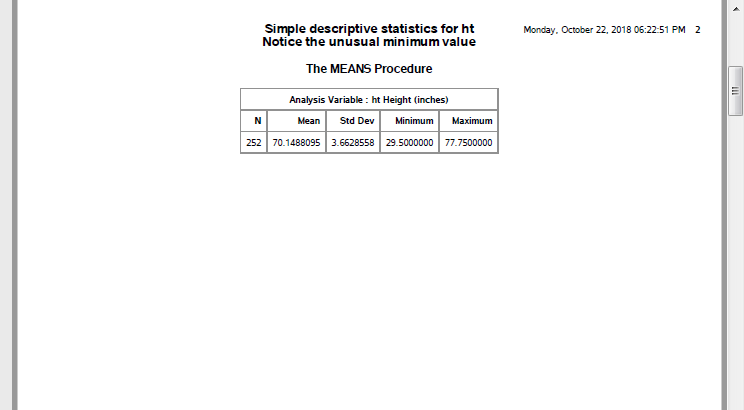
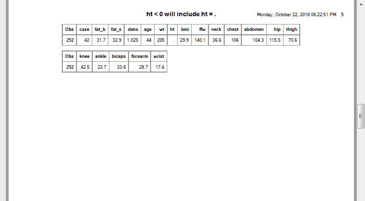
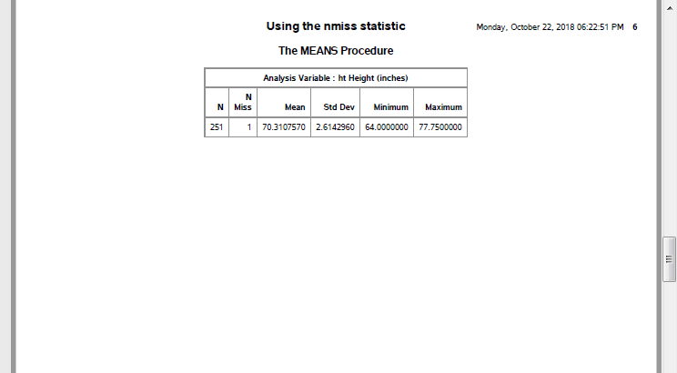
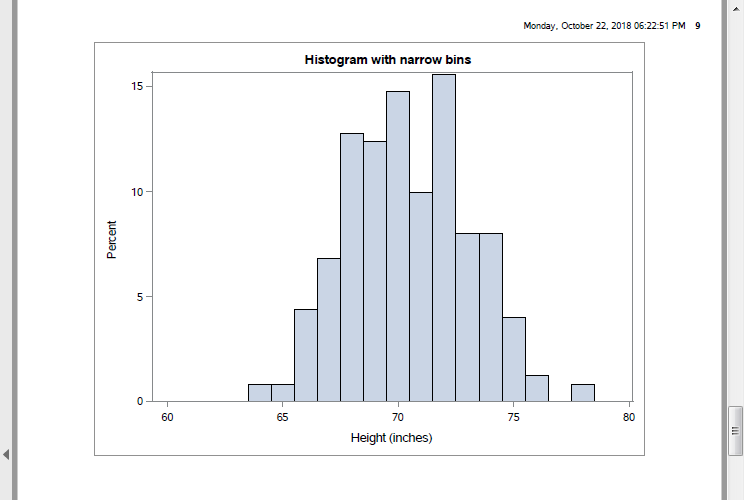
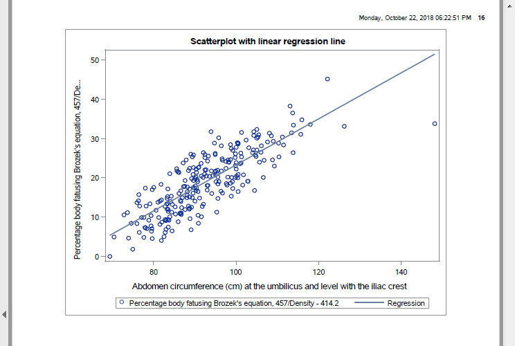

### Overview

<div class="notes">

author: Steve Simon
date: created 2021-05-30
purpose: to produce slides for module01 videos
license: public domain

Here is an overview of what I want to cover in module02.

</div>

## Review definitions

+ Categorical
  + Small number of possible values
  + Each value associated with a category
+ Continuous
  + Large number of possible values
  + Potentially any value in an interval
  
<div class="notes">

Before we start, let's review a couple of   definitions. 

A **categorical variable** is a variable that can only take on a small number of values. Each value is usually associated with a particular category.

Examples of categorical variables are

  * sex (Male or Female),
  * race (White, Black, Native American, etc.),
  * cancer stage (I, II, III, or IV),
  * birth delivery type (Vaginal, C-section). 

A **continuous variable** is a variable that can take on a large number of possible values, potentially any value in some interval.

Examples of continuous variables are

  * Birth weight in grams,
  * gestational age,
  * fasting LDL level.

There are some variables that are on the boundary between categorical and continuous, but it is not worth quibbling about here. 

The point to remember is that the types of graphs that you use and the types of statistics that you compute are dependent on many things, but first and foremost on whether the variables are categorical, continuous, or a mixture.

Today, you will see examples involving mostly continuous variables. 
  
</div>
  

## Semicolons are important

+ Ends every SAS statement
+ Easy to forget
+ Use this to your advantage
  + Several short lines
  + Indent continuations

<div class="notes">

Before I go too far, let me mention and important thing. Every SAS statement ends in a semicolon. This is important. You will forget a semicolon and it will lead to a cryptic error message. So here's a quick hint. If you get an error message on a certain line of code, look to see if you forgot a semicolon on the previous line. It happens to me all the time and I've been using SAS for decades.

</div>  

## Example of stretching statement across multiple lines.

One long line

```{}
statement option1 option2 option3 option4;
```

versus several short lines.

```{}
statement
  option1
  option2
  option3
  option4;
```

<div class="notes">

The use of semicolons is nice, in a way, because it allows you to stretch a complicated SAS statement across two or more rows of your program. This can often make your program more readable. It is hard to read a long line of code. Your eye has to scan left to right and you can sometimes lose track of which line you are on. Most newpapers place their articles in narrow columns because it makes them easier to read.

There is no official rule of thumb on this, but I do try to keep my lines below 50 characters. I also try to indent substatements with a data step or procedure. I use blank lines between data steps and procedures.


Don't obsess about this now, but you'll see a fairly consistent coding style that I use for my SAS code. You don't have to follow my format, of course, which might be a bit too extreme for your tastes. Just experiment with things a bit until you can settle on a layout that you are comfortable with.

</div>  

## Data and infile statements

```{}
filename fat
  "&path/data01/fat.txt";

libname intro
  "&path/data01";

data intro.fat;
  infile fat delimiter=' ';
```


<div class="notes">

I'm carrying over the filename and libname statements from the previous page so you can see how it affects the next two statements.

The data statement creates a new data set. If 
you want a permanent data set, specify a two part
name. The part before the period is the libname
and tells SAS where to store your file. The part
after the period gives the name of the file.
  
If you peek at the file after it is created, you 
will see an extension, .sas7bdat. This the default
extension used by all the internal SAS data sets.
  
The infile statement tells SAS where to find the
raw data. The delimiter option tells SAS how to
tell when one number stops and when another
begins. In this example, spaces are delimiters.     

</div>

## Input statement

```{}
  input 
    case
    fat_b
    fat_s
    dens
    age
    wt
    ht
    bmi
    ffw
    neck
    .
    .
    .
    wrist;
```

<div class="notes">

The input statement tells SAS what the names are for the variables you are reading in. There are lots of variables, so I can only show part of the input statement.

Generally, you should use short names, but not so short as to be cryptic. I recommend lengths of about 8 to 16 characters for a variable name. I am a bit more terse here because I want to minimize the amount of typing that you have to do.

This data set did not have a header, a line
at the very top of the file that lists 
variable names. For files with a header, you
should consider using the import procedure,
which I will describe later.

</div>

## Label statement

```{}
  label
    case="Case number"
    fat_b="Percentage body fatusing Brozek's equation, 457/Density - 414.2"
    fat_s="Percent body fat using Siri's equation, 495/Density - 450"
    dens="Density"
    age="Age (yrs)"
    wt="Weight (lbs)"
    .
    .
    .
    wrist="Wrist circumference (cm) distal to the styloid processes"  
  ;
run;
```
<div class="notes">

  The label statement provides descriptive labels
  for your variables. You can use special characters
  like parentheses, slashes, and dashes that would
  not be allowed in a variable name. The variable
  label provides you with the opportunity to give
  a more detailed description of your variable,
  including the units of measurement. The variable
  labels will appear on some of the SAS output,
  which helps you clarify what the tables and
  graphs are representing.  
  
  The run statement tells SAS that you are ready
  to go and there is nothing more to input or 
  manipulate.                                         
  
</div>


## Print procedure

```{}
proc print
    data=intro.fat(obs=10);
  var case fat_b fat_s dens age;
  title1 "The first ten rows and five columns";
  title2 "of the fat data set";
run;
```

<div class="notes">

It's always a good idea to print out a small 
piece of your data to make sure everything
is okay.
  
The data option tells SAS what data set you
want to print. If you omit this, SAS will
print the most recently created data set.
  
The obs=10 option limits the number of rows 
printed to the first 10. For large data sets,
you should always take advantage of this 
option. ALWAYS. Always, always, always.
  
The var statement limits the variables that
you print to those that you specify. Again,
a great idea for large data sets.
  
The title statement tells SAS to provide
a descriptive title at the top of the page
of output.
  
The run statement says you're done with the
procedure.
  
This data set shows data various body 
measurements. A brief description of this 
file is available at

  http://www.amstat.org/publications/jse/datasets/fat.txt

</div>

## output, page 1


<div class="notes">

This is what your output looks like.

</div>

## Break #1

+ What have you learned
  + libname and filename statements
  + input statement
  + label statement
  + proc print
+ What's next
  + Rules for variable names
  + proc means

## Variable names

+ Brief but descriptive
+ Avoid special symbols
+ No blanks
  + Anecdote: Writer's Exchange website
  + underscore_delimited_name
  + dot.delimited.name
  + CamelCaseName

<div class="notes">

I'm using the variable names provided but if
you create your own names, use brief (but 
descriptive) name for EVERY variable in your
data set. There's no precise rule, but names
should be around 8 characters long. Longer 
variable names make your typing tedious and 
much shorter variable names makes your code 
terse and cryptic.

I'm a bit more terse with these variable names
than I normally would be just to reduce the 
amount of typing you have to do.

You should avoid special symbols in your 
variable names especially symbols that are 
likely to cause confusion (the dash symbol,
for example, which is also the symbol for 
subtraction). You should also avoid blanks.
These rules are pretty much universal across
most statistical software packages.

There are times when you'd like to have a 
blank in your variable name and you can use
two special symbols in SAS (and most other 
statistical pacakges).
  
Before I talk too much about this, let me share an anecdote. There was a working group of writers called The Writer's Exchange, and in the early years of the Internet, they decided to create a website: www.writersexchage.com with no space, of course between writers and exchange because the Internet is not to fond of spaces in domain names. It sounded like a natural web site address to use, but then someone noticed something unfortunate. When you run the words writers exchange together, it can also be read as three words: writer sex change. So you need to be careful that your variable names are not so easily misconstrued when you run two or more words together to get a single variable name.

Here's how you can simulate blanks without actually using blanks.

  * the underscore symbol (above the minus key
  on most keyboards) and
    
  * the dot (period).

  These symbols create some artificial spacing
  that mimics the blanks. Another approach is 
  "CamelCase" which is the mixture of upper and
  lower case within a variable name with each 
  uppercase designating the beginning of a new "word".
;


</div>

## Means procedure
  
```{}
proc means
    n mean std min max
    data=intro.fat;
  var ht;
  title1 "Simple descriptive statistics for ht";
  title2 "Notice the unusual minimum value";
run;
```

<div class="notes">

Let's try to do something useful now. Let's calculated some descriptive statistics on height.

  The means procedure will produce descriptive 
  statistics for your data. By default, it will
  produce the count of non-missing values, the 
  mean, the standard deviation, and the minimum
  and maximum values, but I am listing them
  explicitly here, just for show.
  
  The data option tells SAS which data set you
  want descriptive statistics on, and the var
  statement tells SAS which variable(s) you
  want descriptive statistics on.

</div>

## output, page 2. 



<div class="notes">

Here's the output. There is an unusual data value for ht, 29.5 inches. While this is not totally outside the realm of possibility, you should always ask when you see something unusual like this.

</div>

## Break #2
+ What have you learned
  + Rules for variable names
  + proc means
+ What's next
  + Missing values

## Look at unusual row

```{}
proc sort
    data=intro.fat;
  by ht;
run;

proc print
    data=intro.fat(obs=1);
  title1 "The row with the smallest ht";
run;

```

<div class="notes">

First, let's look at this value in the context of the other values in this row of data.

You do this by sorting the data so that the shortest subject becomes the first row of the data and the tallest subject becomes the last. Then print just the very first row of your data.

Warning: be careful about sorting your data if you can't get the data easily back to the original order. It might be okay, but there are times when you'd like your data all the way back and that means data in the original order. This data set has a case variable that you can resort by in order to get bakc ot the original order.

If you don't have a case variable, store the sorted data in a separate location: something along the lines of proc sort data=x out=y.

</div>

## output, page 3


<div class="notes">

Clearly something is wrong. There's no way that a
person with such a small height would have such a
big weight.

</div>

## Look at opposite end

```{}
proc sort
    data=intro.fat;
  by descending ht;
run;

proc print
    data=intro.fat(obs=1);
  title1 "The row with the largest ht";
run;
```

<div class="notes">

There are several ways to handle this outlier, but
first, let's check to see if something weird is
happening for the tallest person in the data set.

</div>

## output, page 4


<div class="notes">

No, that looks just fine.

  With this outlier on the low end, you might
  consider doing nothing other than noting the
  unusual value.
  
  Alternately, you could delete the entire row
  associated with this value.

  Finally, you might consider converting the
  small ht value to a missing value code.

</div>

## Remove outlier

```{}
data intro.fat1;
  set intro.fat;
  if ht > 29.5;
run;
```

<div class="notes">

This code removes the entire row of data. Notice that I store the modified data under a new name. That way, if I regret tossing the entire row out, I can easily revert to the original data.

</div>

## Change to missing value

```{}
data intro.fat2;
  set intro.fat;
  if ht=29.5 then ht=.;
run;
```

<div class="notes">

This code converts the height to a missing value,
but keeps the original data.

There is no one method that is preferred 
in this setting. If you encounter an unusual
value, you should discuss it with your 
research team, investigate the original
data sources, if possible, and review any
procedures for handling unusual data values
that might be specified in your research
protocol.

Your data set may arrive with missing values
in it already. Data might be designated as 
missing for a variety of reasons (lab result
lost, value below the limit of detection, 
patient refused to answer this question) and
how you handle missing values is way beyond 
the scope of this class. Just remember to 
tread cautiously around missing values as they
are a minefield.

Notice that I store the revised data sets with
the row removed and with the 29.5 replaced by 
a missing value in different data frames. This
is good programming practice. If you ever have
to make a destructive change to your data set
(a change that wipes out one or more values or
a change that is difficult to undo), it is good 
form to store the new results in a fresh spot. 
That way, if you get cold feet, you can easily
backtrack.

We'll use the data set with the 29.5 changed
to a missing value for all of the remaining
analyses of this data set.

</div>

## Logic statements and missing values

```{}
proc print
    data=intro.fat2;
  where ht < 0;
  title "ht < 0 will include ht = .";
run;
```

<div class="notes">

Logic statements involving missing value codes
   are tricky. Look at the output from this sample 
   code. 
   
</div>

## output, page 5



<div class="notes">

SAS stores missing value codes as
the most extreme legal negative number. So if
you want, for example, to exclude negative
values, make sure that you account for missing
values as well.

Every procedure in SAS has its own default
approach to missing values and often provides
you with one or more alternatives. You have
to review this carefully for each and every
statistical procedure that you run. If you
do data manipulations involving missing
values, you have to make sure that the result
correctly reflects what you want.
  
</div>

## The proper way to search for negative ht values

```{}
where (ht < 0) & (ht ~= .) 
```

<div class="notes">

You may hate having to do this and wish that SAS would have handled things differently. Different packages, like R, have a three valued logic system where every logic statement (well, almost every logic statement) involving missing values codes to MISSING rather than to TRUE or FALSE. This sometimes works better, but sometimes the SAS approach works better.

</div>

## nmiss option

```{}
proc means
    n nmiss mean std min max
    data=intro.fat2;
  var ht;
  title "Using the nmiss statistic";
run;
```

<div class="notes">

  If you are concerned at all about missing 
  values, ask for the number of missing values
  in proc means using nmiss. 
;
</div>

## output, page 6



<div class="notes">

Note that your data set has 251 observations and 1 missing value.

</div>

## Break #3
+ What have you learned
  + Missing values
+ What's next
  + Simple transformations
  + Histograms

## Simple transformations

```{}
data converted_units;
  set intro.fat2;
  ht_cm = ht * 2.54;
  wt_kg = wt / 2.2; 
run;

proc print 
    data=converted_units(obs=10);
  var ht ht_cm wt wt_kg;
  title "Original and converted units";
run;
```

<div class="notes">

You can also make simple transformations of your data, such as converting from English units to metric units.

I want to talk more about transformations later, especially the log transformation.

</div>

## output, page 7


<div class="notes">

This is your output with measurements both in the original units and metric. Notice that I did not print any more than 10 rows of data.

</div>

## Histogram

```{}
proc sgplot
    data=intro.fat2;
  histogram ht;
  title "Histogram with default bins";
run;
```

<div class="notes">

A histogram is useful for displaying a continuous variable graphically.

</div>

## output, page 8


<div class="notes">

You should not accept the default width and
starting values for your histogram, but 
should specify values that are meaningful
to you.

</div>

## Histogram with one unit wide intervals

```{}
proc sgplot
    data=intro.fat2;
  histogram ht / binstart=60 binwidth=1;
  title "Histogram with narrow bins";
run;
```

## output, page 9



<div class="notes">

This might be a bit too narrow. The only way you can set the widths properly is through trial and error.

</div>

## Histogram with five unit wide intervals

```{}
proc sgplot
    data=intro.fat2;
  histogram ht / binstart=60 binwidth=5;
  title "Histogram with wide bins";
run;
```

<div class="notes">

It is easy enough to try different interval widths.

</div>

## output, page 10


<div class="notes">

These bars are maybe too wide. The ideal width is probably 2. But I'll stop here, except to note that the labels for this histogram are not ideal. 

</div>

## Nice labels

```{}
proc format;
  value range_fmt
    60="58-62"
  	65="63-67"
	  70="68-72"
  	75="73-77"
	  80="78-82";
run;
proc sgplot
    data=intro.fat2;
  histogram ht / binstart=60 binwidth=5;
  xaxis valuesformat=range_fmt.;
  title "Histogram with re-labeled bins";
run;
```

<div class="notes">

We'll talk more about proc format next week, but a simple application is providing nicer labels for your graphs and tables. The value of 60 that appears on the graph is actually 58 to 62. The value of 65 is actually 63 to 67. Spell out this relationship in proc format to get better labels. Note, however, that if you modify the widths of the bars, you will have to go back and modify the format as well.

</div>

## Break #4
+ What have you learned
  + Simple transformations
  + Histograms
+ What's next
  + Correlations
  + Scatterplots

## Correlations

```{}
proc corr
    data=intro.fat2
    noprob nosimple;
  var fat_b fat_s;
  with neck -- wrist;
  title "Correlation matrix";
run;
```

<div class="notes">

* Note to myself. Talk about saving graphs
  to a png file, datasets to a csv file.
;

* The correlation coefficient is a single 
  number between -1 and +1 that quantifies 
  the strength and direction of a relationship 
  between two continuous variables. As a rough 
  rule of thumb, a correlation larger than +0.7 
  indicates a strong positive association and a 
  correlation smaller than -0.7 indicates a 
  strong negative association. A correlation 
  between +0.3 and +0.7 (-0.3 and -0.7) indicates
  a weak positive (negative) association. A 
  correlation between -0.3 and +0.3 indicates 
  little or no association.

  Don't take these rules too literally. You're
  not trying to make definitive statements about
  your data set. You are just trying to get 
  comfortable with some general patterns that 
  occur in your data set. A complex and 
  definitive statistical analysis will almost
  certainly not agree with at least some of the
  preliminary correlations noted here.

  The corr procedure produces, by default, a
  square correlation matrix of all the 
  numeric variables. The noprob and nosimple
  options cut down on the amount of information
  printed. The with statement produces a
  rectangular correlation matrix.
  
</div>

## output, page 12


<div class="notes">

Notice that I deliberately avoided printing out the entire corelation matrix, which would span several pages of output. This is something you yourself should strive for, especially when you are running something that you want to share with others. Don't overwhelm your reader with things that they may not need. If your readers do want more information, it is better for them to tell you rather than you giving them more in the first meeting that they need.

</div>

## Save correlations

```{}
proc corr
    data=intro.fat2
    noprint
    outp=correlations;
  var fat_b fat_s;
  with neck -- wrist;
run;

proc print 
    data=correlations;
  title "Correlation matrix output to a data set";
run;
```

<div class="notes">

* You can save the correlations in a separate data file. 

</div>

## output, page 13


<div class="notes">

The output is a bit unusual because SAS wants to include means and standard deviations in your output. You can and should remove this. It would be easy enough to do (use the where statement), but I wanted to show you the full data set.

</div>

## SAS code to round correlations

```{}
data correlations;
  set correlations;
  if _type_="CORR";
  drop type;
  fat_b=round(100*fat_b);
  fat_s=round(100*fat_s);
run;
```

<div class="notes">

Saving as a data file allows you to 
manipulate the individual correlations.
Here we multiply the correlations by 100,
round them, and sort them. This can often
simplify the interpretation of large
correlation matrices.

I'm splitting the code onto two PowerPoint
slides. This code does the rounding.


</div>

## SAS code to reorder correlations

```{}
proc sort
    data=correlations;
  by descending fat_b;
run;
proc print 
    data=correlations;
  title "Rounded and re-ordered correlation matrix";
run;
```

<div class="notes">

This code does the reordering and printing.

</div>

## output, page 14


<div class="notes">

This is the output. You can see that measurements at the extremities are poor predictors of body fat. Apparently, we grow fat from the middle outward.

</div>

## Scatterplot

```{}
proc sgplot
    data=intro.fat2;
  scatter x=abdomen y=fat_b;
  title "Simple scatterplot";
run;
```

<div class="notes">

* A scatterplot is also useful for examining the
  relationship among variables. You can produce
  scatterplots several different ways, but the
  scatterplots produced by the sgplot procedure
  have the most flexibility.
;
</div>

## output, page 15


<div class="notes">

This plot shows a general upward trend.

</div>

## Trend line

```{}
proc sgplot
    data=intro.fat2;
  scatter x=abdomen y=fat_b;
  reg x=abdomen y=fat_b;
  title "Scatterplot with linear regression line";
run;
```

<div class="notes">

The reg statement adds a least squares trend line to your graph.

</div>

## output, page 16



<div class="notes">

The trend line is very useful for large and noisy data sets. It also allows you to more quickly visualize extreme values. Notice, for example, that the person with the largest abdomen measure (the biggest gut, if I can be informal) is quite out of line with what you might expect the relationship to be.

</div>

## Smoothing spline

```{}
proc sgplot
    data=intro.fat2;
  scatter x=abdomen y=fat_b;
  pbspline x=abdomen y=fat_b;
  title "Simple scatterplot";
run;
```

<div class="notes">

The pbspline statement adds a smoothing spline to your graph. This allows you to informally investigate more complex relationships.

</div>


## output, page 17


<div class="notes">

The smoothing spline provides some evidence that the relationship is roughly linear a low and medium abdomen measurements, but tends to level off a bit at higher levels. Interpret this with caution, of course, because you have very little data at extrmemy high adbomen measures.

</div>

## Don't forget!

```{}
ods pdf close;
```

<div class="notes">

I always seem to forget this last statement and then I get upset with SAS for not providing the PDF output. But SAS can't produce the PDF output until you tell it you are done. So don't yell at your computer when it's your own darn fault (just like Jimmy Buffet in the Margaritaville song).

</div>

## Summary
+ What have you learned
  + libname and filename statements
  + input and label statements
  + proc print and proc means
  + Missing values and simple transformations
  + Histograms, correlations, scatterplots

## Homework01 (1 of 7)

Having reviewed these analyses, I would like 
you to turn in some simple analyses that you 
run on a fresh data set. This homework 
assignment will be graded pass/fail.

## Homework01 (2 of 7)

There is a second data set on sleep in 
mammals. You can find a brief description of
this data set at

--> http://www.statsci.org/data/general/sleep.html

and you can download the actual data at

--> http://www.statsci.org/data/general/sleep.txt

## Homework01 (3 of 7)

For every question, include the relevant SAS 
output and a brief written commentary explaining
what the results mean. When you send your 
answers, please include the original questions.

## Homework01 (4 of 7)

+ Notice that there is a huge range in body 
weight. Display the information for the 
smallest and the largest mammals.

+ Which variables have missing data?

+ Calculate the mean and standard deviation 
for TotalSleep.

## Homework01 (5 of 7)

+ Draw a histogram for the BodyWt variable.
Note that this variable is highly skewed. 
Re-draw the histogram on the log scale. 
For exta credit, relabel the axes with values
at 0.001, 0.01, etc.

+ Calculate the ratio of BrainWt to BodyWt 
and express it as a percentage. Be sure to 
convert grams to kilograms (or vice versa) 
before computing the ratio. What animal has
the smallest/largest ratio?

## Homework01 (6 of 7)

+ Do bigger animals sleep longer or live
longer? Show your results using a correlation
coefficient.

+ Do animals who have high degrees of 
Predation, Exposure, or Danger sleep less?
Show your results using a plot and a trendline.

## Homework01 (7 of 7)

+ Place all the key results into a document
and copy the original questions and include
your own written answer along with the 
appropriate supporting tables or graphs. 
Do NOT submit uneditted and unannoted
SAS output. You can use any program to
prepare the output, but convert it to a PDF
format before submission. If you have any
difficulty producing a PDF document, please
talk to me.

