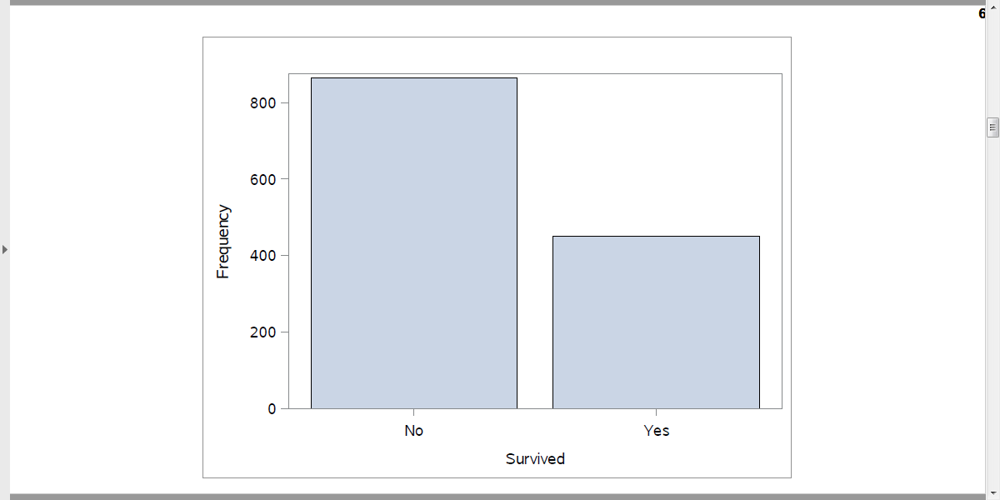
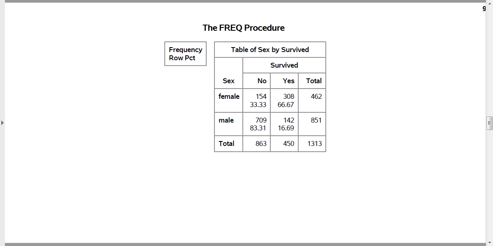
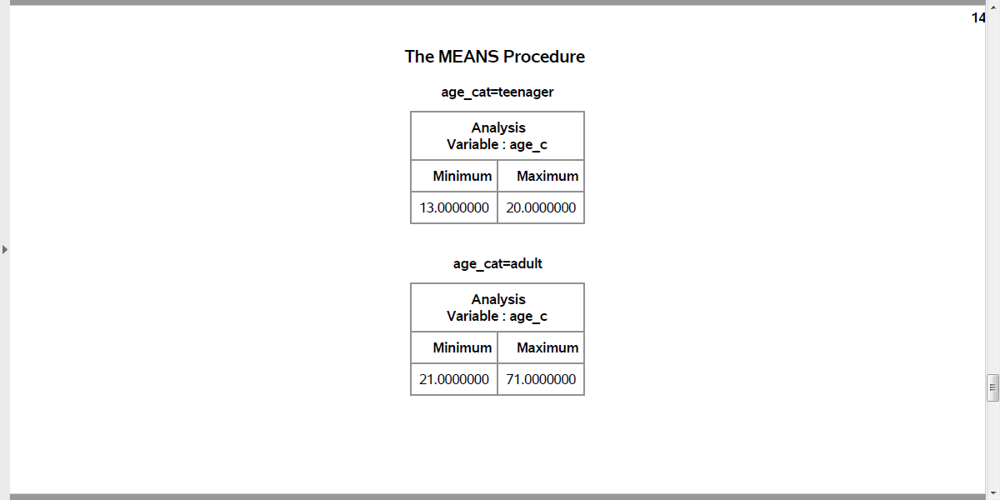

```{r setup, echo=FALSE}
knitr::opts_chunk$set(echo=FALSE, comment="")
suppressMessages(suppressWarnings(library(dplyr)))
suppressMessages(suppressWarnings(library(knitr)))
suppressMessages(suppressWarnings(library(magrittr)))
```

### Categorical data
+ proc format
+ recoding
+ proc freq
+ barcharts

<div class="notes">

We're going to look at a different data set, one with mostly categorical variables. I'll introduce proc format, which allows you to attach labels to categorical data, talk about recoding, and show some tables using proc freq. I'll also show you a simple bar chart.

</div>

```{r lecture02.sas}
program_name <- opts_current$get("label") 
program_name %>%
  readLines(warn=FALSE) -> sas_code

input_source_line <- grep("filename raw_data", sas_code) + 1
sas_code[input_source_line] %>%
  sub('^.*?"', '', .)                                      %>%
  sub('";',    '', .)                                      %>% 
  readLines(n=10)                                          %>%
  paste0(collapse="\n")                                    -> ppt_data

sas_code %>% 
  grep("********* *********", ., fixed=TRUE)               -> comment_lines
k <- (length(comment_lines)-1) %/% 2

ppt_head <- rep(" ", k)
ppt_note <- rep(" ", k)
ppt_code <- rep(" ", k)
for (i in 1:k) {
  ppt_head[i] <- paste0("### ", sas_code[comment_lines[2*i-1] + 1])
  ppt_note[i] <- paste0(sas_code[(comment_lines[2*i-1]+3):(comment_lines[2*i]  -1)], collapse="\n")
  ppt_code[i] <- paste0(sas_code[(comment_lines[2*i]  +2):(comment_lines[2*i+1]-2)], collapse="\n")
}
```

### Titanic data set
```{r}
cat(ppt_data)
```
<div class="notes">
Here are the first ten rows of the Titanic data set.
</div>

<!---Preliminaries--->
`r ppt_head[1]`
```{r}
cat(ppt_code[1])
```
<div class="notes">
`r ppt_note[1]`
</div>

<!---proc import--->
`r ppt_head[2]`
```{r}
cat(ppt_code[2])
```
<div class="notes">
`r ppt_note[2]`
</div>

<!---proc print--->
`r ppt_head[3]`
```{r}
cat(ppt_code[3])
```
<div class="notes">
`r ppt_note[3]`
</div>

### First ten rows of the Titanic data set

<div class="notes">
At first glance, everything looks fine. But if you look closely, you will see that age is left justified. It is caused by the NA code for missing value, which doesn't appear until about line 14 or 15 of the code.
</div>


<!---proc freq--->
`r ppt_head[4]`
```{r}
cat(ppt_code[4])
```
<div class="notes">
`r ppt_note[4]`
</div>

### Counts for categorical data (1/2)

<div class="notes">
Here are the counts for passenger class and sex.
</div>

### Counts for categorical data (2/2)

<div class="notes">
Here are the counts for Survived.
</div>

<!---data step--->
`r ppt_head[5]`
```{r}
cat(ppt_code[5])
```
<div class="notes">
`r ppt_note[5]`
</div>

### Means and standard deviations for age

<div class="notes">
Here are the descriptive statistics for age. Notice the number of missing values.
</div>

<!---proc format--->
`r ppt_head[6]`
```{r}
cat(ppt_code[6])
```
<div class="notes">
`r ppt_note[6]`
</div>

### Nicely formatted counts for survival

<div class="notes">
Notice that the format statement replaces the cryptic 0-1 code with the words no and yes.
</div>

<!---proc sgplot--->
`r ppt_head[7]`
```{r}
cat(ppt_code[7])
```
<div class="notes">
`r ppt_note[7]`
</div>

### Bar chart

<div class="notes">
Here are the descriptive statistics for age. Notice the number of missing values.
</div>


<!---proc freq output--->
`r ppt_head[8]`
```{r}
cat(ppt_code[8])
```
<div class="notes">
`r ppt_note[8]`
</div>

### Percentages, proc freq

<div class="notes">
Here is what the output from proc freq looks like. Just two rows.
</div>

### Percentages in a bar chart

<div class="notes">
Here is what the output from proc freq looks like. Just two rows.
</div>

<!---proc freq--->
`r ppt_head[9]`
```{r}
cat(ppt_code[9])
```
<div class="notes">
`r ppt_note[9]`
</div>

### Percentages, proc freq

<div class="notes">
Here is what the output from proc freq looks like. Among the males, almost 5/6 died. Among the females only 1/3 died.
</div>

<!---data step--->
`r ppt_head[10]`
```{r}
cat(ppt_code[10])
```
<div class="notes">
`r ppt_note[10]`
</div>

<!---proc means--->
`r ppt_head[11]`
```{r}
cat(ppt_code[11])
```
<div class="notes">
`r ppt_note[11]`
</div>

### Recoding age (1 / 3)

<div class="notes">
Here is the quality check. Notice that adult starts at 21. Should adult start at 18 instead?
</div>

### Recoding age (2 / 3)

<div class="notes">
Are the ranges for pre-teen and teenager reasonable?
</div>

### Recoding age (3 / 3)

<div class="notes">
How about the ranges for toddler?
</div>

<!---data step--->
`r ppt_head[12]`
```{r}
cat(ppt_code[12])
```
<div class="notes">
`r ppt_note[12]`
</div>

<!---proc format--->
`r ppt_head[13]`
```{r}
cat(ppt_code[13])
```
<div class="notes">
`r ppt_note[13]`
</div>

<!---proc means--->
`r ppt_head[14]`
```{r}
cat(ppt_code[14])
```
<div class="notes">
`r ppt_note[14]`
</div>

### Better age recode (1 /3)

<div class="notes">
This shows the age categories starting at the youngest: toddler and pre-teen...
</div>

### Better age recode (2 /3)

<div class="notes">
followed y teenager and adult...
</div>

### Better age recode (3 /3)

<div class="notes">
with missing bring up the rear. This order was the order of the number codes. So if you want to display your results in a non-alphabetical order, use number codes.
</div>

<!---data step--->
`r ppt_head[15]`
```{r}
cat(ppt_code[15])
```
<div class="notes">
`r ppt_note[15]`
</div>

### Quality check

<div class="notes">
Here is the quality check. PClass=1st codes to first_class=Yes. PClass=2nd or 3rd codes to first_class=No.
</div>

