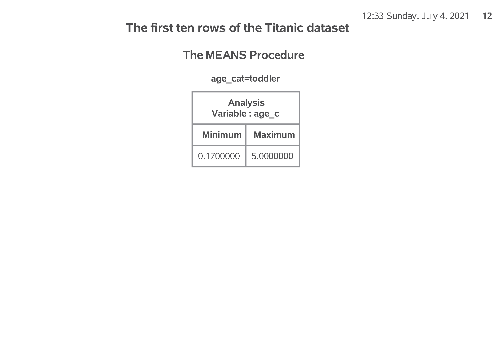

```{r setup, echo=FALSE}
knitr::opts_chunk$set(echo=FALSE, comment="")
suppressMessages(suppressWarnings(library(dplyr)))
suppressMessages(suppressWarnings(library(knitr)))
suppressMessages(suppressWarnings(library(magrittr)))
suppressMessages(suppressWarnings(library(stringr)))
```

### Overview

<div class="notes">

author: Steve Simon
date: created 2021-05-30
purpose: to produce slides for module04 videos
license: public domain

Here is an overview of what I want to cover in module02.

</div>

### Categorical data
+ proc format
+ recoding
+ proc freq
+ barcharts

<div class="notes">

We're going to look at a different data set, one with mostly categorical variables. I'll introduce proc format, which allows you to attach labels to categorical data, talk about recoding, and show some tables using proc freq. I'll also show you a simple bar chart.

</div>

### SAS code: documentation header

```{r}
tx <- readLines("m04-5507-simon-categorical-variables.sas")
px <- function(tx, s1, s2, xtra_lines=-2) {
  tx %>% str_which(s1) -> i1
  tx %>% str_which(s2) -> j1
  if (length(i1)==0) return("No beginning found")
  if (length(j1)==0) return("No ending found")
  if (length(i1) > 1) return("Multiple beginnings found")
  if (length(j1) > 1) return("Multiple endings found")
  j1 <- j1 + xtra_lines
  tx %>%
    extract(i1:j1) %>%
    paste0(collapse="\n") %>%
    return
}
```

```{}
`r px(tx, "^/", "Part01")`
```

<div class="notes">

Here is the documentation header for a program that will show how to work with a dataset with mostly continuous variables.

</div>

### SAS code: filename, libname, ods statements

```{}
`r px(tx, "Part01", "Part02")`
```

<div class="notes">

The filename statement tells you where the raw data is stored.

The libname statement tells you where SAS will store any permanent datsets.

The ods statement tells you that SAS is going to store the results with a particular filename and in pdf format.

</div>

### Read the data using proc import

```{}
`r px(tx, "Part02", "Part03")`
```

<div class="notes">

As a general rule, proc import works 
best for simple delimited files where
the first row contains the variable 
names. With complicated text files 
(such as files where the data for an 
individual extends across more than one
line) or files without variable names
in the first row are usually better 
handled by a data step.

</div>

### SAS code: 

```{}
`r px(tx, "Part03", "Part04")`
```

<div class="notes">


</div>

### SAS output:


<div class="notes">

If you look at the first few rows of
data, you will see that the import went
reasonably well. It is not always this
easy. Do take notice that age is left
justified. It is caused by a number of
"NA" codes for missing values. You 
don't see it here, but if you print a
few more observations, you can see the
"NA" values. It would have been easier
to anticipate these ahead of time, but
We'll fix things up after the fact.

</div>

### SAS code: 

```{}
`r px(tx, "Part04", "Part05")`
```

<div class="notes">

For any categorical variables, your 
first step is to get frequency counts.

</div>

### SAS output:


### SAS output:


### SAS code: 

```{}
`r px(tx, "Part05", "Part06")`
```

<div class="notes">

For the one continuous variable (age)
you need to convert the code "NA" to 
the SAS missing value code, which is a
dot. The easiest way to do this is to
force the data to numeric with a simple
arithmetic equation like adding a zero.
But you get a warning message for each
occurence of NA, which can get tedious.
The input function with two question
marks avoids this issue.

</div>

### SAS output:


### SAS output:


### SAS code: 

```{}
`r px(tx, "Part06", "Part07")`
```

<div class="notes">

For variables like Survived which are
numbers, but the numbers represent a
particular category, you can document
this using a format statement.

</div>

### SAS output:


### SAS code: 

```{}
`r px(tx, "Part07", "Part08")`
```

<div class="notes">

I don't normally like bar charts, but
they do have their uses.

</div>

### SAS output:


### SAS code: 

```{}
`r px(tx, "Part08", "Part09")`
```

<div class="notes">

Getting percentages is a bit tricky. You
have to run proc freq and output the 
results to a new data file, pct_survived.
I am using the noprint option, because
I only want the percentages for internal
use. It wouldn't have hurt anything to 
print out a bit extra, but I want to 
encourage you to limit the amount of
output that you present to a consulting
client.

Note the yaxis maxx=100 statement which
expands the upper limit of the y axis 
to 100%.

</div>

### SAS output:


### SAS code: 

```{}
`r px(tx, "Part09", "Part10")`
```

<div class="notes">

To examine relationships among 
categorical variables use a two 
dimensional crosstabulation.

</div>

### SAS output:


### SAS code: 

```{}
`r px(tx, "Part10", "Part11")`
```

<div class="notes">

If you want to create categories from a
continuous variable, use a series of

  if - then - else
  
statements

</div>

### SAS output:


### SAS code: 

```{}
`r px(tx, "Part11", "Part12")`
```

<div class="notes">

Always cross check your results against
the original variable.

</div>

### SAS output:


### SAS code: 

```{}
`r px(tx, "Part12", "Part13")`
```

<div class="notes">

Notice that the order for age_cat is 
alphabetical, which is probably not
what you want. You can control the 
order by using number codes and 
formats.

</div>

### SAS output:



### SAS code: 

```{}
`r px(tx, "Part13", "Part14")`
```

<div class="notes">

Once  you have the number codes, assign
an interpretable label using proc 
format.

</div>

### SAS output:


### SAS code: 

```{}
`r px(tx, "Part14", "Part15")`
```

<div class="notes">

Here's the quality check again.

</div>

### SAS output:


### SAS code: 

```{}
`r px(tx, "Part15", "End of program")`
```

<div class="notes">

Here's another example where you 
compare First Class passengers to
Second and Third class passengers 
combined.

</div>

### SAS output:


### SAS output:


### Titanic data set

<div class="notes">

Here are the first ten rows of the Titanic data set.

At first glance, everything looks fine. But if you look closely, you will see that age is left justified. It is caused by the NA code for missing value, which doesn't appear until about line 14 or 15 of the code.

</div>

### Counts for categorical data (1/2)


<div class="notes">

Here are the counts for passenger class and sex.

</div>

### Counts for categorical data (2/2)

<div class="notes">

Here are the counts for Survived.

</div>


### Means and standard deviations for age

<div class="notes">

Here are the descriptive statistics for age. Notice the number of missing values.

</div>

### Nicely formatted counts for survival

<div class="notes">

Notice that the format statement replaces the cryptic 0-1 code with the words no and yes.

</div>

### Bar chart

<div class="notes">

Here are the descriptive statistics for age. Notice the number of missing values.

</div>

### Percentages, proc freq

<div class="notes">

Here is what the output from proc freq looks like. Just two rows.

</div>

### Percentages in a bar chart


<div class="notes">

Here is what the output from proc freq looks like. Just two rows.

</div>

### Percentages, proc freq


<div class="notes">

Here is what the output from proc freq looks like. Among the males, almost 5/6 died. Among the females only 1/3 died.

</div>

### Recoding age (1 / 3)


<div class="notes">

Here is the quality check. Notice that adult starts at 21. Should adult start at 18 instead?

</div>

### Recoding age (2 / 3)


<div class="notes">

Are the ranges for pre-teen and teenager reasonable?

</div>

### Recoding age (3 / 3)


<div class="notes">

How about the ranges for toddler?

</div>

### Better age recode (1 /3)


<div class="notes">

This shows the age categories starting at the youngest: toddler and pre-teen...

</div>

### Better age recode (2 /3)


<div class="notes">

followed y teenager and adult...

</div>

### Better age recode (3 /3)


<div class="notes">

with missing bring up the rear. This order was the order of the number codes. So if you want to display your results in a non-alphabetical order, use number codes.

</div>

### Quality check

<div class="notes">

Here is the quality check. PClass=1st codes to first_class=Yes. PClass=2nd or 3rd codes to first_class=No.

</div>

