```{r setup, echo=FALSE}
knitr::opts_chunk$set(echo=FALSE, comment="")
suppressMessages(suppressWarnings(library(dplyr)))
suppressMessages(suppressWarnings(library(knitr)))
suppressMessages(suppressWarnings(library(magrittr)))
suppressMessages(suppressWarnings(library(stringr)))
```

### Overview

+ proc format
+ recoding
+ proc freq
+ barcharts

<div class="notes">

author: Steve Simon
date: created 2021-05-30
purpose: to produce slides for module04 videos
license: public domain

Here is an overview of what I want to cover in this module.

We're going to look at a different data set, one with mostly categorical variables. I'll introduce proc format, which allows you to attach labels to categorical data, talk about recoding, and show some tables using proc freq. I'll also show you a simple bar chart.

</div>

```{r}
tx <- readLines("m04-5507-simon-categorical-variables.sas")

zpad <- function(i) {ifelse(i <10, paste0("0", i), paste0(i))}
```

```{r}
px <- function(tx, s1, s2, d1=0, d2=-2) {
  tx %>% str_which(s1) -> i1
  tx %>% str_which(s2) -> j1
  if (length(i1)==0) return("No beginning found")
  if (length(j1)==0) return("No ending found")
  if (length(i1) > 1) return("Multiple beginnings found")
  if (length(j1) > 1) return("Multiple endings found")
  i1 <- i1 + d1
  j1 <- j1 + d2
  tx %>%
    extract(i1:j1) %>%
    return
}
```

```{r}
co <- function(tx, i, d1=2, d2=-2) {
  s1 <- paste0("Part", zpad(i))
  s2 <- paste0("Notes", zpad(i))
  px(tx, s1, s2, d1, d2) %>%
    paste0(collapse="\n") %>%
	return
}
```

```{r}
no <- function(tx, i, d1=0, d2=-2, part=0) {
  s1 <- paste0("Notes", zpad(i))
  s2 <- paste0("Part", zpad(i+1))
  px(tx, s1, s2, d1, d2) %>%
  	str_replace(fixed("* Notes"), "") %>%
  	str_replace(";$", "") %>%
	str_replace("^[0-9][0-9]. ", "") -> notes_text
  if (part==0) return(paste0(notes_text, collapse="\n"))
  blank_lines <- c(1, str_which(notes_text, "^\\s*$"), length(notes_text))
  if (part > length(blank_lines)-1)
    return(paste0(c("Error", blank_lines), collapse=","))
  ra <- blank_lines[part]:blank_lines[part+1] 
  return(paste0(notes_text[ra], collapse="\n"))
}
```

```{r}
ti <- function(tx, i) {
  s1 <- paste0("Part", zpad(i))
  px(tx, s1, s1, 0, 0) %>%
  	str_replace(fixed("* Part"), "") %>%
	  str_replace("^....", "") %>%
    return   
}
```

### SAS code: `r ti(tx, 0)` <!--documentation header-->
```{}
`r co(tx, 0)`
```
<div class="notes">`r no(tx, 0)`</div>


### SAS code: `r ti(tx, 1)` <!--where to find and store things-->
```{}
`r co(tx, 1)`
```
<div class="notes">`r no(tx, 1)`</div>


### SAS code: `r ti(tx, 2)` <!--import-->
```{}
`r co(tx, 2)`
```
<div class="notes">`r no(tx, 2)`</div>

### SAS code: `r ti(tx, 3)` <!--print-->
```{}
`r co(tx, 3)`
```
<div class="notes">`r no(tx, 3, part=1)`</div>

### SAS output: `r ti(tx, 3)`
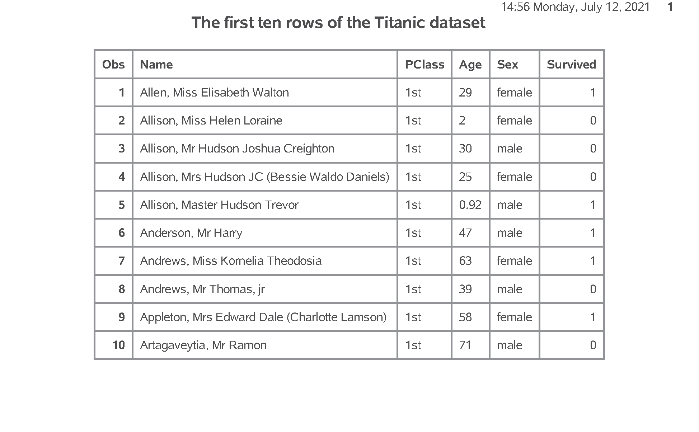
<div class="notes">`r no(tx, 3, part=2)`</div>

### SAS code: `r ti(tx, 4)` <!--freq-->
```{}
`r co(tx, 4)`
```
<div class="notes">`r no(tx, 4, part=1)`</div>

### SAS output: `r ti(tx, 4)` (1/2)
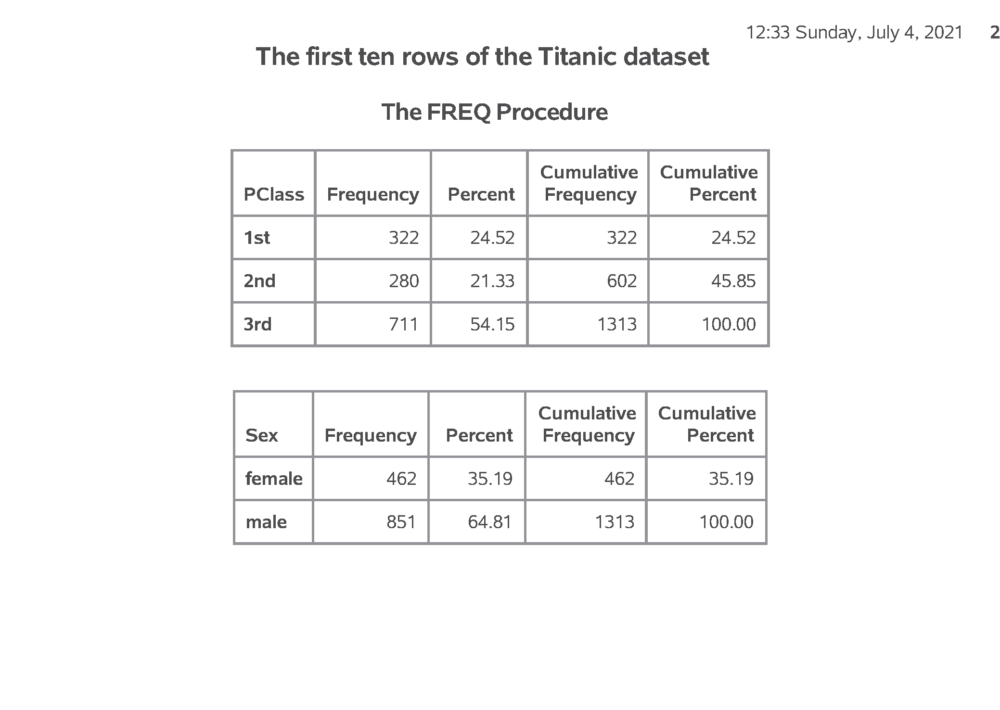
<div class="notes">`r no(tx, 4, part=2)`</div>

### SAS output: `r ti(tx, 4)` (2/2)
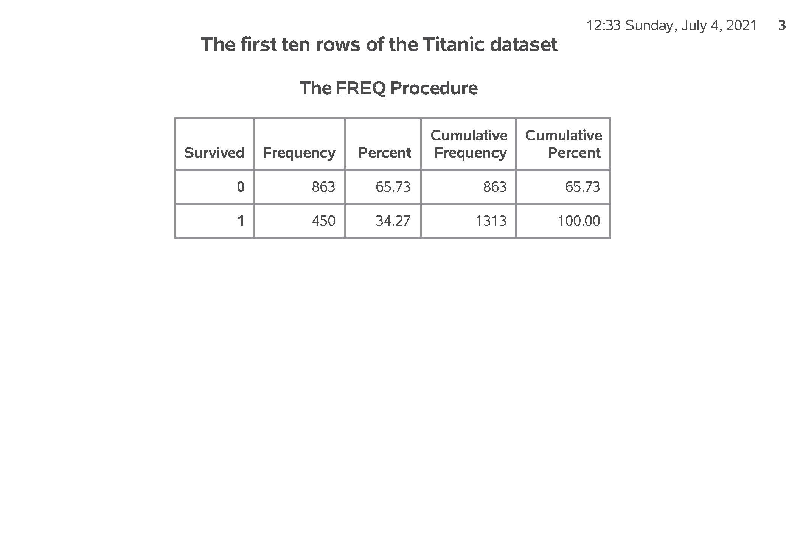
<div class="notes">`r no(tx, 4, part=3)`</div>

### SAS code: `r ti(tx, 5)`  <!--convert-->
```{}
`r co(tx, 5)`
```
<div class="notes">`r no(tx, 5)`</div>

### SAS output: `r ti(tx, 5)` (1/2)
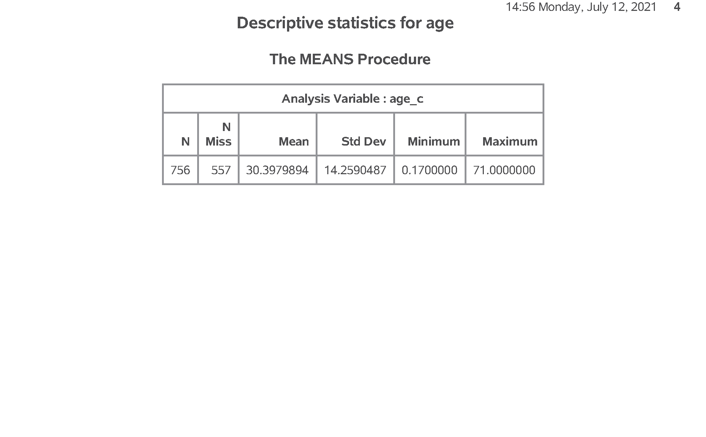
<div class="notes">`r no(tx, 5)`</div>

### SAS code: `r ti(tx, 6)` <!--format-->
```{}
`r co(tx, 6)`
```
<div class="notes">`r no(tx, 6)`</div>

### SAS output: `r ti(tx, 6)` 
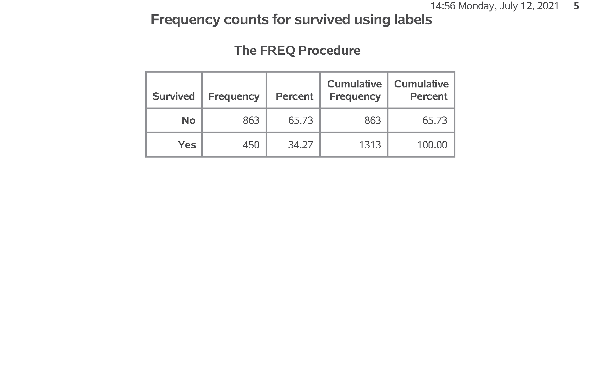
<div class="notes">`r no(tx, 6)`</div>

### SAS code: Creating bar charts

```{}
`r px(tx, "Part07", "Part08")`
```

<div class="notes">

I don't normally like bar charts, but
they do have their uses.

</div>

### SAS output:  Creating bar charts

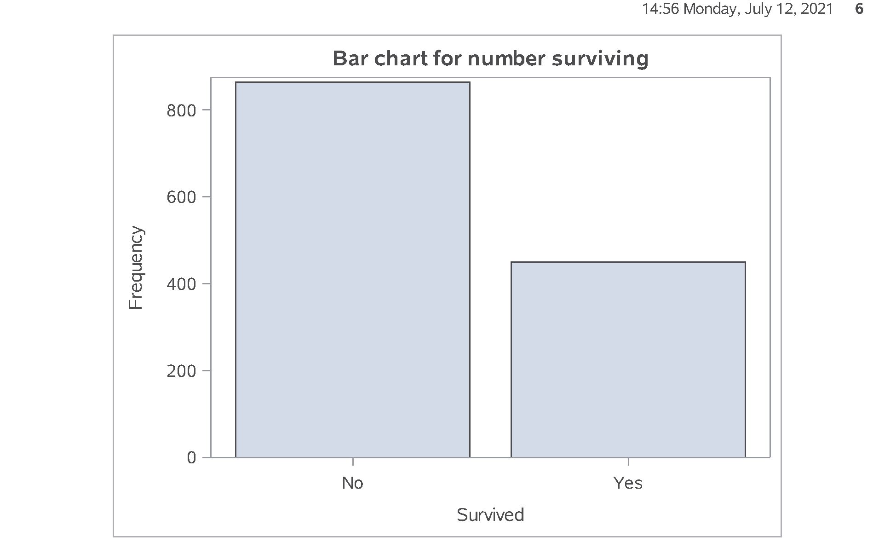

### SAS code: Percentages for bar chart

```{}
`r px(tx, "Part08", "Part09")`
```

<div class="notes">

Getting percentages is a bit tricky. You have to run proc freq and output the results to a new data file, pct_survived. I am using the noprint option, because I only want the percentages for internal use. It wouldn't have hurt anything to print out a bit extra, but I want to encourage you to limit the amount of output that you present to a consulting client.

Note the yaxis max=100 statement which expands the upper limit of the y axis  to 100%.

</div>

### SAS output: Percentages for bar chart

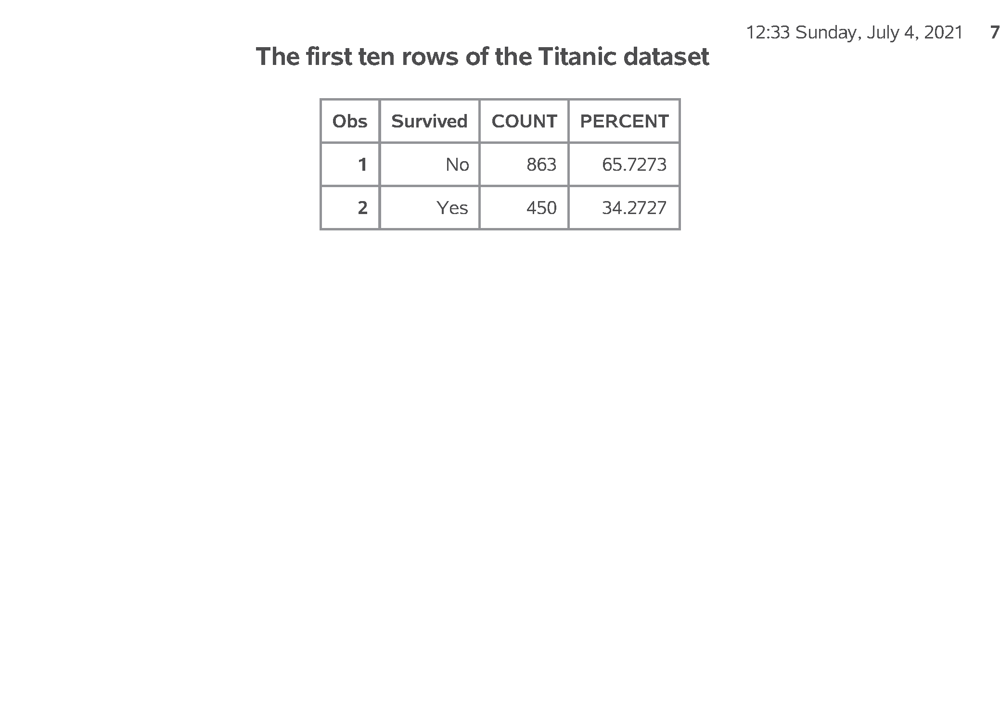

### SAS code: Crosstabulation

```{}
`r px(tx, "Part09", "Part10")`
```

<div class="notes">

To examine relationships among categorical variables use a two dimensional crosstabulation.

</div>

### SAS output: Crosstabulation

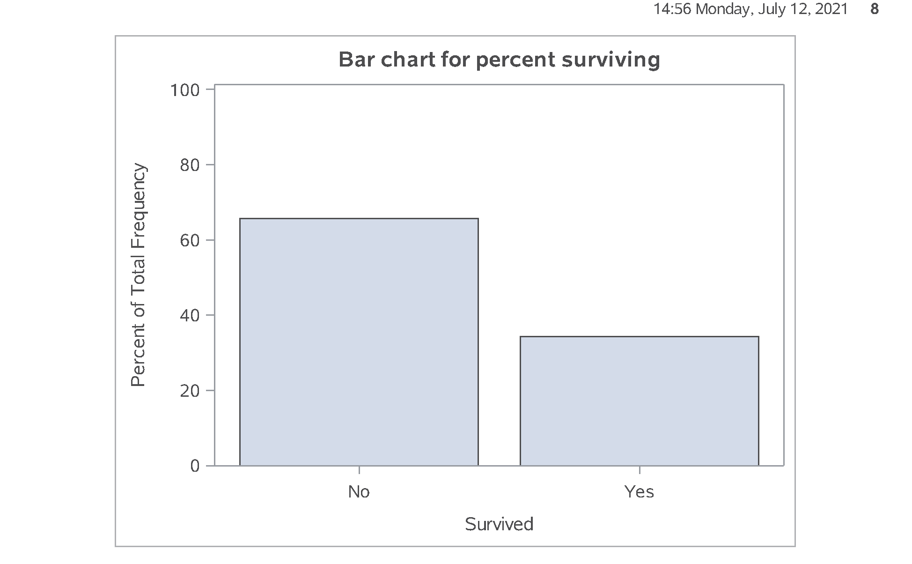

### SAS code: Converting a continuous variable to categorical (1/2)

```{}
`r px(tx, "Part10", "Part11")`
```

<div class="notes">

If you want to create categories from a
continuous variable, use a series of

  if - then - else
  
statements

</div>

### SAS code: Converting a continuous variable to categorical (2/2)

```{}
`r px(tx, "Part11", "Part12")`
```

<div class="notes">

Always cross check your results against the original variable.

</div>

### SAS output: Converting a continuous variable to categorical (1/2)

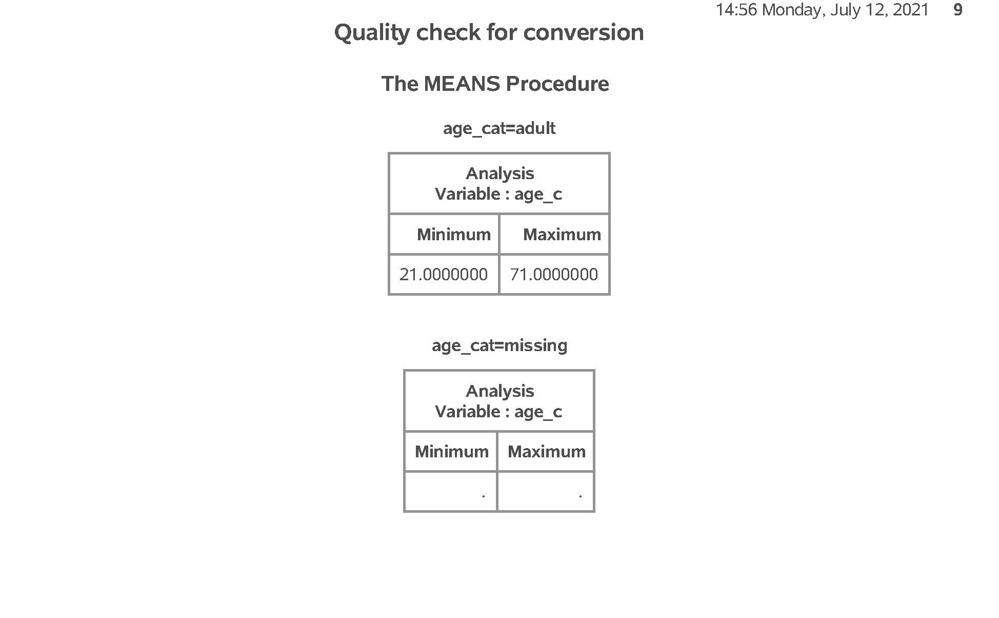

### SAS output: Converting a continuous variable to categorical (2/2)

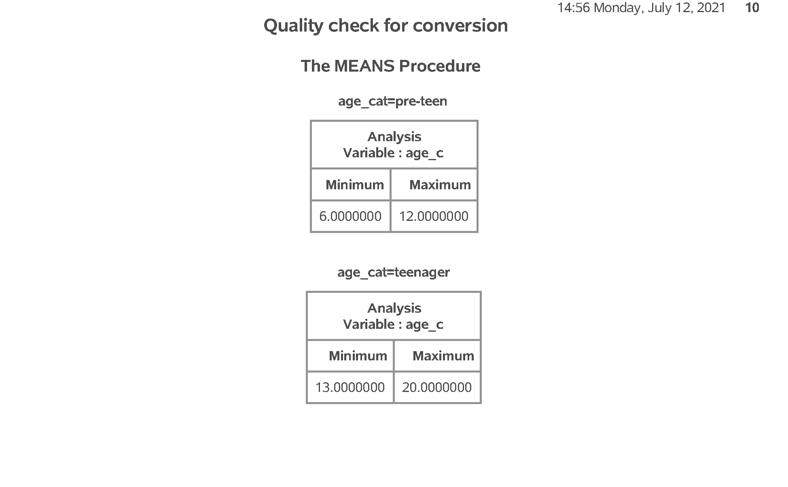

<div class="notes">

Notice that the order for age_cat is alphabetical, which is probably not what you want. You can control the order by using number codes and formats.

</div>

### SAS code: Converting a continuous variable to categorical (2/2)

```{}
`r px(tx, "Part12", "Part13")`
```

<div class="notes">

You'd like these tables orderd from toddler to pre-teen to teenager to adult, then missing.

</div>


### SAS output: A better conversion

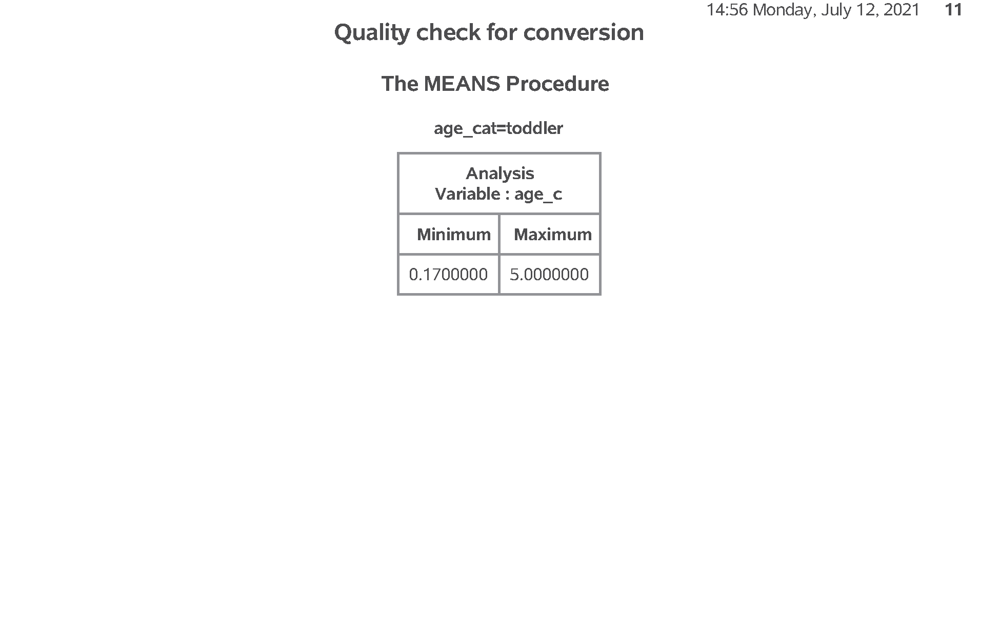

<div class="notes">

Here is the trick to get things ordered properly. Use a number code in the conversion and then add labels with proc format.

</div>

### SAS code: A better conversion

```{}
`r px(tx, "Part13", "Part14")`
```

<div class="notes">

Once  you have the number codes, assign
an interpretable label using proc 
format.

</div>

### SAS output: A better conversion

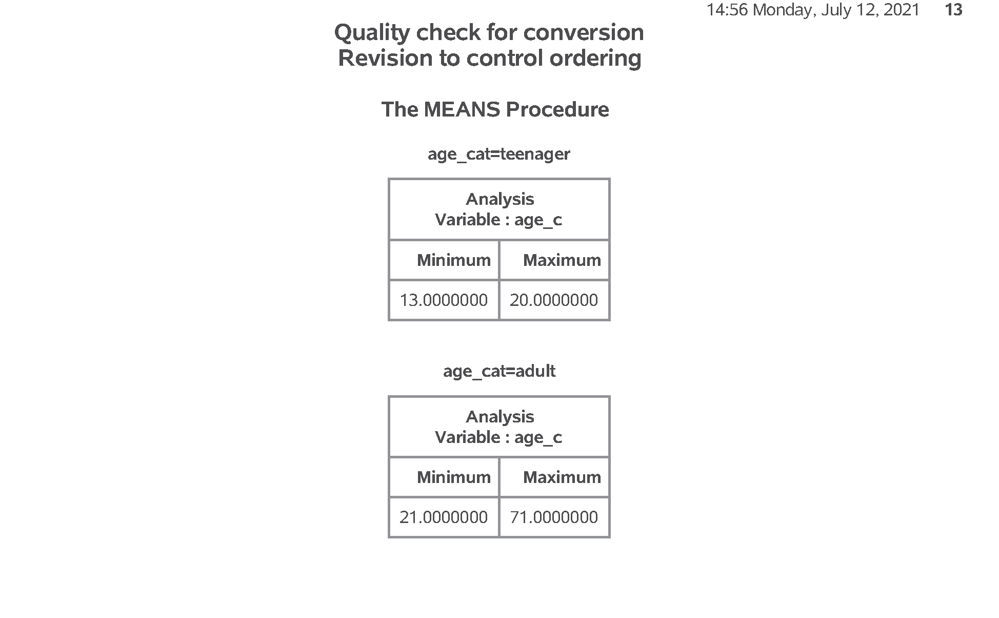

### SAS code: 

```{}
`r px(tx, "Part14", "Part15")`
```

<div class="notes">

Here's the quality check again.

</div>

### SAS output:

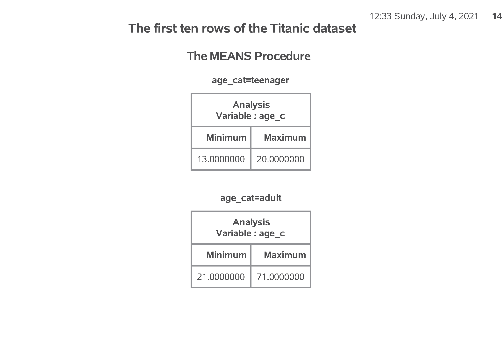

### SAS code: 

```{}
`r px(tx, "Part15", "End of program")`
```

<div class="notes">

Here's another example where you 
compare First Class passengers to
Second and Third class passengers 
combined.

</div>

### SAS output:

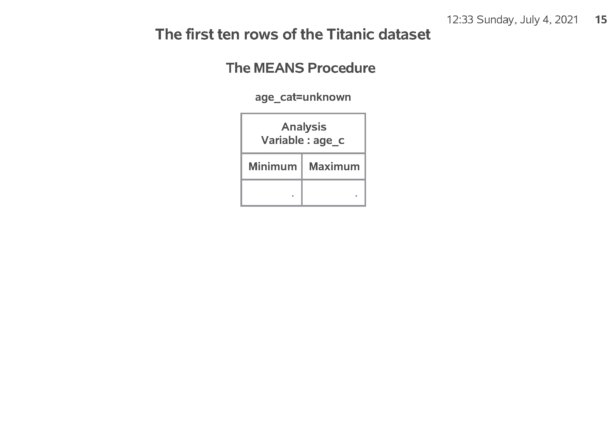

### SAS output:

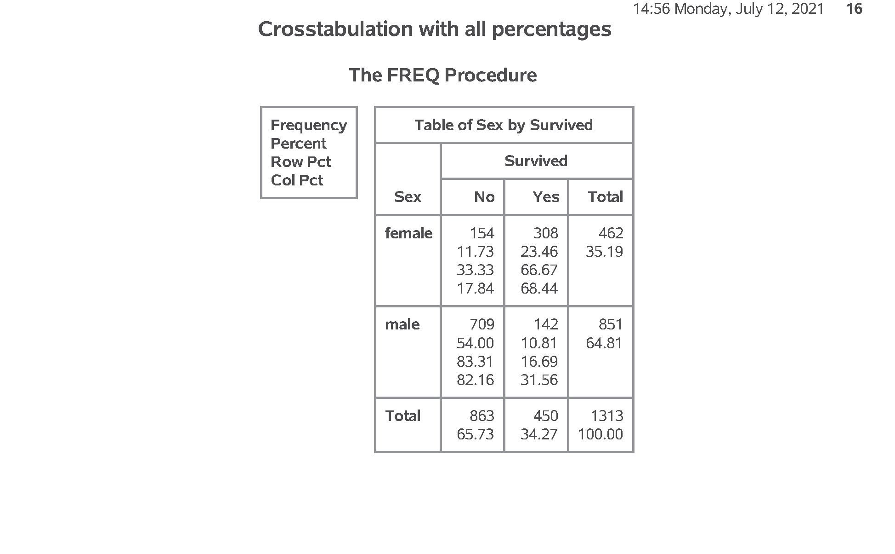


### Titanic data set

<div class="notes">

Here are the first ten rows of the Titanic data set.

At first glance, everything looks fine. But if you look closely, you will see that age is left justified. It is caused by the NA code for missing value, which doesn't appear until about line 14 or 15 of the code.

</div>

### Counts for categorical data (1/2)


<div class="notes">

Here are the counts for passenger class and sex.

</div>

### Counts for categorical data (2/2)

<div class="notes">

Here are the counts for Survived.

</div>


### Means and standard deviations for age

<div class="notes">

Here are the descriptive statistics for age. Notice the number of missing values.

</div>

### Nicely formatted counts for survival

<div class="notes">

Notice that the format statement replaces the cryptic 0-1 code with the words no and yes.

</div>

### Bar chart

<div class="notes">

Here are the descriptive statistics for age. Notice the number of missing values.

</div>

### Percentages, proc freq

<div class="notes">

Here is what the output from proc freq looks like. Just two rows.

</div>

### Percentages in a bar chart


<div class="notes">

Here is what the output from proc freq looks like. Just two rows.

</div>

### Percentages, proc freq


<div class="notes">

Here is what the output from proc freq looks like. Among the males, almost 5/6 died. Among the females only 1/3 died.

</div>

### Recoding age (1 / 3)


<div class="notes">

Here is the quality check. Notice that adult starts at 21. Should adult start at 18 instead?

</div>

### Recoding age (2 / 3)


<div class="notes">

Are the ranges for pre-teen and teenager reasonable?

</div>

### Recoding age (3 / 3)


<div class="notes">

How about the ranges for toddler?

</div>

### Better age recode (1 /3)


<div class="notes">

This shows the age categories starting at the youngest: toddler and pre-teen...

</div>

### Better age recode (2 /3)

<div class="notes">

followed y teenager and adult...

</div>

### Better age recode (3 /3)


<div class="notes">

with missing bring up the rear. This order was the order of the number codes. So if you want to display your results in a non-alphabetical order, use number codes.

</div>

### Quality check

<div class="notes">

Here is the quality check. PClass=1st codes to first_class=Yes. PClass=2nd or 3rd codes to first_class=No.

</div>

